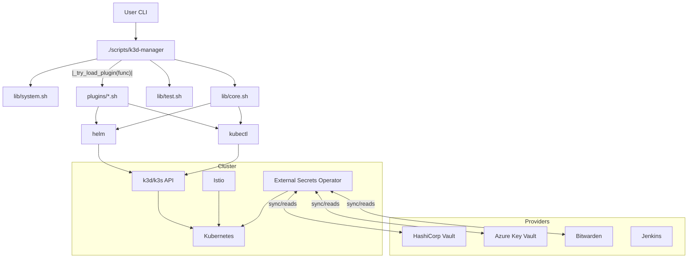
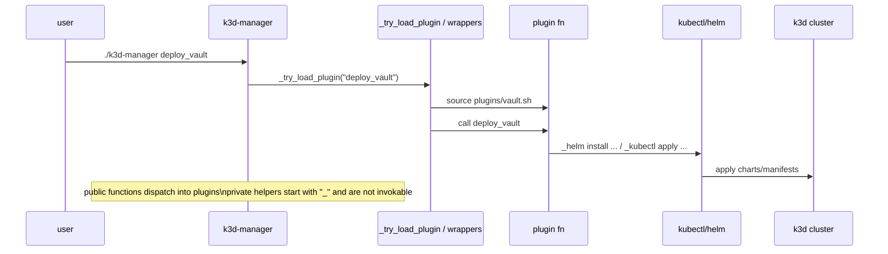

# k3d-manager

Utility scripts for creating and managing a local [k3d](https://k3d.io/) Kubernetes cluster with Istio and related tools.  The main entry point is `./scripts/k3d-manager`, which dispatches functions defined in the core libraries and lazily loads plugin files on demand.

## Usage

```bash
./scripts/k3d-manager                     # show usage and core functions
./scripts/k3d-manager <function> [args]   # invoke a core or plugin function
```

Running the script without arguments prints a short help message.  When you call a function that is not part of the core libraries, the launcher searches `scripts/plugins` and sources a matching plugin file at runtime so unused plugins do not slow startup.

Example:

```bash
./scripts/k3d-manager create_k3d_cluster mycluster             # default 8000/8443
./scripts/k3d-manager create_k3d_cluster second 9090 9443      # custom ports
./scripts/k3d-manager hello
```

Use `-h` or `--help` with any command to see a brief usage message:

```bash
./scripts/k3d-manager create_k3d_cluster -h
./scripts/k3d-manager deploy_vault -h
```

You can run multiple clusters at once by giving each a unique name and
port mapping:

```bash
./scripts/k3d-manager create_k3d_cluster alpha
./scripts/k3d-manager create_k3d_cluster beta 8001 8444
```

### Colima resource configuration (macOS)

The macOS Docker setup uses [Colima](https://github.com/abiosoft/colima). Configure the VM resources through environment variables or by passing positional arguments to the internal `_install_mac_docker` helper:

- `COLIMA_CPU` (default `4`) – number of CPUs
- `COLIMA_MEMORY` (default `8`) – memory in GiB
- `COLIMA_DISK` (default `20`) – disk size in GiB

## Directory layout

```
scripts/
  k3d-manager        # dispatcher
  lib/               # core functionality
  plugins/           # optional features loaded on demand
  etc/               # templates and configs
```

## How it fits together



This diagram outlines how the CLI dispatches to core libraries and loads plugins on demand, which then use Helm and kubectl to manage the cluster.



The sequence shows a user invoking a plugin function, which loads the plugin and applies resources to the cluster.

## Public functions

| Function | Location | Description |
| --- | --- | --- |
| `destroy_k3d_cluster` | `scripts/lib/core.sh` | Delete a k3d cluster |
| `create_k3d_cluster` | `scripts/lib/core.sh` | Create a k3d cluster |
| `deploy_k3d_cluster` | `scripts/lib/core.sh` | Create and configure a cluster |
| `test_istio` | `scripts/lib/test.sh` | Run Istio validation tests |
| `test_nfs_connectivity` | `scripts/lib/test.sh` | Check network connectivity to NFS |
| `test_nfs_direct` | `scripts/lib/test.sh` | Directly mount NFS for troubleshooting |
| `create_az_sp` | `scripts/plugins/azure.sh` | Create an Azure service principal |
| `deploy_azure_eso` | `scripts/plugins/azure.sh` | Deploy Azure ESO resources |
| `eso_akv` | `scripts/plugins/azure.sh` | Manage Azure Key Vault ESO integration |
| `ensure_bws_secret` | `scripts/plugins/bitwarden.sh` | Ensure Bitwarden secret exists |
| `config_bws_eso` | `scripts/plugins/bitwarden.sh` | Configure Bitwarden ESO |
| `eso_example_by_uuid` | `scripts/plugins/bitwarden.sh` | Example ESO lookup by UUID |
| `verify_bws_token` | `scripts/plugins/bitwarden.sh` | Verify Bitwarden session token |
| `deploy_eso` | `scripts/plugins/eso.sh` | Deploy External Secrets Operator |
| `hello` | `scripts/plugins/hello.sh` | Example plugin |
| `deploy_jenkins` | `scripts/plugins/jenkins.sh` | Deploy Jenkins |
| `deploy_vault` | `scripts/plugins/vault.sh` | Deploy HashiCorp Vault |

## Vault PKI setup

The Vault plugin in [`scripts/plugins/vault.sh`](scripts/plugins/vault.sh) automates
the entire PKI bootstrap that Jenkins and other services need. When you run
`./scripts/k3d-manager deploy_vault ha`, the plugin installs the Helm chart,
initialises and unseals the HA cluster, enables the Kubernetes auth method and
only then evaluates the PKI helpers. Once Vault is healthy, `_vault_setup_pki`
runs (if `VAULT_ENABLE_PKI=1`) to mount PKI, generate the root CA and
provision the requested role before `_vault_pki_issue_tls_secret` optionally
writes a Kubernetes TLS secret.

### Configuration knobs

You can override the defaults by exporting the variables before calling the
plugin or by editing the helper files under `scripts/etc`.

**`scripts/etc/vault/vars.sh`**

| Variable | Default | Purpose |
| --- | --- | --- |
| `VAULT_ENABLE_PKI` | `1` | Toggle the entire PKI bootstrap routine. |
| `VAULT_PKI_PATH` | `pki` | Mount path for the PKI secrets engine (for example, `pki` vs `pki_int`). |
| `VAULT_PKI_ROLE` | `jenkins-tls` | Name of the Vault role that will issue leaf certificates. |
| `VAULT_PKI_CN` | `dev.local.me` | Common name used when generating the root CA. |
| `VAULT_PKI_MAX_TTL` | `87600h` | Maximum lifetime for the root CA (10 years by default). |
| `VAULT_PKI_ROLE_TTL` | `720h` | Maximum lifetime for leaf certificates issued by the role. |
| `VAULT_PKI_ALLOWED` | *(empty)* | Comma-separated list of allowed domains/SANs for the role; an empty value allows any host. |
| `VAULT_PKI_ENFORCE_HOSTNAMES` | `true` | Whether Vault should enforce hostname validation when issuing leaf certs. |

**`scripts/etc/jenkins/jenkins-vars.sh`**

| Variable | Default | Purpose |
| --- | --- | --- |
| `VAULT_PKI_ISSUE_SECRET` | `1` | Immediately mint a TLS secret after PKI is ready. |
| `VAULT_PKI_SECRET_NS` | `istio-system` | Namespace where the TLS secret will be written. |
| `VAULT_PKI_SECRET_NAME` | `jenkins-tls` | Name of the Kubernetes `tls` secret to create. |
| `VAULT_PKI_LEAF_HOST` | `jenkins.dev.local.me` | Common name/SAN for the leaf certificate request. |

### Jenkins deployment prerequisites

The Jenkins plugin renders Istio and workload manifests from templates using
`envsubst`. Install the `envsubst` utility from the GNU gettext package and make
sure it is available on your `PATH` before running `./scripts/k3d-manager
deploy_jenkins`.

| Platform | Installation command |
| --- | --- |
| macOS | `brew install gettext` <br/>`brew link --force gettext` |
| Debian/Ubuntu | `sudo apt install gettext` |
| Fedora/RHEL/CentOS | `sudo dnf install gettext` |

### Example workflow

1. Export the desired overrides so the plugin picks them up:

   ```bash
   export VAULT_ENABLE_PKI=1
   export VAULT_PKI_PATH=pki_int
   export VAULT_PKI_CN="dev.local.me"
   export VAULT_PKI_ALLOWED="jenkins.dev.local.me,*.dev.local.me"
   export VAULT_PKI_ENFORCE_HOSTNAMES=true
   export VAULT_PKI_SECRET_NS=istio-system
   export VAULT_PKI_SECRET_NAME=jenkins-tls
   export VAULT_PKI_LEAF_HOST=jenkins.dev.local.me
   ```

2. Deploy Vault in HA mode. The plugin will initialise Vault, configure the PKI
   mount, generate the CA and, with the issuance toggle enabled, create the TLS
   secret automatically.

   ```bash
   ./scripts/k3d-manager deploy_vault ha
   ```

3. Verify that Vault issued the secret and inspect the resulting certificate:

   ```bash
   kubectl get secret -n istio-system jenkins-tls -o jsonpath='{.type}'
   kubectl get secret -n istio-system jenkins-tls -o jsonpath='{.data.tls\.crt}' \
     | base64 -d \
     | openssl x509 -noout -subject -issuer
   ```

   Seeing `kubernetes.io/tls` as the type and the expected subject/issuer
   confirms the PKI issuer workflow ran successfully.

   The Jenkins certificate rotator automatically revokes the superseded
   certificate in Vault after it applies a new Kubernetes TLS secret, ensuring
   that stale leaf certificates cannot be reused.

## Writing a plugin

Plugins live under `scripts/plugins/` and are sourced only when their function is invoked. Guidelines:

* Public entry points must not start with `_`.
* Keep functions idempotent and avoid side effects on load.
* Use the helper wrappers (`_run_command`, `_kubectl`, `_helm`, `_curl`) for consistent behaviour.

Skeleton:

```bash
#!/usr/bin/env bash
# scripts/plugins/mytool.sh

function mytool_do_something() {
  _kubectl apply -f my.yaml
}

function _mytool_helper() {
  :
}
```

### `_run_command` helper

The `_run_command` wrapper executes system commands with consistent error handling
and optional `sudo` support. Its general form is:

```
_run_command [--quiet] [--prefer-sudo|--require-sudo] [--probe '<subcmd>'] -- <prog> [args...]
```

Examples:

```bash
# install a package, preferring sudo but falling back to the current user
_run_command --prefer-sudo -- apt-get install -y jq

# require sudo and abort if it is unavailable
_run_command --require-sudo -- mkdir /etc/myapp

# probe a subcommand to decide if sudo is needed
_run_command --probe 'config current-context' -- kubectl get nodes
```

Use `--` to separate `_run_command` options from the command being executed.
Unless `--quiet` is specified, failures print the exit code and full command.

## Security notes

* `_failfast_on`/`_failfast_off` toggle `set -Eeuo pipefail`.
* Set `ENABLE_TRACE=1` to log trace output to `/tmp/k3d.trace`.
* `_run_command` and friends handle sudo, probing and exit codes safely.
* Use `_cleanup_register` with `mktemp` to clean up temporary files automatically.


## Tests

Run the test suites via the manager script. The `_ensure_bats` helper in
`scripts/lib/system.sh` installs [Bats](https://github.com/bats-core/bats-core)
using your system package manager when needed:

```bash
./scripts/k3d-manager test all            # run all suites
./scripts/k3d-manager test plugins        # run the plugins suite
./scripts/k3d-manager test lib            # run the lib suite
```

Test subcommands are discovered automatically by scanning `scripts/tests` for `.bats` files.
