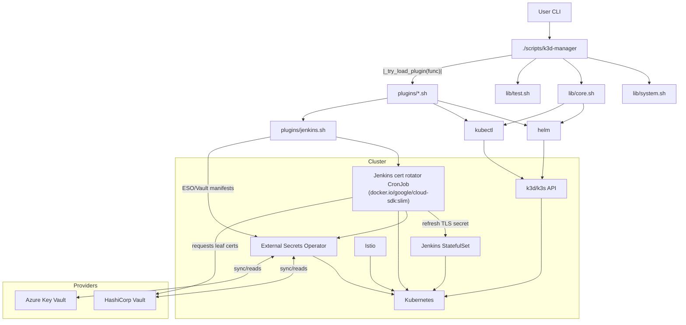
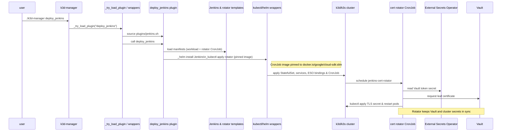

# k3d-manager

Utility scripts for creating and managing a local development Kubernetes cluster with Istio and related tools.  The main entry point is `./scripts/k3d-manager`, which dispatches functions defined in the core libraries and lazily loads plugin files on demand.  k3d remains the default provider on macOS, and other platforms can select their backend by exporting `CLUSTER_PROVIDER`.

## Usage

```bash
./scripts/k3d-manager                     # show usage and core functions
./scripts/k3d-manager <function> [args]   # invoke a core or plugin function
```

Running the script without arguments prints a short help message.  When you call a function that is not part of the core libraries, the launcher searches `scripts/plugins` and sources a matching plugin file at runtime so unused plugins do not slow startup.

Example:

```bash
./scripts/k3d-manager create_cluster mycluster                 # default 8000/8443
./scripts/k3d-manager create_cluster second 9090 9443          # custom ports
./scripts/k3d-manager deploy_cluster                           # provider-aware bootstrap + Istio
CLUSTER_PROVIDER=k3s ./scripts/k3d-manager deploy_cluster -f   # auto-install k3s without prompting
./scripts/k3d-manager hello
```

Use `-h` or `--help` with any command to see a brief usage message:

```bash
./scripts/k3d-manager create_cluster -h
./scripts/k3d-manager deploy_vault -h
```

You can run multiple clusters at once by giving each a unique name and
port mapping:

```bash
./scripts/k3d-manager create_cluster alpha
./scripts/k3d-manager create_cluster beta 8001 8444
```

Set `CLUSTER_PROVIDER` to select a different backend module:

```bash
CLUSTER_PROVIDER=k3d ./scripts/k3d-manager deploy_cluster
```

## Verification quickstart

Once the core add-ons are deployed you can run these spot checks to confirm ESO-backed secrets are in use:

```bash
# LDAP administrator bind (uses secret/openldap-admin)
scripts/tests/plugins/openldap.sh            # or rerun scripts/k3d-manager deploy_ldap

# Jenkins credentials (uses Vault/ESO; Jenkins authenticates via LDAP)
kubectl -n directory get secret openldap-admin \
  -o jsonpath='{.data.LDAP_ADMIN_PASSWORD}' | base64 -d

# Optional: verify via Jenkins API inside the controller pod using the LDAP admin account
POD=$(kubectl -n jenkins get pod -l app.kubernetes.io/component=jenkins-controller \
      -o jsonpath='{.items[0].metadata.name}')
PASS=$(kubectl -n directory get secret openldap-admin \
       -o jsonpath='{.data.LDAP_ADMIN_PASSWORD}' | base64 -d)
kubectl -n jenkins exec "$POD" -c jenkins -- \
  curl -fsS -u "ldap-admin:$PASS" http://localhost:8080/user/ldap-admin/api/json
```

The first command exercises the OpenLDAP deployment (the helper prints a warning if `ldapsearch` is missing); the second returns the Vault-synchronised LDAP administrator password that Jenkins now consumes via the LDAP plugin. The final command shows an HTTP 200 when authentication succeeds.

## Jenkins Authentication Modes

Jenkins can be deployed with different authentication backends depending on your environment:

### Default Mode (No Directory Service)

```bash
./scripts/k3d-manager deploy_jenkins --enable-vault
```

Uses Jenkins built-in authentication with credentials stored in Vault via External Secrets Operator.

### Active Directory Testing Mode

```bash
./scripts/k3d-manager deploy_jenkins --enable-ad --enable-vault
```

Deploys OpenLDAP with Active Directory schema for local development and testing. This mode:
- Uses the `ldap` plugin with AD-compatible schema
- Configures OpenLDAP with `msPerson` and `msOrganizationalUnit` object classes
- Stores LDAP credentials in Vault
- Ideal for testing AD integration before deploying to production

### Production Active Directory Integration

```bash
# Configure AD connection
export AD_DOMAIN="corp.example.com"
export AD_SERVER="dc1.corp.example.com,dc2.corp.example.com"  # optional

./scripts/k3d-manager deploy_jenkins --enable-ad-prod --enable-vault
```

Connects Jenkins to a production Active Directory server. This mode:
- Uses the `active-directory` plugin
- Validates AD connectivity (DNS resolution and LDAPS port 636) before deployment
- Stores AD service account credentials in Vault
- Requires network access to the AD domain controllers

Configuration file: `scripts/etc/jenkins/ad-vars.sh`

#### Skip Validation (for testing)

To bypass the pre-flight connectivity check:

```bash
./scripts/k3d-manager deploy_jenkins --enable-ad-prod --enable-vault --skip-ad-validation
```

**Note:** The three directory service modes (`--enable-ldap`, `--enable-ad`, `--enable-ad-prod`) are mutually exclusive. Choose one based on your environment.

## Vault Agent Sidecar for LDAP Credentials

Jenkins uses Vault agent sidecar injection to securely manage LDAP bind credentials at runtime, eliminating hardcoded passwords in ConfigMaps and enabling rotation without redeployment.

### How It Works

When Jenkins is deployed with `--enable-vault`, the Vault agent injector automatically:

1. **Injects an init container** (`vault-agent-init`) that authenticates to Vault using the Jenkins service account
2. **Fetches LDAP credentials** from Vault's KV store (`secret/data/ldap/openldap-admin`)
3. **Writes credentials as files** to `/vault/secrets/` in a shared memory volume
4. **Jenkins reads credentials** using JCasC's `${file:...}` syntax at startup

### Benefits

- **No passwords in ConfigMaps** - Credentials never baked into configuration at deployment time
- **Easier password rotation** - Update Vault, restart Jenkins pod (no redeployment needed)
- **Ephemeral storage** - Secrets stored in memory-backed volume, cleared on pod termination
- **Backup mechanism** - K8s secrets (managed by ESO) remain available as fallback

### Password Rotation Procedure

```bash
# 1. Update password in Vault
kubectl exec -n vault vault-0 -- vault kv put secret/ldap/openldap-admin \
  LDAP_BIND_DN="cn=ldap-admin,dc=home,dc=org" \
  LDAP_ADMIN_PASSWORD="new-password-here"

# 2. Update LDAP server (if applicable)
./scripts/k3d-manager deploy_ldap

# 3. Restart Jenkins pod to fetch new credentials
kubectl delete pod -n jenkins jenkins-0
```

The new Jenkins pod automatically fetches fresh credentials from Vault via the sidecar.

### Technical Details

**Implementation:** `docs/implementations/vault-sidecar-implementation.md`

**Key Components:**
- Vault Kubernetes auth role: `jenkins-ldap-reader`
- Vault policy: Read access to `secret/data/ldap/openldap-admin`
- Pod annotations: `vault.hashicorp.com/agent-inject: "true"`
- JCasC configuration: `managerPasswordSecret: '${file:/vault/secrets/ldap-bind-password}'`

**Verification:**
```bash
# Check vault-agent-init was injected
kubectl get pod -n jenkins jenkins-0 -o jsonpath='{.spec.initContainers[*].name}'

# Verify secret files exist
kubectl exec -n jenkins jenkins-0 -- ls -la /vault/secrets/
```

## Using k3s clusters

The helper scripts in this repository now understand a `k3s` provider in addition
to the default k3d backend. When `CLUSTER_PROVIDER=k3s` is exported (or
auto-detected), `deploy_cluster` walks through an interactive bootstrap routine
that can install [k3s](https://k3s.io/) for you. The dispatcher asks for
confirmation before touching the host; pass `-f` to `deploy_cluster` to run the
same workflow non-interactively in CI.

### Automatic installation workflow

1. `deploy_cluster` prints the provider it detected and, if it sees a
   `k3s`-capable Linux host, prompts before copying the systemd unit file from
   `scripts/etc/k3s/` and downloading the k3s binary.
2. After you confirm (or when `-f` is supplied), the helper installs k3s,
   enables the service, waits for the API server to become reachable, and then
   applies the same Istio configuration the k3d flow uses.
3. The script saves a kubeconfig under `${K3S_KUBECONFIG_PATH}` (default
   `/etc/rancher/k3s/k3s.yaml`) and points `kubectl`/plugins at it, so follow-on
   commands such as `deploy_vault` or `deploy_jenkins` operate on the new
   control plane without additional setup.

### Prerequisites for the automatic k3s path

* Linux with `systemd` so the installer can register `k3s.service` (server) and
  optional `k3s-agent.service` units. Enable the service at boot and verify it
  is active with `sudo systemctl status k3s` before applying workloads.
* Root privileges (either running as root or via password-less `sudo`) so the
  helper can place files under `/etc/rancher/k3s/` and `/usr/local/bin/`.
* Outbound internet access to download the k3s release and Istio components.
* Open the Kubernetes API (`6443/tcp`) so your workstation can reach the
  cluster, along with kubelet/metrics traffic (`10250/tcp`) and, when you deploy
  multiple agents, the overlay network port (`8472/udp`) and NodePort range
  (`30000-32767/tcp`).
* Writable storage for persistent volumes under
  `/var/lib/rancher/k3s/storage` and for the embedded containerd runtime under
  `/var/lib/rancher/k3s/agent/containerd/`.

### Required environment for Jenkins and CLI integrations

The Jenkins plugin and the shell helpers discover non-k3d clusters through a few
environment variables and binaries:

* `CLUSTER_PROVIDER` (preferred) or `K3D_MANAGER_PROVIDER` / `K3DMGR_PROVIDER`
  must be exported with the value `k3s` so the dispatcher selects the k3s
  backend.
* `KUBECONFIG` has to point at the kubeconfig file for your k3s control plane.
  Copy `/etc/rancher/k3s/k3s.yaml` from the server to a location Jenkins can read
  and update the cluster server hostname if necessary.
* The `k3s` CLI must be available on the PATH when you run k3s-specific helpers
  so health checks and log collection can call it.

### Minimal workflow for existing k3s control planes

1. Install k3s manually or through your configuration management tool by
   following the [official quick-start instructions](https://docs.k3s.io/quick-start)
   (for example `curl -sfL https://get.k3s.io | sh -s - server --disable traefik`).
2. Copy the kubeconfig (`/etc/rancher/k3s/k3s.yaml`) to the machine where you run
   k3d-manager and set `KUBECONFIG` to its path. Adjust the API server address in
   the kubeconfig if you access the control plane remotely.
3. Export `CLUSTER_PROVIDER=k3s` (or one of the supported aliases) and ensure the
   `k3s` binary is installed locally.
4. Run `./scripts/k3d-manager deploy_cluster` to let the helper verify the
   control plane and apply Istio, or call a narrower command such as
   `deploy_vault` to target a specific add-on.

### Remediation when automatic installation is unavailable

Some environments (for example immutable hosts, distributions without
`systemd`, or machines that block `sudo`) cannot run the automated installer.
Use the following fallbacks when the prompt reports that auto-install is not
supported:

* Provision k3s manually with `curl -sfL https://get.k3s.io | INSTALL_K3S_EXEC="server --disable traefik" sh -` and then rerun
  `deploy_cluster -f` so the helper only applies Istio and add-ons.
* Copy `scripts/etc/k3s/k3s.service.tmpl` to the host and adjust the paths if
  your distribution uses a non-standard service directory.
* Ensure `/etc/rancher/k3s/k3s.yaml` is readable (copy it to your workstation or
  expose it through your secrets manager) and export `KUBECONFIG` before running
  any plugins.
* If `sudo` is unavailable, pre-create `/usr/local/bin/k3s` and the config
  directories with the desired ownership, then rerun the command with `-f` so it
  skips privileged operations that are already satisfied.

## k3s backend (bare-metal installations)

Some teams run the same manifests against a remote [k3s](https://k3s.io/) cluster
instead of the local k3d environment. The helper functions in this repository do
not provision k3s for you, but they work as soon as your `kubectl` context points
at an existing k3s API server. Make sure the host satisfies the following
expectations before running any plugins against it:

### Required services

* Linux with `systemd` so the installer can register `k3s.service` (server) and
  optional `k3s-agent.service` units. Enable the service at boot and verify it
  is active with `sudo systemctl status k3s` before applying workloads.
* `containerd` ships with k3s and is started by the `k3s` unit; no separate
  Docker or Colima layer is involved.

### Container runtime ports

* Open the Kubernetes API (`6443/tcp`) so your workstation can reach the
  cluster.
* Allow kubelet and metrics traffic (`10250/tcp`) when you rely on `kubectl
  logs`, `exec`, or the test helpers that scrape node metrics.
* Keep the default flannel VXLAN overlay port (`8472/udp`) and NodePort range
  (`30000-32767/tcp`) accessible between nodes if you deploy multiple agents.
* If you enable the embedded registry, expose the registry port (`5000/tcp`) so
  image pushes from the CI scripts succeed.

### Host storage paths

* Persistent volume data is stored under `/var/lib/rancher/k3s/storage`.
* Container images and runtime metadata live under
  `/var/lib/rancher/k3s/agent/containerd/`.
* The Jenkins plugin still expects a writable host path that is available on all
  nodes. Either reuse the default `${JENKINS_HOME_PATH}` export from
  `scripts/etc/cluster_var.sh` or bind it to a directory under
  `/var/lib/rancher/k3s/storage`.

### Setup differences compared with k3d

* k3d provisions everything inside Docker. The supplied scripts create and
  delete clusters automatically, so the only prerequisites are Docker (or
  Colima) and the `k3d` CLI. With the k3s provider the same `deploy_cluster`
  command can install packages directly on the host—confirm the prompt or use
  `-f` to run unattended, and fall back to the manual steps above when
  auto-install is disabled.
* k3d exposes ports through the k3d load balancer (for example HTTP/HTTPS
  mapping set in `scripts/etc/cluster.yaml.tmpl`). With k3s there is no Docker
  network layer; ensure those ports are opened directly in the host firewall.
* k3d automatically writes credentials to your default kubeconfig. For k3s you
  must copy `/etc/rancher/k3s/k3s.yaml` to your workstation (or export
  `KUBECONFIG` to point at it) so the manager script can talk to the remote
  cluster.

### Colima resource configuration (macOS)

The macOS Docker setup uses [Colima](https://github.com/abiosoft/colima). Configure the VM resources through environment variables or by passing positional arguments to the internal `_install_mac_docker` helper:

- `COLIMA_CPU` (default `4`) – number of CPUs
- `COLIMA_MEMORY` (default `8`) – memory in GiB
- `COLIMA_DISK` (default `20`) – disk size in GiB

## Documentation

Detailed design, planning, and troubleshooting references live under `docs/`. Use the categorized list below to navigate directly to the file you need.

### Architecture
- **[Configuration-Driven Design](docs/architecture/configuration-driven-design.md)** - Core design principle that keeps providers pluggable
- **[Jenkins Authentication Analysis](docs/architecture/JENKINS_AUTHENTICATION_ANALYSIS.md)** - Survey of supported Jenkins auth backends and trade-offs

### Planning Documents
- **[Directory Service Interface](docs/plans/directory-service-interface.md)** - Shared contract for OpenLDAP, AD, and Azure AD implementations
- **[Active Directory Integration](docs/plans/active-directory-integration.md)** - Plan for wiring Jenkins to enterprise AD
- **[Active Directory Testing Strategy](docs/plans/active-directory-testing-strategy.md)** - Test matrix for validating AD scenarios locally
- **[Explicit Directory Service Commands](docs/plans/explicit-directory-service-commands.md)** - CLI roadmap for directory-focused helpers
- **[LDAP Integration](docs/plans/ldap-integration.md)** - Tasks required to harden the LDAP stack
- **[LDAP + Jenkins Integration](docs/plans/ldap-jenkins-integration.md)** - Jenkins-facing LDAP wiring plan
- **[Jenkins Authentication Analysis](docs/plans/jenkins-authentication-analysis.md)** - Gap assessment to reach production-ready auth
- **[Jenkins K8s Agents & SMB CSI](docs/plans/jenkins-k8s-agents-and-smb-csi.md)** - Persistent storage + agent topology plan
- **[Jenkins Security Enhancements](docs/plans/jenkins-security-enhancements.md)** - Follow-up items to raise Jenkins posture
- **[Jenkins Smoke Test Implementation](docs/plans/jenkins-smoke-test-implementation.md)** - Automated validation coverage proposal
- **[Jenkins TOTP MFA](docs/plans/jenkins-totp-mfa.md)** - Phased rollout for time-based MFA
- **[Remaining Tasks Priority](docs/plans/remaining-tasks-priority.md)** - Backlog ordering for near-term milestones
- **[Secret Backend Interface](docs/plans/secret-backend-interface.md)** - Multi-backend secret management abstraction
- **[Vault Resilience](docs/plans/vault-resilience.md)** - Hardening plan for Vault HA + recovery paths

### Developer Guides
- **[CLAUDE.md](CLAUDE.md)** - Project overview and development guidelines for Claude Code
- **[AGENTS.md](AGENTS.md)** - Code style principles and contribution guidelines specific to Codex agents

### Implementation Documentation
- **[Vault Agent Sidecar Implementation](docs/implementations/vault-sidecar-implementation.md)** - LDAP password injection via Vault agent sidecar

### How-To Guides
- **[Configuring SSL Trust for jenkins-cli](docs/howto/jenkins-cli-ssl-trust.md)** - Configure Java truststore to validate Vault-issued certificates
- **[LDAP Bulk User Import](docs/howto/ldap-bulk-user-import.md)** - Steps for loading fixture users into the directory
- **[LDAP Password Rotation](docs/howto/ldap-password-rotation.md)** - Manual rotation workflow for bind credentials
- **[Jenkins K8s Agents Testing](docs/howto/jenkins-k8s-agents-testing.md)** - Smoke tests for dynamically provisioned Jenkins agents

### Examples
- **[LDAP Users CSV](docs/examples/ldap-users-example.csv)** - Fixture dataset for directory import tests

### Issue Logs
- **[ESO SecretStore Not Ready](docs/issues/2025-10-19-eso-secretstore-not-ready.md)** - Timeline and fix for ESO readiness
- **[LDAP Bind DN Mismatch](docs/issues/2025-10-20-ldap-bind-dn-mismatch.md)** - Debug notes on LDAP DN drift
- **[Jenkins Pod Readiness Timeout](docs/issues/2025-11-07-jenkins-pod-readiness-timeout.md)** - Investigation into slow pod startups
- **[LDAP Empty Directory (No Users)](docs/issues/2025-11-11-ldap-empty-directory-no-users.md)** - RCA for missing seeded users
- **[LDAP Password envsubst Issue](docs/issues/2025-11-21-ldap-password-envsubst-issue.md)** - Shell templating bug report
- **[Cert Rotation Fixes](docs/issues/2025-11-21-cert-rotation-fixes.md)** - Follow-up changes after cert rotation incidents

### Test Guides & Results
- **[Active Directory Testing Instructions](docs/tests/active-directory-testing-instructions.md)** - End-to-end AD verification steps
- **[Certificate Rotation Validation](docs/tests/certificate-rotation-validation.md)** - Checklist for TLS rotation drills
- **[LDAP Password Rotation Test Guide](docs/tests/ldap-password-rotation-test-guide.md)** - Repeatable validation process
- **[LDAP Password Rotation Test Results 2025-11-21](docs/tests/ldap-password-rotation-test-results-2025-11-21.md)** - Latest rotation outcomes
- **[LDAP Auth Test Results 2025-11-20](docs/tests/ldap-auth-test-results-2025-11-20.md)** - Current LDAP auth health
- **[Cert Rotation Test Results 2025-11-17](docs/tests/cert-rotation-test-results-2025-11-17.md)** - Historical TLS rotation run
- **[Cert Rotation Test Results 2025-11-19](docs/tests/cert-rotation-test-results-2025-11-19.md)** - Follow-up TLS rotation run

### Status Tracking
- **[AD Integration Status](docs/ad-integration-status.md)** - Rolling status board for AD feature parity

## Directory layout

```
scripts/
  k3d-manager        # dispatcher
  lib/               # core functionality
  plugins/           # optional features loaded on demand
  etc/               # templates and configs
docs/
  architecture/      # architecture and design documents
  plans/             # feature planning and specifications
  howto/             # user guides and how-to documentation
```

## How it fits together



This refreshed diagram highlights how the CLI dispatches to core libraries, loads plugins on demand, and—through the Jenkins plugin—renders the External Secrets Operator integration and the certificate-rotator CronJob that runs Google's published Cloud SDK image (`docker.io/google/cloud-sdk:slim`) to keep Vault-backed TLS material current for the Jenkins workload.



The sequence now traces the `deploy_jenkins` flow: k3d-manager sources the Jenkins plugin, renders the workload and rotator manifests, applies them with the pinned Google Cloud SDK-based kubectl image, and shows the CronJob fetching Vault-issued certificates through ESO before refreshing the Kubernetes secret.

> **Upgrade note:** rerun `./scripts/k3d-manager deploy_jenkins` after pulling this update so the helper refreshes the `jenkins-cert-rotator` Vault policy with the new `pki/revoke` permission. Without the refreshed policy the CronJob cannot call Vault's revoke endpoint and may leave superseded certificates active.

## Public functions

| Function | Location | Description |
| --- | --- | --- |
| `destroy_cluster` | `scripts/lib/core.sh` | Delete the active provider's cluster |
| `create_cluster` | `scripts/lib/core.sh` | Create a cluster for the active provider |
| `deploy_cluster` | `scripts/lib/core.sh` | Provider-aware bootstrap (k3d or k3s) plus Istio |
| `test_istio` | `scripts/lib/test.sh` | Run Istio validation tests |
| `test_nfs_connectivity` | `scripts/lib/test.sh` | Check network connectivity to NFS |
| `test_nfs_direct` | `scripts/lib/test.sh` | Directly mount NFS for troubleshooting |
| `create_az_sp` | `scripts/plugins/azure.sh` | Create an Azure service principal |
| `deploy_azure_eso` | `scripts/plugins/azure.sh` | Deploy Azure ESO resources |
| `eso_akv` | `scripts/plugins/azure.sh` | Manage Azure Key Vault ESO integration |
| `deploy_eso` | `scripts/plugins/eso.sh` | Deploy External Secrets Operator |
| `hello` | `scripts/plugins/hello.sh` | Example plugin |
| `deploy_jenkins` | `scripts/plugins/jenkins.sh` | Deploy Jenkins |
| `deploy_vault` | `scripts/plugins/vault.sh` | Deploy HashiCorp Vault |

## Vault PKI setup

The Vault plugin in [`scripts/plugins/vault.sh`](scripts/plugins/vault.sh) automates
the entire PKI bootstrap that Jenkins and other services need. When you run
`./scripts/k3d-manager deploy_vault`, the plugin installs the Helm chart,
initialises and unseals the HA cluster, enables the Kubernetes auth method and
only then evaluates the PKI helpers. Once Vault is healthy, `_vault_setup_pki`
runs (if `VAULT_ENABLE_PKI=1`) to mount PKI, generate the root CA and
provision the requested role before `_vault_pki_issue_tls_secret` optionally
writes a Kubernetes TLS secret.

### Configuration knobs

You can override the defaults by exporting the variables before calling the
plugin or by editing the helper files under `scripts/etc`.

**`scripts/etc/vault/vars.sh`**

| Variable | Default | Purpose |
| --- | --- | --- |
| `VAULT_ENABLE_PKI` | `1` | Toggle the entire PKI bootstrap routine. |
| `VAULT_PKI_PATH` | `pki` | Mount path for the PKI secrets engine (for example, `pki` vs `pki_int`). |
| `VAULT_PKI_ROLE` | `jenkins-tls` | Name of the Vault role that will issue leaf certificates. |
| `VAULT_PKI_CN` | `dev.local.me` | Common name used when generating the root CA. |
| `VAULT_PKI_MAX_TTL` | `87600h` | Maximum lifetime for the root CA (10 years by default). |
| `VAULT_PKI_ROLE_TTL` | `720h` | Maximum lifetime for leaf certificates issued by the role. |
| `VAULT_PKI_ALLOWED` | *(empty)* | Comma-separated list of allowed domains/SANs for the role; an empty value allows any host. |
| `VAULT_PKI_ENFORCE_HOSTNAMES` | `true` | Whether Vault should enforce hostname validation when issuing leaf certs. |

**`scripts/etc/jenkins/jenkins-vars.sh`**

| Variable | Default | Purpose |
| --- | --- | --- |
| `VAULT_PKI_ISSUE_SECRET` | `1` | Immediately mint a TLS secret after PKI is ready. |
| `VAULT_PKI_SECRET_NS` | `istio-system` | Namespace where the TLS secret will be written. |
| `VAULT_PKI_SECRET_NAME` | `jenkins-tls` | Name of the Kubernetes `tls` secret to create. |
| `VAULT_PKI_LEAF_HOST` | `jenkins.dev.local.me` | Common name/SAN for the leaf certificate request (also used as the default VirtualService host). |
| `JENKINS_VIRTUALSERVICE_HOSTS` | *(empty)* | Optional comma-separated list of hosts to render into the Istio `VirtualService`; defaults to `VAULT_PKI_LEAF_HOST`. |

The rendered Istio VirtualService now sets `X-Forwarded-Proto` and `X-Forwarded-Port` headers so Jenkins generates HTTPS links when requests traverse the shared Istio ingress gateway. If you supply a custom `virtualservice.yaml.tmpl`, keep those headers and ensure the destination port stays aligned with the Helm chart's `controller.servicePort` (default `8081`).

> **Note:** When `VAULT_PKI_ALLOWED` is not provided, the Jenkins plugin derives the Vault role's `allowed_domains` from
> `VAULT_PKI_LEAF_HOST`. Domains under `nip.io` and `sslip.io` are automatically permitted so dynamic DNS entries continue
> to validate without manual configuration.

### Jenkins deployment prerequisites

The Jenkins plugin renders Istio and workload manifests from templates using
`envsubst`. Install the `envsubst` utility from the GNU gettext package and make
sure it is available on your `PATH` before running `./scripts/k3d-manager
deploy_jenkins`.

| Platform | Installation command |
| --- | --- |
| macOS | `brew install gettext` <br/>`brew link --force gettext` |
| Debian/Ubuntu | `sudo apt install gettext` |
| Fedora/RHEL/CentOS | `sudo dnf install gettext` |

#### Disconnected clusters and preloaded charts

Air-gapped environments can still deploy the Jenkins and External Secrets
Operator stacks by downloading the Helm charts ahead of time and pointing the
plugins at the local files. From a workstation with network access:

```bash
mkdir -p ~/k3d-manager-charts
helm pull external-secrets/external-secrets \
  --repo https://charts.external-secrets.io \
  --destination ~/k3d-manager-charts
helm pull jenkins/jenkins \
  --repo https://charts.jenkins.io \
  --destination ~/k3d-manager-charts
```

Copy the resulting `.tgz` archives to a location the disconnected operators can
read, then export the overrides before running `deploy_eso` or
`deploy_jenkins`:

```bash
export ESO_HELM_CHART_REF=/opt/charts/external-secrets-<version>.tgz
export ESO_HELM_REPO_URL=
export JENKINS_HELM_CHART_REF=/opt/charts/jenkins-<version>.tgz
export JENKINS_HELM_REPO_URL=
```

When the chart reference resolves to a local path—or when the repo URL is empty
or also points at local storage—the plugins skip `_helm repo add` and
`_helm repo update`, allowing the deployment to proceed without reaching the
public repositories. Operators that mirror the charts internally can instead set
`ESO_HELM_REPO_URL` or `JENKINS_HELM_REPO_URL` to their mirror and adjust
`ESO_HELM_CHART_REF`/`JENKINS_HELM_CHART_REF` accordingly.

### Example workflow

1. Export the desired overrides so the plugin picks them up:

   ```bash
   export VAULT_ENABLE_PKI=1
   export VAULT_PKI_PATH=pki_int
   export VAULT_PKI_CN="dev.local.me"
   export VAULT_PKI_ALLOWED="jenkins.dev.local.me,*.dev.local.me"
   export VAULT_PKI_ENFORCE_HOSTNAMES=true
   export VAULT_PKI_SECRET_NS=istio-system
   export VAULT_PKI_SECRET_NAME=jenkins-tls
   export VAULT_PKI_LEAF_HOST=jenkins.dev.local.me
   ```

2. Deploy Vault (the plugin always provisions an HA cluster). The plugin will
   initialise Vault, configure the PKI mount, generate the CA and, with the
   issuance toggle enabled, create the TLS secret automatically.

   ```bash
   ./scripts/k3d-manager deploy_vault
   ```

3. Verify that Vault issued the secret and inspect the resulting certificate:

   ```bash
   kubectl get secret -n istio-system jenkins-tls -o jsonpath='{.type}'
   kubectl get secret -n istio-system jenkins-tls -o jsonpath='{.data.tls\.crt}' \
     | base64 -d \
     | openssl x509 -noout -subject -issuer
   ```

   Seeing `kubernetes.io/tls` as the type and the expected subject/issuer
   confirms the PKI issuer workflow ran successfully.

   The Jenkins certificate rotator automatically revokes the superseded
   certificate in Vault after it applies a new Kubernetes TLS secret, ensuring
   that stale leaf certificates cannot be reused.

   Re-running `./scripts/k3d-manager deploy_jenkins` on existing clusters now
   refreshes the Vault policy if the `revoke` capability is missing so the
   CronJob can successfully retire old certificates after each rotation.

   By default, the CronJob pulls `docker.io/google/cloud-sdk:slim`, the
   Google-maintained Cloud SDK image that bundles `kubectl`. Update the
   `JENKINS_CERT_ROTATOR_IMAGE` variable (either in the environment or in
   `scripts/etc/jenkins/jenkins-vars.sh`) before deploying if your registries
   differ. Google publishes the image across its registries and Docker Hub, so
   mirror it or pin to a digest in your own registry if you need stronger
   controls over image rotation.

   If the deployment notices the rotator pods are stuck with image pull errors
   (`ErrImagePull` or `ImagePullBackOff`), it emits a warning advising you to
   set `JENKINS_CERT_ROTATOR_IMAGE` or update
   `scripts/etc/jenkins/jenkins-vars.sh` so the CronJob uses an image from a
   registry the cluster can reach.

## Writing a plugin

Plugins live under `scripts/plugins/` and are sourced only when their function is invoked. Guidelines:

* Public entry points must not start with `_`.
* Keep functions idempotent and avoid side effects on load.
* Use the helper wrappers (`_run_command`, `_kubectl`, `_helm`, `_curl`) for consistent behaviour.

Skeleton:

```bash
#!/usr/bin/env bash
# scripts/plugins/mytool.sh

function mytool_do_something() {
  _kubectl apply -f my.yaml
}

function _mytool_helper() {
  :
}
```

### `_run_command` helper

The `_run_command` wrapper executes system commands with consistent error handling
and optional `sudo` support. Its general form is:

```
_run_command [--quiet] [--prefer-sudo|--require-sudo] [--probe '<subcmd>'] -- <prog> [args...]
```

Examples:

```bash
# install a package, preferring sudo but falling back to the current user
_run_command --prefer-sudo -- apt-get install -y jq

# require sudo and abort if it is unavailable
_run_command --require-sudo -- mkdir /etc/myapp

# probe a subcommand to decide if sudo is needed
_run_command --probe 'config current-context' -- kubectl get nodes
```

Use `--` to separate `_run_command` options from the command being executed.
Unless `--quiet` is specified, failures print the exit code and full command.

## Security notes

* `_failfast_on`/`_failfast_off` toggle `set -Eeuo pipefail`.
* Set `ENABLE_TRACE=1` to log trace output to `/tmp/k3d.trace`.
* `_run_command` and friends handle sudo, probing and exit codes safely.
* Use `_cleanup_register` with `mktemp` to clean up temporary files automatically.


## Tests

Run the test suites via the manager script. The `_ensure_bats` helper in
`scripts/lib/system.sh` installs [Bats](https://github.com/bats-core/bats-core)
using your system package manager when needed:

```bash
./scripts/k3d-manager test all            # run all suites
./scripts/k3d-manager test core           # run the core suite
./scripts/k3d-manager test plugins        # run the plugins suite
./scripts/k3d-manager test lib            # run the lib suite
./scripts/k3d-manager test install_k3d    # run a single .bats file
./scripts/k3d-manager test install_k3d --case "_install_k3d exports INSTALL_DIR"
                                          # run one test case
./scripts/k3d-manager test -v install_k3d --case "_install_k3d exports INSTALL_DIR"
                                          # verbose output for the same case
# failing runs keep logs in scratch/test-logs/<suite>/<case-hash>/<timestamp>.log (artifacts alongside the log)
```

Test subcommands are discovered automatically by scanning `scripts/tests` for `.bats` files.
