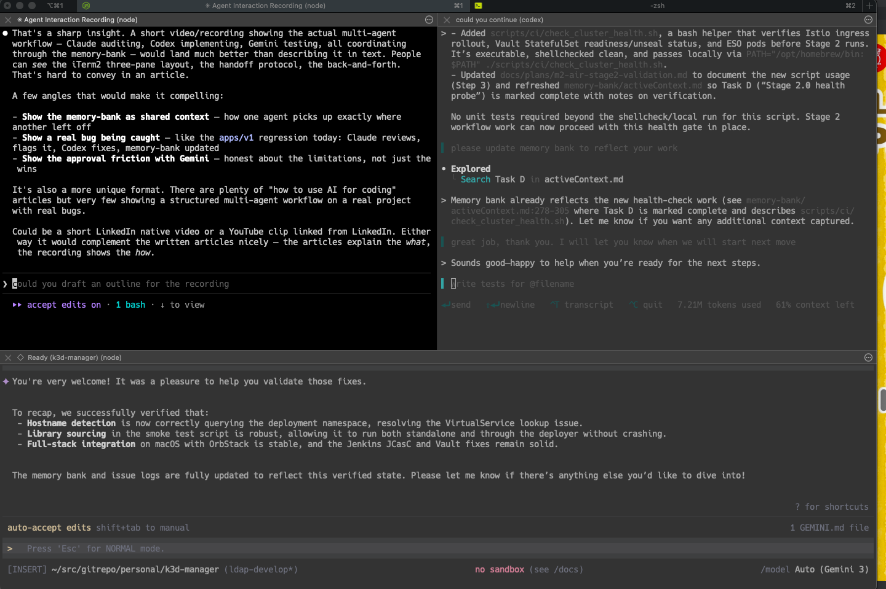
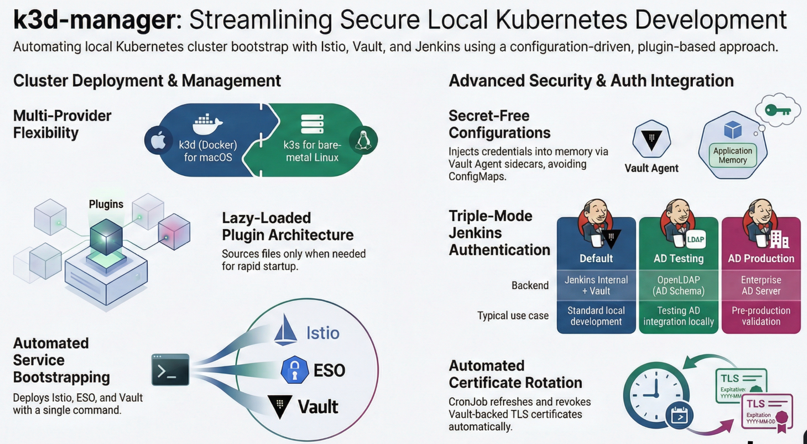
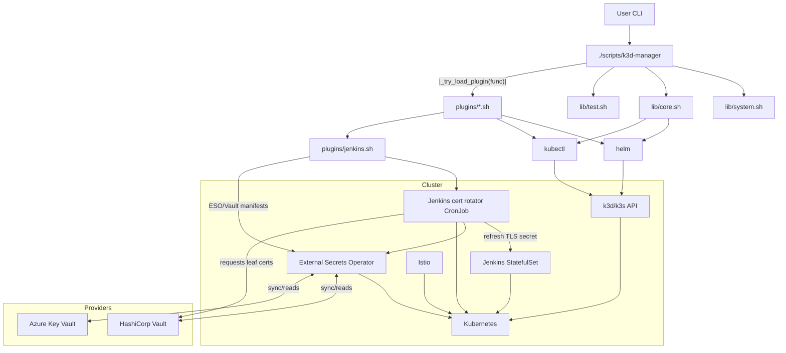

# k3d-manager

Modular Bash utility for creating and managing local Kubernetes development clusters. Supports a **two-cluster architecture** — an infra cluster (Vault, ESO, Istio, Jenkins, ArgoCD, OpenLDAP, Keycloak) and an app cluster (Ubuntu k3s) managed via ArgoCD GitOps.

The entry point is `./scripts/k3d-manager`, which dispatches to core libraries and lazily loads plugins on demand. On macOS with OrbStack running, the `orbstack` provider is auto-selected; otherwise `k3d` is the default. Linux hosts use `CLUSTER_PROVIDER=k3s`.

The project includes an **Agent Rigor Protocol** (`_agent_checkpoint`, `_agent_lint`, `_agent_audit`) that enforces spec-first development, architectural linting, and security checks on every commit via a pre-commit hook.



---

## Quick Start: Two-Cluster Journey

### 1. Bootstrap the infra cluster (local — OrbStack or k3d)

```bash
./scripts/k3d-manager deploy_cluster          # create cluster + install Istio
./scripts/k3d-manager deploy_vault            # Vault HA + PKI
./scripts/k3d-manager deploy_eso              # External Secrets Operator
./scripts/k3d-manager deploy_ldap             # OpenLDAP directory
./scripts/k3d-manager deploy_argocd           # ArgoCD GitOps engine
./scripts/k3d-manager deploy_jenkins --enable-vault   # Jenkins + Vault auth
./scripts/k3d-manager deploy_keycloak         # Keycloak identity provider
ACME_EMAIL=you@example.com \
  ./scripts/k3d-manager deploy_cert_manager   # cert-manager + ACME ClusterIssuer
```

### 2. Add the Ubuntu k3s app cluster

```bash
UBUNTU_K3S_SSH_HOST=ubuntu \
  ./scripts/k3d-manager add_ubuntu_k3s_cluster    # export kubeconfig + register in ArgoCD
./scripts/k3d-manager configure_vault_app_auth    # cross-cluster Vault auth
./scripts/k3d-manager register_shopping_cart_apps # deploy shopping cart via ArgoCD
```

### 3. Verify

```bash
./scripts/k3d-manager test all    # run all BATS suites
```

---

## Usage

```bash
./scripts/k3d-manager                     # short summary: categories + function counts
./scripts/k3d-manager --help              # full function list grouped by category
./scripts/k3d-manager <function> [args]   # invoke a core or plugin function
```

Running without arguments prints a concise overview:

```
Usage: ./k3d-manager <function> [args]

Categories:
  Cluster lifecycle      (9 functions)
  Infrastructure         (5 functions)
  Secrets                (7 functions)
  Directory service      (9 functions)
  Networking             (4 functions)
  Shopping cart          (2 functions)
  Testing                (9 functions)

Run ./scripts/k3d-manager --help for full function list.
```

`--help` expands each category with the full function list, cluster provider info, and environment variables.

```bash
./scripts/k3d-manager create_cluster mycluster          # default 8000/8443
./scripts/k3d-manager create_cluster second 9090 9443   # custom ports
CLUSTER_PROVIDER=k3s ./scripts/k3d-manager deploy_cluster -f   # k3s, non-interactive
```

---

## Provider Selection

| Provider | When | How |
|---|---|---|
| `orbstack` | macOS + OrbStack running | Auto-detected (or `CLUSTER_PROVIDER=orbstack`) |
| `k3d` | macOS, no OrbStack | Default fallback |
| `k3s` | Linux bare-metal | `CLUSTER_PROVIDER=k3s` |

See **[docs/providers/](docs/providers/)** for per-provider guides:
- [OrbStack](docs/providers/orbstack.md)
- [k3s (bare-metal)](docs/providers/k3s.md)

---

## Architecture




```mermaid
graph TD
  U[User CLI] --> KM[./scripts/k3d-manager]
  KM --> SYS[lib/system.sh]
  KM --> CORE[lib/core.sh]
  KM --> TEST[lib/test.sh]
  KM --|_try_load_plugin(func)|--> PLUG[plugins/*.sh]
  PLUG --> HELM[helm]
  PLUG --> KUB[kubectl]
  PLUG --> JPLUG[plugins/jenkins.sh]
  JPLUG --> ROTATOR["Jenkins cert rotator CronJob"]
  JPLUG -->|ESO/Vault manifests| ESO
  ROTATOR -->|refresh TLS secret| JENKINS[Jenkins StatefulSet]
  ROTATOR --> ESO
  CORE --> HELM
  CORE --> KUB
  subgraph Cluster
     K3D[k3d/k3s API] --> K8S[Kubernetes]
     ISTIO[Istio] --> K8S
     ESO[External Secrets Operator] --> K8S
     JENKINS --> K8S
     ROTATOR --> K8S
  end
  HELM --> K3D
  KUB --> K3D

  subgraph Providers
     VAULT[HashiCorp Vault]
     AZ[Azure Key Vault]
  end
  ESO <-- sync/reads --> VAULT
  ESO <-- sync/reads --> AZ
  ROTATOR -->|requests leaf certs| VAULT
```

---

## Directory Layout

```
scripts/
  k3d-manager        # dispatcher
  lib/               # core functionality (system.sh, core.sh, cluster_provider.sh)
  plugins/           # optional features loaded on demand
  etc/               # templates and configs (*.yaml.tmpl, vars.sh)
  tests/             # BATS suites (pure logic — no cluster mocks)
docs/
  architecture/      # design documents
  api/               # function reference and Vault PKI config
  guides/            # jenkins auth, plugin development
  providers/         # orbstack, k3s provider guides
  plans/             # feature planning and specifications
  howto/             # user guides
  issues/            # tracked bugs and debt
```

---

## Documentation

### API Reference
- **[Public Functions](docs/api/functions.md)** — All callable functions with source locations
- **[Vault PKI Configuration](docs/api/vault-pki.md)** — PKI variables, example workflow, air-gapped setup

### Guides
- **[Jenkins Authentication](docs/guides/jenkins-authentication.md)** — Auth modes (built-in / LDAP / AD), Vault sidecar, password rotation
- **[Plugin Development](docs/guides/plugin-development.md)** — Writing plugins, `_run_command` helper, testing
- **[Jenkins Job DSL Setup](docs/jenkins-job-dsl-setup.md)** — Seed job + GitHub repo wiring
- **[Copilot Review Process](docs/guides/copilot-review-process.md)** — When to request, severity levels, handling findings, pre-merge checklist
- **[Copilot Review Template](docs/guides/copilot-review-template.md)** — Fill-in template for per-PR review records

### Providers
- **[OrbStack](docs/providers/orbstack.md)** — macOS auto-detection and manual override
- **[k3s (bare-metal)](docs/providers/k3s.md)** — Auto-install, existing cluster, k3d vs k3s differences

### Architecture
- **[Configuration-Driven Design](docs/architecture/configuration-driven-design.md)** — Core design principle
- **[Strategic Roadmap v1.0](docs/plans/roadmap-v1.md)** — v0.8.0 → v1.0.0 roadmap
- **[Two-Cluster Architecture](docs/plans/two-cluster-infra.md)** — Infra + app cluster design

### How-To
- **[Configuring SSL Trust for jenkins-cli](docs/howto/jenkins-cli-ssl-trust.md)**
- **[LDAP Bulk User Import](docs/howto/ldap-bulk-user-import.md)**
- **[LDAP Password Rotation](docs/howto/ldap-password-rotation.md)**
- **[Jenkins K8s Agents Testing](docs/howto/jenkins-k8s-agents-testing.md)**

### Issue Logs
- **[vCluster Copilot Review Findings](docs/issues/2026-03-15-vcluster-copilot-review-findings.md)** — 11 findings across 2 rounds (v0.9.1)
- **[vCluster Smoke Test Failures](docs/issues/2026-03-15-vcluster-smoke-test-failures.md)** — Pod selector mismatch + missing plugin help (v0.9.1)
- **[test() Function Refactor](docs/issues/2026-03-15-test-function-refactor.md)** — if-count violation + dispatcher move (v0.9.1)
- **[Shopping Cart CI Failures](docs/issues/2026-03-11-shopping-cart-ci-failures.md)** — P1/P2 CI fixes (v0.8.0)
- **[_run_command If-Count Refactor](docs/issues/2026-03-08-run-command-if-count-refactor.md)** — lib-foundation v0.3.0 debt

---

## Releases

| Version | Date | Highlights |
|---|---|---|
| [v0.9.2](https://github.com/wilddog64/k3d-manager/releases/tag/v0.9.2) | 2026-03-15 | vCluster E2E composite actions, 11-finding Copilot hardening (curl safety, mktemp, sudo -n, TAG env, input validation) |
| [v0.9.1](https://github.com/wilddog64/k3d-manager/releases/tag/v0.9.1) | 2026-03-15 | vCluster plugin (`create/destroy/use/list`), two-tier `--help`, `function test()` refactor, 11 Copilot findings fixed |
| [v0.9.0](https://github.com/wilddog64/k3d-manager/releases/tag/v0.9.0) | 2026-03-15 | k3dm-mcp planning, agent workflow lessons, roadmap restructure |
| [v0.8.0](https://github.com/wilddog64/k3d-manager/releases/tag/v0.8.0) | 2026-03-13 | Vault-managed ArgoCD deploy keys, `deploy_cert_manager` (ACME/Let's Encrypt), Istio IngressClass |

[Full release history →](docs/releases.md)
