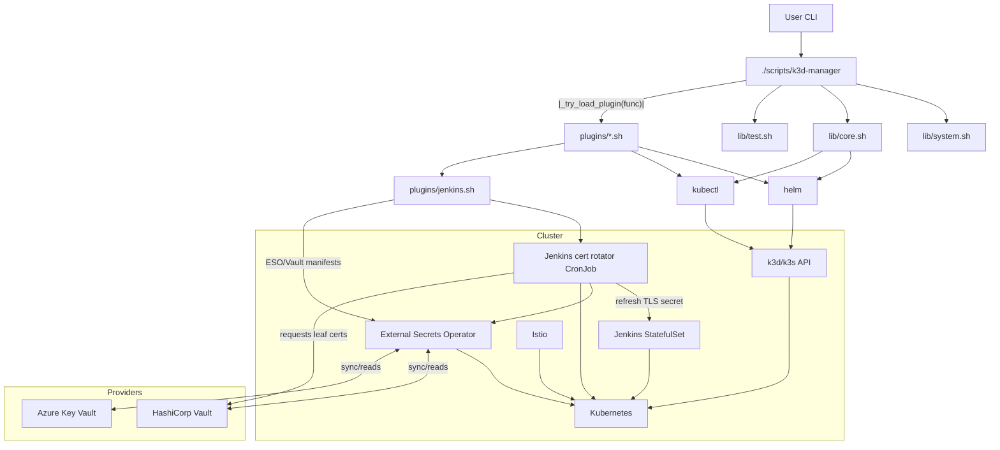

# k3d-manager

Modular Bash utility for creating and managing local Kubernetes development clusters. Supports a **two-cluster architecture** — an infra cluster (Vault, ESO, Istio, Jenkins, ArgoCD, OpenLDAP, Keycloak) and an app cluster (Ubuntu k3s) managed via ArgoCD GitOps.

The entry point is `./scripts/k3d-manager`, which dispatches to core libraries and lazily loads plugins on demand. On macOS with OrbStack running, the `orbstack` provider is auto-selected; otherwise `k3d` is the default. Linux hosts use `CLUSTER_PROVIDER=k3s`.

The project includes an **Agent Rigor Protocol** (`_agent_checkpoint`, `_agent_lint`, `_agent_audit`) that enforces spec-first development, architectural linting, and security checks on every commit via a pre-commit hook.


---

## Quick Start: Two-Cluster Journey

### 1. Bootstrap the infra cluster (local — OrbStack or k3d)

```bash
./scripts/k3d-manager deploy_cluster --confirm          # create cluster + install Istio
./scripts/k3d-manager deploy_vault --confirm            # Vault HA + PKI
./scripts/k3d-manager deploy_eso --confirm              # External Secrets Operator
./scripts/k3d-manager deploy_ldap --confirm             # OpenLDAP directory
./scripts/k3d-manager deploy_argocd --confirm           # ArgoCD GitOps engine
ENABLE_JENKINS=1 ./scripts/k3d-manager deploy_jenkins --enable-vault            # Jenkins + Vault auth
./scripts/k3d-manager deploy_keycloak --confirm         # Keycloak identity provider
ACME_EMAIL=you@example.com \
  ./scripts/k3d-manager deploy_cert_manager --confirm   # cert-manager + ACME ClusterIssuer
```

### 2. Provision the ACG sandbox (app cluster on AWS EC2)

```bash
# One-time: set AWS credentials from the ACG console in ~/.aws/credentials
acg_provision --confirm           # VPC + SG + key pair + t3.medium EC2; updates ~/.ssh/config
acg_status                        # verify instance state + k3s health
acg_extend                        # open browser to extend sandbox TTL (+4h)
acg_teardown --confirm            # terminate instance; remove ubuntu-k3s kubeconfig context
```

> Set `ACG_ALLOWED_CIDR=<your-ip>/32` to restrict SSH/6443 ingress (default: `0.0.0.0/0`).
>
> **First run:** `antigravity_acg_extend` will open the Antigravity browser and prompt for Pluralsight login as needed. Log in manually — the session cookie persists across runs until it expires. Set `K3DM_ACG_SKIP_SESSION_CHECK=1` to bypass the Antigravity session check.

### 3. Add the Ubuntu k3s app cluster

```bash
UBUNTU_K3S_SSH_HOST=ubuntu \
  ./scripts/k3d-manager add_ubuntu_k3s_cluster    # export kubeconfig + register in ArgoCD
./scripts/k3d-manager configure_vault_app_auth    # cross-cluster Vault auth
./scripts/k3d-manager register_shopping_cart_apps # deploy shopping cart via ArgoCD
```

### 4. Verify

```bash
./scripts/k3d-manager test all    # run all BATS suites
```

---

## Usage

```bash
./scripts/k3d-manager                     # short summary: categories + function counts
./scripts/k3d-manager --help              # full function list grouped by category
./scripts/k3d-manager <function> [args]   # invoke a core or plugin function
```

Running without arguments prints a concise overview:

```
Usage: ./k3d-manager <function> [args]

Categories:
  Cluster lifecycle      (9 functions)
  Infrastructure         (5 functions)
  Secrets                (7 functions)
  Directory service      (9 functions)
  Networking             (4 functions)
  Shopping cart          (2 functions)
  Testing                (9 functions)

Run ./scripts/k3d-manager --help for full function list.
```

`--help` expands each category with the full function list, cluster provider info, and environment variables.

```bash
./scripts/k3d-manager create_cluster mycluster          # default 8000/8443
./scripts/k3d-manager create_cluster second 9090 9443   # custom ports
CLUSTER_PROVIDER=k3s ./scripts/k3d-manager deploy_cluster -f   # k3s, non-interactive
```

### Safety Gates, Dry-Run, and Plans

- Running any `deploy_*` function with no arguments now shows the help text instead of executing. Pass explicit options or `--confirm` to apply the defaults, e.g. `./scripts/k3d-manager deploy_vault --confirm --namespace secrets`.
- Add `--dry-run` (or `-n`) to print every command that would run without executing, useful for reviewing changes or validating permissions. Sets `K3DM_DEPLOY_DRY_RUN=1`—set it in the environment to dry-run full sessions.
- `deploy_vault --plan` inspects the current cluster state (namespace, Helm release, Vault status, PKI/policy setup) and prints a Terraform-style plan before you run the real deployment.

---

## Provider Selection

| Provider | When | How |
|---|---|---|
| `orbstack` | macOS + OrbStack running | Auto-detected (or `CLUSTER_PROVIDER=orbstack`) |
| `k3d` | macOS, no OrbStack | Default fallback |
| `k3s` | Linux bare-metal | `CLUSTER_PROVIDER=k3s` |

See **[docs/providers/](docs/providers/)** for per-provider guides:
- [OrbStack](docs/providers/orbstack.md)
- [k3s (bare-metal)](docs/providers/k3s.md)

---

## Architecture



```mermaid
graph TD
  U[User CLI] --> KM[./scripts/k3d-manager]
  KM --> SYS[lib/system.sh]
  KM --> CORE[lib/core.sh]
  KM --> TEST[lib/test.sh]
  KM --|_try_load_plugin(func)|--> PLUG[plugins/*.sh]
  PLUG --> HELM[helm]
  PLUG --> KUB[kubectl]
  PLUG --> JPLUG[plugins/jenkins.sh]
  JPLUG --> ROTATOR["Jenkins cert rotator CronJob"]
  JPLUG -->|ESO/Vault manifests| ESO
  ROTATOR -->|refresh TLS secret| JENKINS[Jenkins StatefulSet]
  ROTATOR --> ESO
  CORE --> HELM
  CORE --> KUB
  subgraph Cluster
     K3D[k3d/k3s API] --> K8S[Kubernetes]
     ISTIO[Istio] --> K8S
     ESO[External Secrets Operator] --> K8S
     JENKINS --> K8S
     ROTATOR --> K8S
  end
  HELM --> K3D
  KUB --> K3D

  subgraph Providers
     VAULT[HashiCorp Vault]
     AZ[Azure Key Vault]
  end
  ESO <-- sync/reads --> VAULT
  ESO <-- sync/reads --> AZ
  ROTATOR -->|requests leaf certs| VAULT
```

---

## Directory Layout

```
scripts/
  k3d-manager        # dispatcher
  lib/               # core functionality (system.sh, core.sh, cluster_provider.sh)
  plugins/           # optional features loaded on demand
  etc/               # templates and configs (*.yaml.tmpl, vars.sh)
  tests/             # BATS suites (pure logic — no cluster mocks)
docs/
  architecture/      # design documents
  api/               # function reference and Vault PKI config
  guides/            # jenkins auth, plugin development
  providers/         # orbstack, k3s provider guides
  plans/             # feature planning and specifications
  howto/             # user guides
  issues/            # tracked bugs and debt
```

---

## Documentation

### API Reference
- **[Public Functions](docs/api/functions.md)** — All callable functions with source locations
- **[Vault PKI Configuration](docs/api/vault-pki.md)** — PKI variables, example workflow, air-gapped setup

### Plugins

| Plugin | Key Functions | Description |
|---|---|---|
| **ACG** | `acg_provision`, `acg_status`, `acg_extend`, `acg_teardown` | AWS ACG sandbox lifecycle — VPC + SG + EC2 provisioning; [spec](docs/plans/v0.9.6-acg-plugin.md) |
| **Antigravity** | `antigravity_install`, `antigravity_trigger_copilot_review`, `antigravity_poll_task`, `antigravity_acg_extend` | Browser automation via gemini CLI + Playwright over CDP (port 9222) — Copilot coding agent trigger, ACG sandbox TTL extend |
| **ArgoCD** | `deploy_argocd`, `deploy_argocd_bootstrap`, `register_app_cluster`, `configure_vault_argocd_repos` | GitOps engine deployment + app cluster registration + Vault repo auth |
| **Vault** | `deploy_vault`, `configure_vault_app_auth` | HashiCorp Vault HA + PKI + cross-cluster auth |
| **ESO** | `deploy_eso` | External Secrets Operator — syncs Vault/AKV secrets into Kubernetes |
| **Jenkins** | `deploy_jenkins` | Jenkins StatefulSet + Vault sidecar + ESO cert rotation CronJob |
| **LDAP** | `deploy_ldap`, `deploy_ad`, `ldap_get_user_password` | OpenLDAP or Active Directory directory service |
| **Keycloak** | `deploy_keycloak`, `test_keycloak` | Keycloak identity provider + smoke test |
| **cert-manager** | `deploy_cert_manager` | cert-manager + ACME ClusterIssuer (Let's Encrypt) |
| **vCluster** | `vcluster_create`, `vcluster_destroy`, `vcluster_use`, `vcluster_list` | Virtual cluster lifecycle on top of the infra cluster |
| **Tunnel** | `tunnel_start`, `tunnel_stop`, `tunnel_status` | autossh persistent tunnel with launchd boot persistence |
| **Azure** | `create_az_sp`, `deploy_azure_eso`, `eso_akv` | Azure Service Principal + ESO with Azure Key Vault backend |
| **SMB CSI** | `deploy_smb_csi` | SMB CSI driver for Windows-compatible persistent volumes |
| **Shopping Cart** | `register_shopping_cart_apps`, `deploy_app_cluster` | Demo app cluster bootstrap — k3sup EC2 install + ArgoCD app registration |
| **Hello** | `hello` | Minimal example plugin — Hello World; reference for new plugin authors |

### Guides
- **[Jenkins Authentication](docs/guides/jenkins-authentication.md)** — Auth modes (built-in / LDAP / AD), Vault sidecar, password rotation
- **[Plugin Development](docs/guides/plugin-development.md)** — Writing plugins, `_run_command` helper, testing
- **[Jenkins Job DSL Setup](docs/jenkins-job-dsl-setup.md)** — Seed job + GitHub repo wiring
- **[Copilot Review Process](docs/guides/copilot-review-process.md)** — When to request, severity levels, handling findings, pre-merge checklist
- **[Copilot Review Template](docs/guides/copilot-review-template.md)** — Fill-in template for per-PR review records

### Providers
- **[OrbStack](docs/providers/orbstack.md)** — macOS auto-detection and manual override
- **[k3s (bare-metal)](docs/providers/k3s.md)** — Auto-install, existing cluster, k3d vs k3s differences

### Architecture
- **[Configuration-Driven Design](docs/architecture/configuration-driven-design.md)** — Core design principle
- **[Strategic Roadmap v1.0](docs/plans/roadmap-v1.md)** — v0.8.0 → v1.0.0 roadmap
- **[Two-Cluster Architecture](docs/plans/two-cluster-infra.md)** — Infra + app cluster design

### How-To

**Secrets & Identity**
- **[Vault](docs/howto/vault.md)** — Deploy, init, PKI cert issuance, cross-cluster auth
- **[ESO](docs/howto/eso.md)** — Deploy, connect a secret store, troubleshoot sync failures
- **[Keycloak](docs/howto/keycloak.md)** — Deploy, smoke test, LDAP federation

**GitOps & CI/CD**
- **[ArgoCD](docs/howto/argocd.md)** — Deploy, register app cluster, configure deploy keys
- **[cert-manager](docs/howto/cert-manager.md)** — Deploy, Vault + ACME issuers, certificate lifecycle

**Cloud Sandbox**
- **[ACG Sandbox](docs/howto/acg.md)** — Full lifecycle: provision → k3s install → extend TTL → teardown
- **[Antigravity Browser Automation](docs/howto/antigravity.md)** — First-run setup, ACG extend, Copilot agent trigger

**Networking**
- **[SSH Tunnel](docs/howto/tunnel.md)** — autossh setup, launchd boot persistence, app cluster access

**Jenkins**
- **[Configuring SSL Trust for jenkins-cli](docs/howto/jenkins-cli-ssl-trust.md)** — Trust Vault-issued certs for `jenkins-cli.jar`
- **[Jenkins K8s Agents Testing](docs/howto/jenkins-k8s-agents-testing.md)** — Verify dynamic pod agents in the infra cluster

**LDAP / Directory**
- **[LDAP Bulk User Import](docs/howto/ldap-bulk-user-import.md)** — Import users from a CSV into OpenLDAP
- **[LDAP Password Rotation](docs/howto/ldap-password-rotation.md)** — Rotate user passwords via the rotator CronJob

---

## Issue Logs

All tracked bugs, investigations, and debt are filed in **[docs/issues/](docs/issues/)** — one Markdown file per incident.

Recent entries:

| Date | Issue | Component |
|---|---|---|
| 2026-03-28 | [Copilot PR #52 review findings](docs/issues/2026-03-28-copilot-pr52-review-findings.md) | antigravity — yolo always-on, sleep not stubbed, tmpdir not isolated, model order wrong in 3 places |
| 2026-03-28 | [ACG domain redirection](docs/issues/2026-03-28-acg-domain-redirection.md) | antigravity — `learn.acloud.guru` retired; redirects to Pluralsight |
| 2026-03-27 | [ACG session E2E test failure](docs/issues/2026-03-27-acg-session-e2e-fail.md) | antigravity — nested gemini agent blocked by Plan Mode + path restriction |
| 2026-03-26 | [Copilot PR #51 review findings](docs/issues/2026-03-26-copilot-pr51-review-findings.md) | antigravity, ldap, agent_rigor — 7 fixed, 5 deferred to lib-foundation v0.3.14 |
| 2026-03-24 | [Antigravity Copilot agent validation](docs/issues/2026-03-24-antigravity-copilot-agent-validation.md) | antigravity — auth isolation verdict: Playwright CLI cannot inherit browser cookies |

[All issues →](docs/issues/)

---

## Releases

| Version | Date | Highlights |
|---|---|---|
| v0.9.18 | 2026-03-28 | Pluralsight URL migration — `_ACG_SANDBOX_URL` + `_antigravity_ensure_acg_session` updated to `app.pluralsight.com` |
| [v0.9.17](https://github.com/wilddog64/k3d-manager/releases/tag/v0.9.17) | 2026-03-27 | Antigravity model fallback (`gemini-2.5-flash` first), ACG session check, nested agent fix (`--approval-mode yolo` + workspace temp path) |
| [v0.9.16](https://github.com/wilddog64/k3d-manager/releases/tag/v0.9.16) | 2026-03-26 | Antigravity IDE + CDP browser automation — gemini CLI + Playwright engine; `antigravity_install`, `antigravity_trigger_copilot_review`, `antigravity_acg_extend`; ldap stdin hardening |

<details>
<summary>Older releases</summary>

| Version | Date | Highlights |
|---|---|---|
| [v0.9.11](https://github.com/wilddog64/k3d-manager/releases/tag/v0.9.11) | 2026-03-22 | dynamic plugin CI — `detect` job skips cluster tests for docs-only PRs; maps plugin changes to targeted smoke tests |
| [v0.9.10](https://github.com/wilddog64/k3d-manager/releases/tag/v0.9.10) | 2026-03-22 | if-count allowlist elimination (jenkins) — 8 helpers extracted; allowlist now `system.sh` only |
| [v0.9.9](https://github.com/wilddog64/k3d-manager/releases/tag/v0.9.9) | 2026-03-22 | if-count allowlist elimination — 11 ldap helpers + 6 vault helpers extracted; allowlist down to `system.sh` only |
| [v0.9.7](https://github.com/wilddog64/k3d-manager/releases/tag/v0.9.7) | 2026-03-22 | lib-foundation sync (`--interactive-sudo`, `_run_command_resolve_sudo`), `deploy_cluster` no-args guard, `bin/` `_kubectl` wrapper, BATS stub fixes, Copilot PR #41 findings |
| [v0.9.6](https://github.com/wilddog64/k3d-manager/releases/tag/v0.9.6) | 2026-03-22 | ACG sandbox plugin (`acg_provision/status/extend/teardown`), VPC/SG idempotency, `ACG_ALLOWED_CIDR` security, kops-for-k3s reframe |
| [v0.9.5](https://github.com/wilddog64/k3d-manager/releases/tag/v0.9.5) | 2026-03-21 | `deploy_app_cluster` — EC2 k3sup install + kubeconfig merge + ArgoCD registration; replaces manual rebuild |
| [v0.9.4](https://github.com/wilddog64/k3d-manager/releases/tag/v0.9.4) | 2026-03-21 | autossh tunnel plugin, ArgoCD cluster registration, smoke-test gate, `_run_command` TTY fallback, lib-foundation v0.3.3 |
| [v0.9.3](https://github.com/wilddog64/k3d-manager/releases/tag/v0.9.3) | 2026-03-16 | TTY fix (`_DCRS_PROVIDER` global), lib-foundation v0.3.2 subtree, cluster rebuild smoke test |
| [v0.9.2](https://github.com/wilddog64/k3d-manager/releases/tag/v0.9.2) | 2026-03-15 | vCluster E2E composite actions, 11-finding Copilot hardening (curl safety, mktemp, sudo -n, input validation) |
| [v0.9.1](https://github.com/wilddog64/k3d-manager/releases/tag/v0.9.1) | 2026-03-15 | vCluster plugin (`create/destroy/use/list`), two-tier `--help`, `function test()` refactor, 11 Copilot findings fixed |
| [v0.9.0](https://github.com/wilddog64/k3d-manager/releases/tag/v0.9.0) | 2026-03-15 | k3dm-mcp planning, agent workflow lessons, roadmap restructure |
| [v0.8.0](https://github.com/wilddog64/k3d-manager/releases/tag/v0.8.0) | 2026-03-13 | Vault-managed ArgoCD deploy keys, `deploy_cert_manager` (ACME/Let's Encrypt), Istio IngressClass |

[Full release history →](docs/releases.md)

</details>
