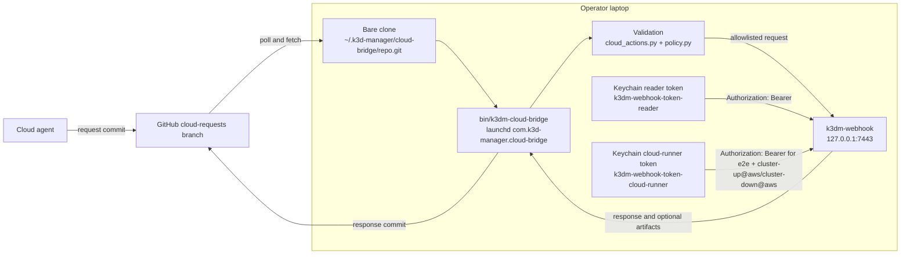
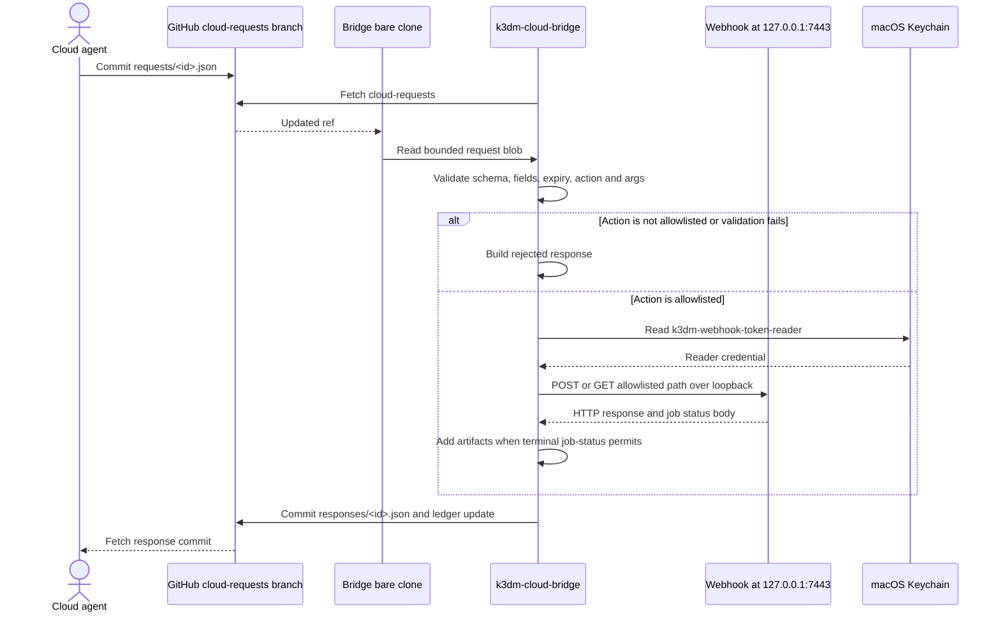

# Architecture: Cloud Session Request Bridge

## Purpose

The bridge uses a pull model for cloud sessions: a cloud agent has GitHub access, but no
inbound route to the operator's laptop. The agent writes a bounded request to the orphan
`cloud-requests` branch, and the laptop-side poller fetches that branch every 5 seconds while
active, then every 60 seconds after 10 idle minutes.
The bridge calls the local webhook with a reader credential and commits the response back to
the same branch. Nothing inbound reaches the laptop, and the request branch is not a shell.

## Components



`bin/k3dm-cloud-bridge` reads request JSON from the bare clone, validates the exact six-field
contract and the action-specific argument patterns, then calls `http://127.0.0.1:7443`. The
reader token is resolved from Keychain item `k3dm-webhook-token-reader`; the scoped cloud-runner
token is resolved from `k3dm-webhook-token-cloud-runner` and is used only for `make-e2e-remote`,
`make-e2e`, `sandbox-up` and `sandbox-down`; the latter two are fixed to provider `aws`. The bridge
does not accept a token from the branch. Terminal `job-status` responses
may add `artifacts/` paths for the structured summary and scrubbed `junit.xml`; raw `output.log`
is not implemented.

## One request, end to end



Slow `health` calls run on one background worker so the main loop can serve other requests. The
worker performs only the webhook HTTP call; the main thread performs all git/index writes. When a
queued Make response includes a `job_id`, the main thread records it in `ledger/watching.txt`.
Each tick follows up to `MAX_PER_TICK` watched jobs through the reader-token `job-status` path and
writes `responses/<request_id>.final.json` with terminal status and artifacts, or an expiry response
after the declared timeout plus ten minutes.

## Trust boundaries

| Boundary | What crosses it | What enforces it | Source file |
|---|---|---|---|
| Untrusted branch content | Request JSON, including action and args | Exact required fields, size cap, schema, expiry, regex validation, and consumed request ids | `bin/k3dm-cloud-bridge` |
| Action allowlist | A request becomes one fixed webhook route and, where applicable, fixed action or Make target | `ACTION_ALLOWLIST`; unknown actions and extra or missing args are rejected | `scripts/lib/webhook/cloud_actions.py`, `bin/k3dm-cloud-bridge` |
| Credential-bound role | Reader bearer credential and an optional role header | Reader token sets the ceiling; `X-K3DM-Role` can only narrow it; route and target policy still applies. Cloud-runner lifecycle capabilities bind the provider (`cluster-up@aws`, `cluster-down@aws`). | `bin/k3dm-cloud-bridge`, `scripts/lib/webhook/auth.py`, `scripts/lib/webhook/policy.py` |
| Loopback-only webhook | The bridge's HTTP call to port 7443 | The bridge connects to `127.0.0.1`; the webhook's authentication and route policy remain in force | `bin/k3dm-cloud-bridge`, `bin/k3dm-webhook` |
| Agent capability boundary | Read-only health, status, diagnostics and allowlisted test/query requests | The bridge has no lifecycle or mutating action in its allowlist, and the reader credential cannot satisfy higher role floors | `scripts/lib/webhook/cloud_actions.py`, `scripts/lib/webhook/make_targets.py`, `scripts/lib/webhook/policy.py` |

The agent can never choose an arbitrary URL, shell command, Make target outside the allowlist,
provider, destructive target, or administrator/operator-only target through this channel. The only
lifecycle actions are fixed `sandbox-up` and `sandbox-down` calls to the disposable ACG sandbox;
`sandbox-down` keeps the hub. A response commit is data returned to the branch; it is not permission
to execute a second action.

## Operations

Bootstrap the orphan branch, then install the user LaunchAgent:

```bash
make init-cloud-requests
make install-cloud-bridge
```

Use `make restart-cloud-bridge` after code or template changes. `make uninstall-cloud-bridge`
boots out the agent and removes its plist; requests already on the branch become inert. The
LaunchAgent writes both stdout and stderr to `~/Library/Logs/k3dm-cloud-bridge.log`. The bridge
polls and pushes through the bare clone at `~/.k3d-manager/cloud-bridge/repo.git`, leaving the
working tree untouched.

For the request schema, action table, token setup and operator procedures, see
[`docs/howto/cloud-session-requests.md`](../howto/cloud-session-requests.md).
