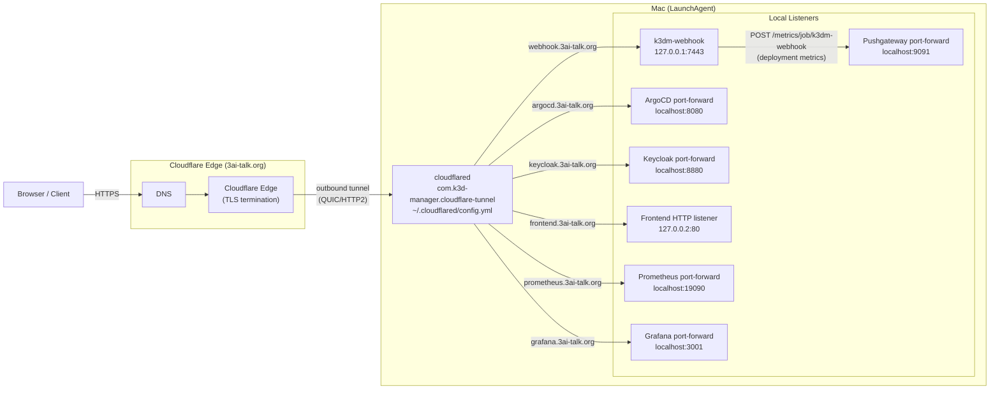
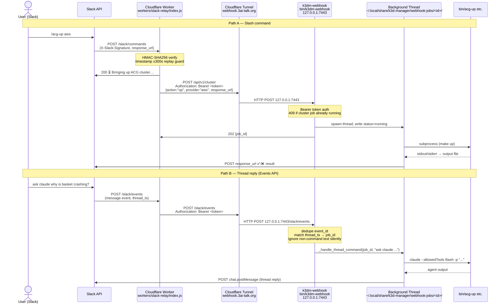

# Architecture: Cloudflare Tunnel + Slack Relay

Two related subsystems that together expose local k3d-manager services to the
internet and accept Slack slash commands that drive cluster lifecycle.

---

## 1 — Cloudflare Named Tunnel (ingress)

`cloudflared` runs as a macOS LaunchAgent (`com.k3d-manager.cloudflare-tunnel`)
installed by `bin/acg-up` Step 10h. It dials outbound to the Cloudflare edge
(no inbound firewall holes required) and routes public hostnames to local
port-forwarded services on the Mac.



### Key files

| File | Purpose |
|------|---------|
| `scripts/etc/cloudflared/config.yml` | Static ingress rules (hostname → local service) |
| `~/.cloudflared/<tunnel-id>.json` | Tunnel credentials (restored from Keychain by `acg-up`) |
| `~/.cloudflared/cert.pem` | Cloudflare origin cert (restored from Keychain) |
| `bin/acg-up` Step 10h | Installs/updates the Cloudflare tunnel LaunchAgent plist |
| `bin/acg-up` Step 14c | Installs Pushgateway port-forward LaunchAgent (localhost:9091) |
| `bin/acg-down` | Unloads and removes all LaunchAgent plists |

---

## 2 — Slack Relay → Webhook Server (command path)

There are two inbound paths from Slack to the webhook:

- **Slash commands** — user types `/acg-up` etc. in any channel; Slack sends a form POST to the Cloudflare Worker which verifies and forwards.
- **Thread replies** — user types in an active job thread; Slack sends a `message` event via the Events API; the Worker forwards it to `/slack/events` on the webhook.



### Routes handled by k3dm-webhook

| Method | Path | Action |
|--------|------|--------|
| `POST` | `/api/v1/cluster` | `bin/acg-up` or `bin/acg-down` (action: up\|down\|kill) |
| `POST` | `/api/v1/cluster-status` | cluster health check → Slack |
| `POST` | `/api/v1/cluster-refresh` | `bin/acg-refresh` — restore tunnel + credentials |
| `POST` | `/api/v1/cluster-resume` | `bin/acg-up` from last checkpoint |
| `POST` | `/api/v1/ask` | AI agent question (claude / gemini / codex) → Slack |
| `POST` | `/api/v1/argocd-upgrade` | ArgoCD helm upgrade (chart_version, stage: acg\|infra) |
| `POST` | `/slack/events` | Slack Events API — thread replies, URL verification |
| `GET`  | `/api/v1/health` | JSON smoke-test report (used by `bin/acg-status`) |
| `GET`  | `/api/v1/status/<job_id>` | Poll job status + last 2 KB of output |

### Auth chain

```
Slack → Worker    HMAC-SHA256(SLACK_SIGNING_SECRET)  timestamp replay guard
Worker → Webhook  Authorization: Bearer <token>       stored in CF Worker secrets
Webhook token     macOS Keychain (k3dm-webhook-token) read by bin/k3dm-webhook at startup
```

### Key files

| File | Purpose |
|------|---------|
| `workers/slack-relay/index.js` | Cloudflare Worker — signature verify + relay |
| `bin/k3dm-webhook` | Python HTTP server — auth, job dispatch, Slack reply |
| `bin/k3dm-webhook-setup` | One-time setup: generate token, install LaunchAgent plist |
| `~/Library/LaunchAgents/com.k3d-manager.webhook.plist` | LaunchAgent keeping webhook server alive |
| `~/.local/share/k3d-manager/webhook-jobs/<id>/` | Job state: `status`, `output`, `action`, `response_url`, `thread_ts` |

### Concurrent job guard

`POST /api/v1/cluster` returns `409` if a cluster job (`up` or `down`) is
already running. The Worker surfaces this to Slack as:

> ⚠️ cluster job already running — use /acg-status to check progress

---

## 3 — Deployment Metrics (Prometheus Pushgateway)

After every `acg-up`, `acg-down`, or `acg-resume` job completes, `k3dm-webhook`
pushes metrics to the Prometheus Pushgateway running in the cluster.

```
k3dm-webhook (Mac) ──POST──► localhost:9091 (LaunchAgent port-forward)
                                     │
                              Pushgateway pod (monitoring ns, ubuntu-k3s)
                                     │
                              Prometheus scrapes /metrics
                                     │
                              Grafana dashboard "k3dm Deployment Metrics"
```

### Metrics pushed

| Metric | Type | Labels | Description |
|--------|------|--------|-------------|
| `k3dm_deployment_duration_seconds` | gauge | `action`, `provider`, `status`, `job_id` | Wall-clock seconds for the job |
| `k3dm_deployment_last_timestamp_seconds` | gauge | `action`, `provider`, `status` | Unix timestamp of last completion |
| `k3dm_deployment_success` | gauge | `action`, `provider`, `job_id` | `1` = success, `0` = failed |

Push group key: `/metrics/job/k3dm-webhook/instance/{action}-{provider}` — one entry per
action+provider pair; the latest completed job overwrites the previous.

### Environment override

`K3DM_PUSHGATEWAY_URL` (default: `http://localhost:9091`) — set to `""` to disable metric
pushes without changing code.

### Key files

| File | Purpose |
|------|---------|
| `bin/k3dm-webhook` | `_push_metrics()` — pushes after each job `_finish()` |
| `bin/acg-up` Step 14c | Installs Pushgateway port-forward LaunchAgent (localhost:9091) |
| `bin/acg-down` | Unloads Pushgateway port-forward LaunchAgent |
| `scripts/plugins/observability.sh` | `_deploy_pushgateway_acg()` — Helm install + dashboard ConfigMap |
| `scripts/etc/helm/observability/kube-prometheus-stack-acg-values.yaml` | Adds `pushgateway` scrape job |
| `scripts/etc/grafana/dashboards/k3dm-deployments-configmap.yaml` | Grafana dashboard ConfigMap |
