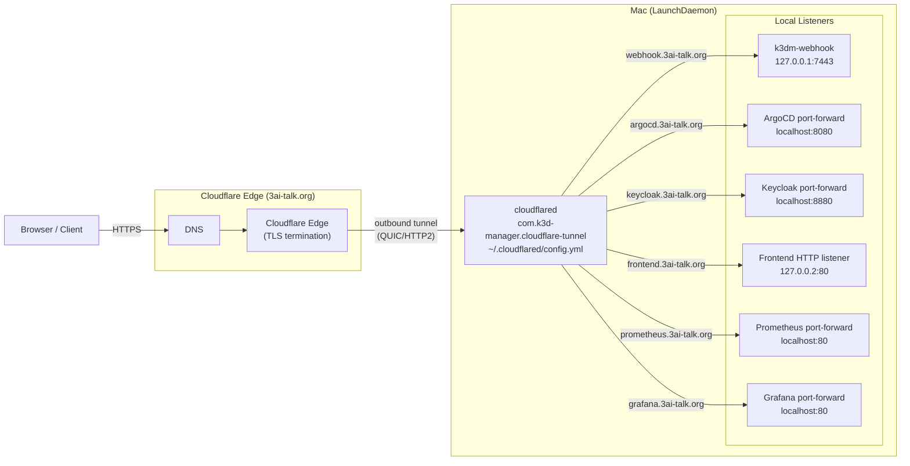
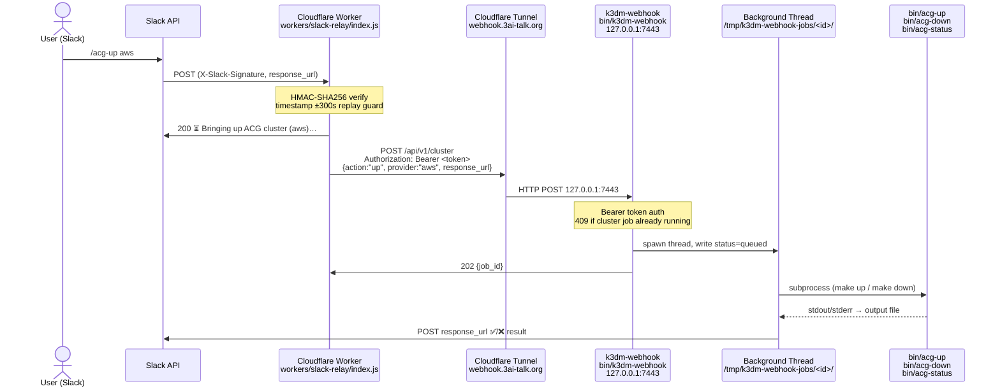

# Architecture: Cloudflare Tunnel + Slack Relay

Two related subsystems that together expose local k3d-manager services to the
internet and accept Slack slash commands that drive cluster lifecycle.

---

## 1 — Cloudflare Named Tunnel (ingress)

`cloudflared` runs as a macOS LaunchDaemon (`com.k3d-manager.cloudflare-tunnel`)
installed by `bin/acg-up` Step 10h. It dials outbound to the Cloudflare edge
(no inbound firewall holes required) and routes public hostnames to local
port-forwarded services on the Mac.



### Key files

| File | Purpose |
|------|---------|
| `scripts/etc/cloudflared/config.yml` | Static ingress rules (hostname → local service) |
| `~/.cloudflared/<tunnel-id>.json` | Tunnel credentials (restored from Keychain by `acg-up`) |
| `~/.cloudflared/cert.pem` | Cloudflare origin cert (restored from Keychain) |
| `bin/acg-up` Step 10h | Installs/updates the LaunchDaemon plist |
| `bin/acg-down` | Unloads and removes the LaunchDaemon plist |

---

## 2 — Slack Relay → Webhook Server (command path)

Slack slash commands travel through a Cloudflare Worker that verifies the
Slack signature and forwards to the local webhook server. The webhook server
runs each command as a background job and posts the result back to Slack via
`response_url`.



### Routes handled by k3dm-webhook

| Method | Path | Action |
|--------|------|--------|
| `POST` | `/api/v1/cluster` | `bin/acg-up` or `bin/acg-down` (action: up\|down) |
| `POST` | `/api/v1/cluster-status` | cluster health check → Slack |
| `POST` | `/api/v1/argocd-upgrade` | ArgoCD helm upgrade (chart_version, stage: acg\|infra) |
| `POST` | `/api/v1/analyze` | Claude AI log analysis → Slack |
| `GET`  | `/api/v1/status/<job_id>` | Poll job status + last 2 KB of output |

### Auth chain

```
Slack → Worker    HMAC-SHA256(SLACK_SIGNING_SECRET)  timestamp replay guard
Worker → Webhook  Authorization: Bearer <token>       stored in CF Worker secrets
Webhook token     macOS Keychain (k3dm-webhook-token) read by bin/k3dm-webhook at startup
```

### Key files

| File | Purpose |
|------|---------|
| `workers/slack-relay/index.js` | Cloudflare Worker — signature verify + relay |
| `bin/k3dm-webhook` | Python HTTP server — auth, job dispatch, Slack reply |
| `bin/k3dm-webhook-setup` | One-time setup: generate token, install LaunchAgent plist |
| `~/Library/LaunchAgents/com.k3d-manager.webhook.plist` | LaunchAgent keeping webhook server alive |
| `/tmp/k3dm-webhook-jobs/<id>/` | Job state: `status`, `output`, `action`, `response_url` |

### Concurrent job guard

`POST /api/v1/cluster` returns `409` if a cluster job (`up` or `down`) is
already running. The Worker surfaces this to Slack as:

> ⚠️ cluster job already running — use /acg-status to check progress
