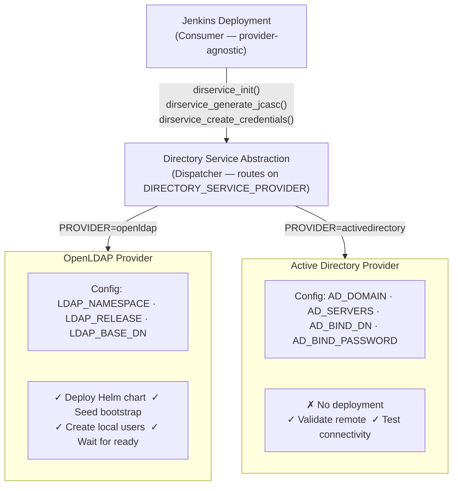
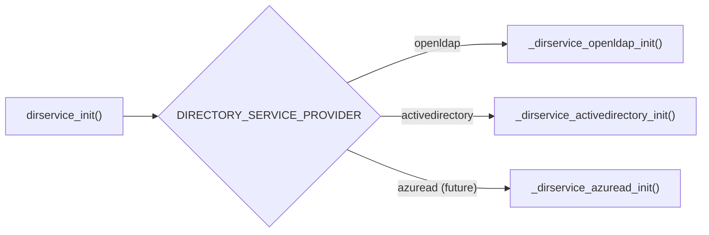
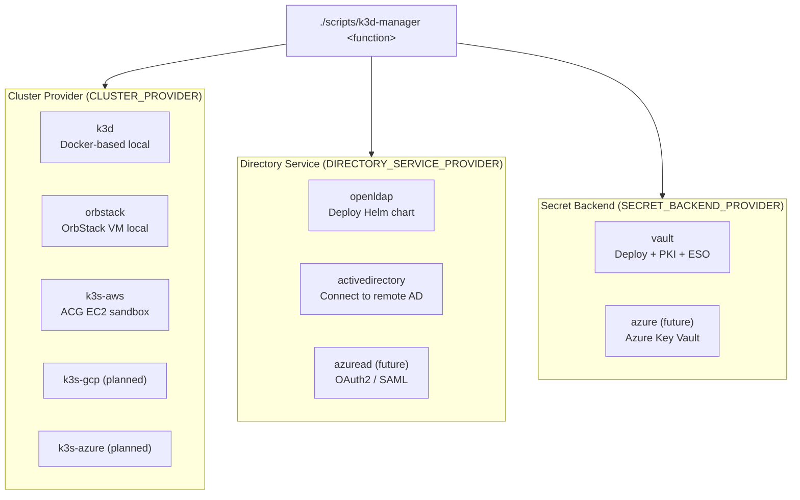

# Configuration-Driven Design Architecture

**Date**: 2025-11-05
**Status**: Implemented (Phase 1)
**Related**: [Directory Service Interface](../plans/directory-service-interface.md), [Secret Backend Abstraction](../plans/secret-backend-interface.md)

---

## Overview

k3d-manager uses a **configuration-driven design** where system behavior is determined by configuration data rather than code changes. This enables the same codebase to support multiple providers (OpenLDAP, Active Directory, Azure AD, Vault, Azure Key Vault, etc.) without modifying consumer code.

## Core Principle

> **Configuration determines behavior. Code provides interface.**

The system behavior is entirely controlled by:
1. **Provider selection** → Environment variable (e.g., `DIRECTORY_SERVICE_PROVIDER`)
2. **Provider-specific configuration** → Environment variables or config files
3. **Common interface** → Same function calls regardless of provider

## Architecture Diagram



## Key Benefits

### 1. Separation of Concerns

**Consumer code** (e.g., Jenkins deployment) doesn't need to know provider details:

```bash
# jenkins.sh - Provider-agnostic
function deploy_jenkins() {
   if [[ "$enable_ldap" -eq 1 ]]; then
      dirservice_init             # Don't care HOW
      dirservice_generate_jcasc   # Don't care WHAT format
   fi
}
```

**Provider code** handles all specifics:
- Local vs remote deployment
- Protocol differences (LDAP vs LDAPS vs OAuth2)
- Jenkins plugin configuration
- Connectivity validation

### 2. Zero Code Changes for New Providers

Adding a new directory service provider requires:
- Create new provider file: `scripts/lib/dirservices/newprovider.sh`
- Implement provider interface functions
- Add configuration variables
- **NO changes to Jenkins plugin or other consumers**

Example - Adding Azure AD:
```bash
# Create provider file
# scripts/lib/dirservices/azuread.sh
function _dirservice_azuread_init() {
   # OAuth2 flow instead of LDAP
   # Completely different implementation
   # But same interface!
}

# Usage: same command, different config
DIRECTORY_SERVICE_PROVIDER=azuread \
  ./scripts/k3d-manager deploy_jenkins --enable-ldap
```

### 3. Configuration as Documentation

Configuration variables are self-documenting:

```bash
# OpenLDAP config → tells you "this deploys locally"
LDAP_NAMESPACE=directory
LDAP_RELEASE=openldap
LDAP_BASE_DN=dc=home,dc=org

# Active Directory config → tells you "this connects remotely"
AD_DOMAIN=corp.example.com
AD_SERVERS=dc1.corp.example.com,dc2.corp.example.com
AD_BIND_DN=CN=svc-jenkins,OU=ServiceAccounts,DC=corp,DC=example,DC=com
```

### 4. Environment-Specific Behavior

Same command, different environments, different results:

```bash
# Development (local Mac)
export DIRECTORY_SERVICE_PROVIDER=openldap
./scripts/k3d-manager deploy_jenkins --enable-ldap
# Result: Deploy everything locally in k3d

# Production (corporate network)
export DIRECTORY_SERVICE_PROVIDER=activedirectory
./scripts/k3d-manager deploy_jenkins --enable-ldap
# Result: Connect to existing enterprise AD
```

## Configuration Schema Pattern

Each provider defines its own configuration schema:

### OpenLDAP Configuration
```bash
LDAP_NAMESPACE=directory        # Where to deploy
LDAP_RELEASE=openldap          # Helm release name
LDAP_BASE_DN=dc=home,dc=org    # LDAP base DN
LDAP_ADMIN_PASSWORD=secret     # Admin password
LDAP_ORG_NAME="Home Org"       # Organization name
LDAP_BOOTSTRAP_LDIF=/path      # Initial users/groups
```

### Active Directory Configuration
```bash
AD_DOMAIN=corp.example.com                          # AD domain
AD_SERVERS=dc1.corp.example.com,dc2.corp.example.com # DCs
AD_BASE_DN=DC=corp,DC=example,DC=com               # Search base
AD_BIND_DN=CN=svc-jenkins,OU=ServiceAccounts,...  # Service account
AD_BIND_PASSWORD=SecurePass123                     # Password
AD_USE_SSL=1                                       # Use LDAPS
AD_PORT=636                                        # LDAP port
```

### Azure AD Configuration (Future)
```bash
AZURE_AD_TENANT_ID=xxxxxxxx-xxxx-xxxx-xxxx-xxxxxxxxxxxx
AZURE_AD_CLIENT_ID=yyyyyyyy-yyyy-yyyy-yyyy-yyyyyyyyyyyy
AZURE_AD_CLIENT_SECRET=zzzzzzzzzzzzzzzzzzzzzzzzzzzzzzzz
AZURE_AD_REDIRECT_URI=https://jenkins.example.com/securityRealm/finishLogin
```

## What Configuration Drives

### Deployment Behavior
- **OpenLDAP**: Deploys Helm chart, seeds LDIF, waits for pods
- **Active Directory**: Validates connectivity, no deployment
- **Azure AD**: Validates app registration, configures OAuth2

### Connection Parameters
- Protocol (LDAP, LDAPS, OAuth2, SAML)
- Endpoints (servers, ports, URLs)
- Authentication method (simple bind, Kerberos, OAuth2)

### Jenkins Integration
- Which Jenkins plugin to use (`ldap` vs `active-directory` vs `saml`)
- How to inject credentials (env vars vs file mounts vs OAuth tokens)
- Security realm configuration format

### Validation Strategy
- **Local services**: Wait for pod ready, check service endpoints
- **Remote services**: Test connectivity, validate credentials
- **Cloud services**: Verify API access, check app registration

## Real-World Example

### Scenario 1: Developer on Mac (No Corporate Network)

```bash
# Configuration: Use local OpenLDAP
export DIRECTORY_SERVICE_PROVIDER=openldap

./scripts/k3d-manager deploy_jenkins --enable-ldap

# What happens:
# 1. deploy_jenkins calls dirservice_init()
# 2. Abstraction routes to _dirservice_openldap_init()
# 3. OpenLDAP provider:
#    - Deploys Helm chart to k3d
#    - Creates admin credentials
#    - Seeds test users (alice, bob, charlie)
#    - Waits for pods ready
# 4. Jenkins configured: ldap://openldap.directory.svc:1389
# Result: Self-contained dev environment
```

### Scenario 2: Same Developer, Corporate VPN

```bash
# Configuration: Use corporate Active Directory
export DIRECTORY_SERVICE_PROVIDER=activedirectory
export AD_DOMAIN=corp.example.com
export AD_SERVERS=dc1.corp.example.com,dc2.corp.example.com
export AD_BIND_DN="CN=svc-jenkins,OU=ServiceAccounts,DC=corp,DC=example,DC=com"
export AD_BIND_PASSWORD="SecurePassword123"

./scripts/k3d-manager deploy_jenkins --enable-ldap

# What happens:
# 1. deploy_jenkins calls dirservice_init()  ← SAME CALL
# 2. Abstraction routes to _dirservice_activedirectory_init()
# 3. Active Directory provider:
#    - Tests connectivity to dc1.corp.example.com:636
#    - Validates service account can bind
#    - Validates user/group read permissions
#    - Stores credentials in Vault
#    - NO deployment (AD already exists)
# 4. Jenkins configured: ldaps://dc1.corp.example.com:636
# Result: Authenticates against corporate AD
```

### Key Insight: Same Code, Different Behavior

The `deploy_jenkins` function **has no idea** which provider is used. It calls the abstraction layer, which dispatches based on configuration. Each provider implements behavior appropriate for its type.

## Design Pattern: Strategy Pattern via Configuration

This is the **Strategy Pattern** from design patterns, implemented through configuration:

```bash
# Configuration-Driven Strategy (bash)
function dirservice_init() {
  provider=$(_directory_service_provider)  # Read config
  _dirservice_${provider}_init "$@"        # Dispatch
}
```



## Extending to Other Abstractions

This pattern is used throughout k3d-manager:



### Secret Backend Abstraction
```bash
# Vault backend (local deployment)
SECRET_BACKEND_PROVIDER=vault
./scripts/k3d-manager deploy_jenkins

# Azure Key Vault (remote)
SECRET_BACKEND_PROVIDER=azure
AZURE_KEYVAULT_NAME=my-vault
./scripts/k3d-manager deploy_jenkins

# Same interface, different behavior
```

### Cluster Provider Abstraction
```bash
# k3d (Docker-based, macOS)
CLUSTER_PROVIDER=k3d
./scripts/k3d-manager deploy_cluster

# k3s (systemd-based, Linux)
CLUSTER_PROVIDER=k3s
./scripts/k3d-manager deploy_cluster

# Different infrastructure, same command
```

## Comparison: Code-Driven vs Configuration-Driven

### Code-Driven Approach (Anti-Pattern)
```bash
# Bad: Tightly coupled
function deploy_jenkins_with_ldap() { ... }
function deploy_jenkins_with_ad() { ... }
function deploy_jenkins_with_azure_ad() { ... }

# Adding new provider = modify all consumers
# N providers × M consumers = N×M code changes
```

### Configuration-Driven Approach (Our Design)
```bash
# Good: Loosely coupled
function deploy_jenkins() {
  dirservice_init  # Provider determined by config
}

# Adding new provider = one new file
# N providers × M consumers = N code changes (M unchanged)
```

## Data vs Code

### Configuration Data Controls:
- Deploy or connect
- Where to deploy (namespace, release)
- How to connect (servers, ports, SSL)
- What credentials to use
- Which Jenkins plugin to configure
- How to validate (local vs remote)

### Code Provides:
- Common interface (abstraction layer)
- Provider-specific implementation
- Error handling and validation
- Integration with other systems

## Summary

Configuration-driven design enables:

1. **Configuration determines behavior** - deploy vs connect, local vs remote
2. **Code provides interface** - consistent API regardless of provider
3. **Providers implement specifics** - each handles its own details
4. **Zero coupling** - consumers don't know provider details
5. **Infinite extensibility** - add providers without modifying consumers

This approach is perfect for DevOps tools where different environments need different behaviors with the same commands.

## Related Documentation

- [Directory Service Interface Design](../plans/directory-service-interface.md) - Provider interface specification
- [Secret Backend Abstraction](../plans/secret-backend-interface.md) - Similar pattern for secret backends
- [Active Directory Integration Plan](../plans/active-directory-integration.md) - AD provider implementation plan
- [CLAUDE.md](../../CLAUDE.md) - Project overview and development guidelines
