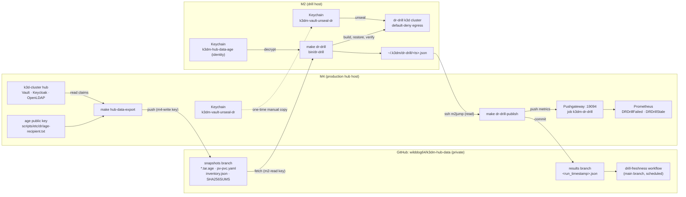
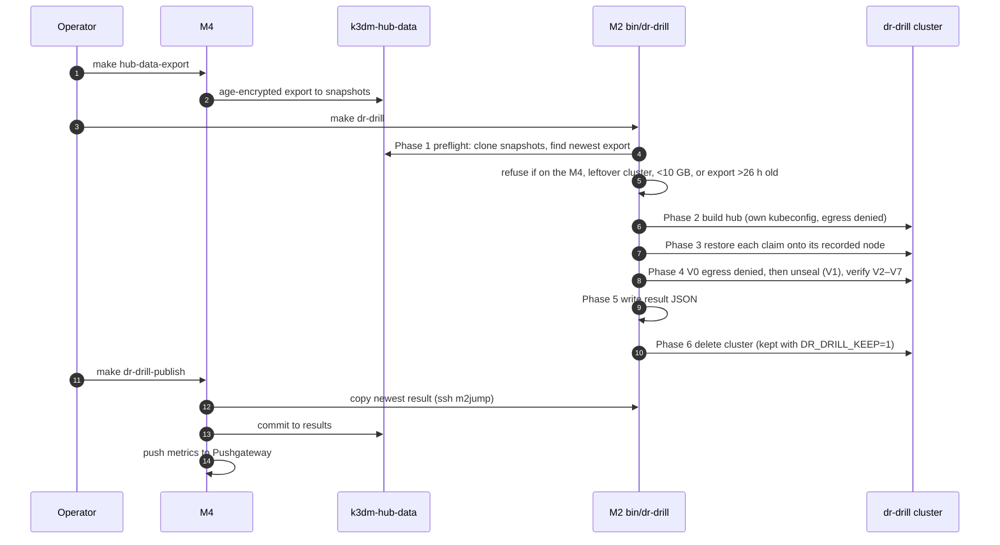

# Architecture: Weekly Hub DR Drill

## Purpose

The drill proves, every week, that the hub's data can be restored. It restores the encrypted
Vault, Keycloak and LDAP claims into a throwaway `dr-drill` k3d cluster on the M2, checks them
(V0–V7), records the restore time (RTO) and the data age (RPO), and publishes the result to the
hub's monitoring. The production hub on the M4 is only read, never changed.

How to run it: [`docs/howto/hub-dr-drill.md`](../howto/hub-dr-drill.md).
Design decisions: [`docs/plans/v1.43.0-hub-dr-drill.md`](../plans/v1.43.0-hub-dr-drill.md).

## Components

## Drill sequence

## Trust boundaries

| Item | Lives on | Never |
|---|---|---|
| age identity (decrypt key) | M2 Keychain + Bitwarden note | on the M4 (except a real restore), in git, in logs |
| age public key | git (`scripts/etc/dr/age-recipient.txt`) | — (not a secret) |
| Vault unseal shards | Keychain `k3dm-vault-unseal-dr` on both Macs | in the export, in git; a drill never writes them |
| Export contents | GitHub, encrypted | plaintext Kubernetes Secrets (`state.db` is not exported) |
| Write access to the data repo | M4 deploy key `m4-write` | the M2 (read-only key `m2-read`) |
| Metrics | M4 → hub Pushgateway | pushed from the M2 |

The drill cluster gets a default-deny egress policy in every drill namespace before any workload
starts. Check V0 proves egress is blocked before Vault is unsealed, so restored data cannot leave
the M2.

## Monitoring

- **Alerts:** `DRDrillFailed` (latest drill failed) and `DRDrillStale` (no drill for 8 days),
  both email only (`platform-warning`).
- **Independent check:** the data repo's scheduled `drill-freshness` workflow fails, and GitHub
  emails, when the newest result is older than 8 days or failed. It works even if the M4 is down.
- **Dashboard:** `k3dm DR Drill`, planned for v1.46.0
  (`docs/plans/v1.46.0-dr-drill-dashboard.md`).

## Failure modes

| Symptom | Where it shows | Meaning |
|---|---|---|
| `leftover drill cluster exists` | Phase 1 | A kept cluster from an earlier run; `k3d cluster delete dr-drill` on the M2 |
| `failed: phase2` | result JSON | The drill hub did not build; read the `[hub-up]` step that failed |
| `operator init … cannot be recovered` | Phase 2 | Vault initialised but the keys were lost; delete the cluster and rerun |
| `could not record the inventory` | `make hub-data-export` on the M4 | The Vault, Keycloak or LDAP count failed; nothing was pushed. Fix that service, then export again |
| `failed: unseal` | result JSON | The M2 Keychain shards do not match the export's Vault; repeat the shard copy |
| `failed: V0` | result JSON | A drill pod reached the internet; the egress policy is not working |
