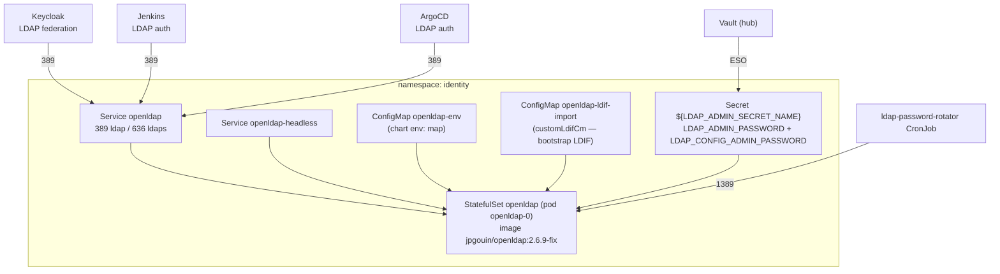

# OpenLDAP Directory Service (Symas)

The directory service backs every login in the infra cluster — Keycloak federation,
Jenkins auth, and ArgoCD auth all bind to it. As of **v1.22.0** it runs on the
community **Symas** OpenLDAP image via the `jp-gouin/openldap-stack-ha` chart, replacing
the retired Bitnami image.

> Directory backend is selected by `DIRECTORY_SERVICE_PROVIDER` (`openldap` / `activedirectory`).
> This document covers the `openldap` provider. Deploy with `./scripts/k3d-manager deploy_ldap --confirm`.

---

## Why the migration

`bitnamilegacy/openldap` is frozen — Bitnami moved its maintained images to a paid
catalog in August 2025, so the `bitnamilegacy/*` namespace no longer receives CVE
patches. The hub Trivy report showed **66 criticals** on that image, the single worst
offender in the cluster, and bumping the `-rN` tag within `bitnamilegacy` cannot clear
them because the namespace is stale.

**Decision (2026-08-03):** migrate to the actively-maintained Symas-based
`jpgouin/openldap:2.6.9-fix` image via the `jp-gouin/openldap-stack-ha` chart (`4.3.3`).
The cutover is designed to be transparent to consumers — the in-cluster service name and
ports are pinned so nothing downstream has to change its connection string.

Source finding: [`docs/bugs/2026-08-02-openldap-legacy-image-cve-and-trivy-alert-grouping.md`](../bugs/2026-08-02-openldap-legacy-image-cve-and-trivy-alert-grouping.md).

---

## Topology

The single stable contract for every consumer is the host
**`openldap.identity.svc.cluster.local:389`** (TLS on `636`). That name is pinned via the
chart's `fullnameOverride: openldap`, so the underlying workload can change without
touching Keycloak / Jenkins / ArgoCD config.

---

## What changed vs. the Bitnami chart

The migration crosses a chart boundary, so several internal names moved. Consumers are
insulated from all of it because the **service name and ports are unchanged**.

| Concern | Bitnami (old) | Symas `openldap-stack-ha` 4.3.3 (current) |
|---|---|---|
| Image | `bitnamilegacy/openldap:2.6.10-debian-12-r4` | `jpgouin/openldap:2.6.9-fix` |
| Chart | `openldap-bitnami` @ `1.5.3` | `jp-gouin/openldap-stack-ha` @ `4.3.3` |
| Workload kind | Deployment | **StatefulSet** (pod `openldap-0`) |
| Service name | `openldap-openldap-bitnami` | **`openldap`** (`fullnameOverride`) |
| Container name | `openldap-bitnami` | `openldap-stack-ha` |
| Pod label `app.kubernetes.io/name` | `openldap-bitnami` | `openldap-stack-ha` |
| Service ports | 389 / 636 | **389 / 636 (unchanged)** |
| Container ports | 1389 / 1636 | **1389 / 1636 (unchanged)** |
| Admin creds | `envFrom.secretRef` | `global.existingSecret` → same `envFrom.secretRef` |
| Env shape | `extraEnv` list + `envFrom` | `global.*` + `env:` map (ConfigMap `openldap-env`) |
| LDIF bootstrap | Vault→ESO Secret + `mount_ldif_secret` | `customLdifCm` ConfigMap mounted at `/cm-ldifs/`, applied on first boot |
| Subcharts | none | `ltb-passwd` / `phpldapadmin` / `replication` — all **disabled** |

The chart contract above was rendered from `helm template` against the real chart, not
copied from its docs — the values file (`scripts/etc/ldap/values.yaml.tmpl`) tracks that
rendered ground truth. The full migration spec, including exact value blocks, lives at
[`docs/plans/v1.22.0-openldap-symas-migration.md`](../plans/v1.22.0-openldap-symas-migration.md).

---

## Credentials

- **Admin / config passwords** are sourced from Vault and synced into the
  `${LDAP_ADMIN_SECRET_NAME}` Secret by ESO. The chart consumes it via
  `global.existingSecret`, which needs **two** keys: `LDAP_ADMIN_PASSWORD` and
  `LDAP_CONFIG_ADMIN_PASSWORD`.
- Passwords are generated **delimiter-safe (hex)**. The Symas chart templates several
  values through `sed`, and a `/` or `&` in a password corrupts the rendered manifest;
  hex generation keeps the payload free of `sed` metacharacters. See
  [`docs/issues/2026-08-05-openldap-chart-password-sed-delimiter.md`](../issues/2026-08-05-openldap-chart-password-sed-delimiter.md).
- The platform users `admin` / `developer` / `operator` are seeded from a **durable**
  Vault-backed bootstrap (`bootstrap-basic-schema.ldif`) so they survive the chart swap
  and any future StatefulSet re-create — the seed is idempotent, not one-shot.

---

## Consumer wiring

Every consumer resolves the directory through a single overridable host variable, all now
defaulted to the pinned Symas service name:

| Consumer | Variable | Default |
|---|---|---|
| Keycloak | `KEYCLOAK_LDAP_HOST` | `openldap.identity.svc.cluster.local` |
| Jenkins | (rendered in `values-ldap.yaml.tmpl`) | `openldap.identity.svc.cluster.local` |
| ArgoCD | `ARGOCD_LDAP_HOST` | `openldap.identity.svc.cluster.local` |
| Password rotator | `LDAP_ROTATION_PORT` | `1389` (container port, in-pod) |

Keycloak federation policy and the password-rotator pod-selector labels were reconciled to
the new service on cutover — see
[`docs/issues/2026-08-05-openldap-consumer-reconciliation.md`](../issues/2026-08-05-openldap-consumer-reconciliation.md).

---

## Operations

- **Deploy / re-create:** `./scripts/k3d-manager deploy_ldap --confirm`
- **Read a user password:** `./scripts/k3d-manager ldap_get_user_password <user>`
- **Bulk user import:** [LDAP Bulk User Import](../howto/ldap-bulk-user-import.md)
- **Password rotation:** [LDAP Password Rotation](../howto/ldap-password-rotation.md)

---

## Related

- [Configuration-Driven Design](configuration-driven-design.md) — the design principle these templates follow
- [Two-Cluster Architecture](../plans/two-cluster-infra.md) — where the directory service sits in the infra cluster
