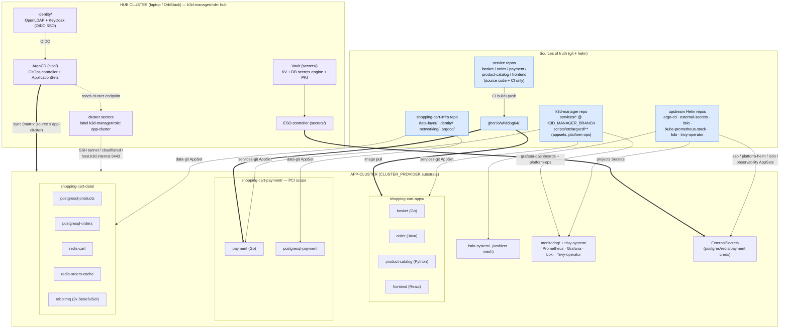
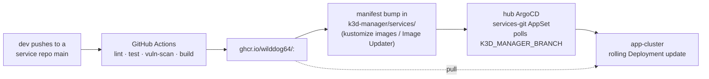
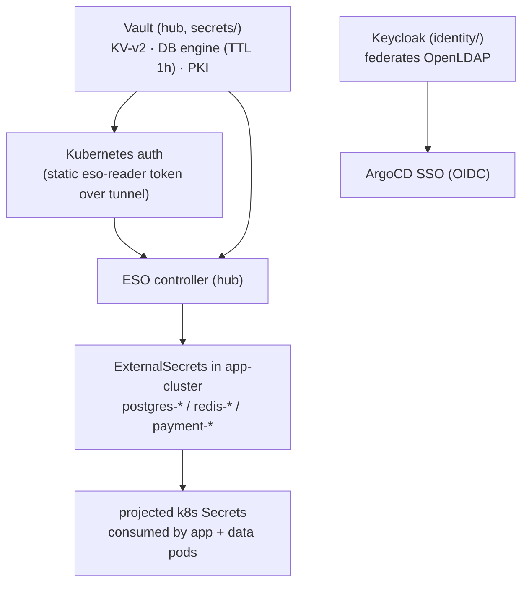
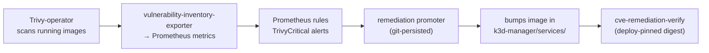

# Shopping-Cart Deployment Architecture (end-to-end)

**Last updated:** 2026-08-14
**Status:** Living document — the authoritative, current picture of how the shopping-cart
platform is deployed by k3d-manager. Supersedes the two-cluster snapshot in
`shopping-cart-infra/docs/architecture.md` (2026-03), which predates the
manifests-in-k3d-manager and multi-substrate model.

This is the **one complete diagram** spanning both repos: where every piece of deployed
state originates (`shopping-cart-infra` vs `k3d-manager/services`), how it reaches a
cluster, and how the runtime pieces talk to each other.

---

## 0. The one-paragraph model

k3d-manager runs a **hub-and-spoke GitOps** system. A single **hub cluster** (your laptop)
runs ArgoCD, Vault, ESO, and the identity stack. Every workload cluster ("app-cluster") is
registered to the hub as an ArgoCD cluster secret labelled `k3d-manager/role: app-cluster`.
A set of **ApplicationSets** on the hub use *matrix generators* — `(git/helm source) ×
(every app-cluster)` — so the same manifests fan out to whichever substrate is active
(`CLUSTER_PROVIDER`). The application microservice manifests live **in `k3d-manager/services/*`**;
the stateful data-layer manifests live **in `shopping-cart-infra/data-layer`**. Vault is the
root of trust; ESO projects short-TTL credentials into the app-cluster. Nothing but git and
Helm repos is a source of truth — no manifests are `kubectl apply`-ed by hand.

---

## 1. Complete deployment topology

**How to read it:** every arrow into the app-cluster is an ArgoCD sync driven by an
ApplicationSet on the hub. The label on the arrow is the ApplicationSet name and the box it
leaves is the source of truth. The dashed hub→app-cluster edge is the network path ArgoCD
uses to reach the workload cluster's API server.

---

## 2. What deploys what — the ApplicationSet map

All ApplicationSets live in `k3d-manager/scripts/etc/argocd/applicationsets/` and run on the
hub. Each uses a **matrix generator**: a git-directory or Helm generator crossed with a
`clusters` generator selecting `k3d-manager/role: app-cluster`. That cross-product is why one
set of manifests deploys to every registered app-cluster automatically.

| ApplicationSet | Source (repo / chart) | Target namespace | Deploys |
|---|---|---|---|
| `services-git` | **k3d-manager** `services/*` @ `${K3D_MANAGER_BRANCH}` | `shopping-cart-apps`, `shopping-cart-payment` | basket, order, payment, product-catalog, frontend, namespace |
| `data-git` | **shopping-cart-infra** `data-layer/` | `shopping-cart-data` | postgres ×3, redis ×2, rabbitmq |
| `eso` | `charts.external-secrets.io` (Helm) | `secrets` | External Secrets Operator |
| `platform-helm` | `argo-helm` (Helm) | `cicd` | ArgoCD (self-managed) |
| `istio-ambient` | `istio-release` charts (base, istiod, cni, ztunnel) | `istio-system` | Istio ambient mesh |
| `observability` / `observability-acg` | kube-prometheus-stack, loki, trivy-operator (Helm) | `monitoring`, `trivy-system` | Prometheus, Grafana, Loki, Trivy-operator |
| `grafana-dashboards-hub` / `-acg` | **k3d-manager** `scripts/etc/argocd/platform-ops` | `monitoring` | CVE dashboards + platform-ops jobs |

> **Two-repo split (the crux):** application **code** lives in the per-service repos, but the
> **deployment manifests** for the apps live in `k3d-manager/services/*`, while the
> **data-layer manifests** live in `shopping-cart-infra/data-layer`. `services-git` excludes
> `services/shopping-cart-identity` (identity is a hub platform service, not an app workload).

> ⚠️ **Release gotcha:** `${K3D_MANAGER_BRANCH}` freezes to whatever branch was checked out
> when the set was last applied. Manifests committed on a newer branch are **inert** until the
> ApplicationSets are re-applied for **both** the hub and ACG variants. Reapplying the sets is a
> required release step — confirm with `argocd_check_values_branch`.

---

## 3. GitOps + image flow

- CI in each service repo builds and pushes `ghcr.io/wilddog64/<service>:<sha>`; it does **not**
  deploy — ArgoCD polls on its own schedule.
- The Deployment manifest that references the image lives in `k3d-manager/services/<svc>`.
  ArgoCD Image Updater / kustomize `images` overrides pin the running tag
  (`ignoreApplicationDifferences` on `.spec.source.kustomize.images` keeps ArgoCD from
  fighting the Image Updater).
- Per-Application patches (applied by the AppSet, not committed to the service manifest):
  replica cap to fit small nodes, and `ghcr-pull-secret` injection for private images.

---

## 4. Secrets + identity

- **Vault is the root of trust.** DB creds are dynamically issued (TTL 1h, max 24h); ESO
  refreshes the k8s Secret before expiry. Redis passwords are static KV secrets.
- Over the tunnel, Vault's Kubernetes-auth CA validation can't complete, so ESO falls back to a
  static `eso-reader`-scoped token — a known tunnel-architecture limitation.
- Keycloak federates OpenLDAP and is ArgoCD's OIDC provider (Dex disabled); the `groups` claim
  maps to ArgoCD RBAC.

---

## 5. Substrates (`CLUSTER_PROVIDER`) and connectivity

The app-cluster is substrate-agnostic — the same ApplicationSets deploy to whichever provider is
active. Provider libs live in `k3d-manager/scripts/lib/providers/`.

| Provider | Substrate | Role today | Ingress / connectivity |
|---|---|---|---|
| `orbstack` / `k3d` | local containers | hub + local app-cluster | port-forward, `host.k3d.internal:6443` |
| `k3s` | local k3s / VM | app-cluster | SSH tunnel |
| `k3s-aws` | ACG ephemeral sandbox | throwaway app-cluster (Tier-2 e2e) | reverse tunnel; **never** registered to hub permanently |
| `k3s-hostinger` | persistent VPS | public app-cluster | cloudflared named tunnel |
| `k3s-gcp` / `k3s-az` | cloud VM | app-cluster (experimental) | tunnel / nip.io |
| `k3s-oci` | — | **descoped** (no Always-Free instance) | — |

- **ACG sandboxes are ephemeral** (4h +4h). They are self-contained for Tier-2 e2e and must
  **never** register to the hub (would leave orphan Applications). Hub deregistration of an ACG
  cluster is handled by `_k3s_aws_deregister_cluster` (deletes only `ubuntu-k3s` hub objects).
- **hostinger** is the persistent public surface; a single cloudflared connector on the tunnel
  fronts frontend/product-images. Split-brain (a stray launchd connector) is a known 502 mode.

---

## 6. CVE remediation loop (platform-ops)

- Trivy findings become Prometheus metrics/alerts; the promoter resolves a clean candidate image
  and commits the bump into `services/<svc>`, which ArgoCD then syncs.
- `image_repository` label shape differs between the inventory (`org/repo`) and remediation
  (`ghcr.io/...`) series — joins must `label_replace` or silently no-op.
- **v1.26.0 (scoped):** cosign sign+attest closes the loop — a Kyverno verify gate (staged
  Audit→Enforce) plus a promoter verify step will require signed images before promotion.

---

## 7. Relationship to `shopping-cart-infra/docs/architecture.md`

That doc (2026-03) remains useful for **data-layer**, **RabbitMQ exchange design**, and
**per-service DB ownership** detail. Where the two disagree, **this doc wins** on:

- **Manifest location** — apps are in `k3d-manager/services/*`, not each repo's `k8s/base/`.
- **Control plane** — hub-and-spoke ArgoCD with matrix ApplicationSets, not a single root
  Application per repo.
- **Substrates** — many providers (ACG, hostinger, cloud), not just OrbStack + Parallels.
- **Observability + CVE** — deployed and live, not "planned".

---

## References

- ApplicationSets: `scripts/etc/argocd/applicationsets/*.yaml`
- Service manifests: `services/*`
- Provider libs: `scripts/lib/providers/*.sh`
- Data-layer manifests: `shopping-cart-infra/data-layer/`
- CVE pipeline: `docs/architecture/cve-remediation-pipeline.md`
- Ingress/port-forward: `docs/architecture/ingress-port-forwarding.md`
- Interview-prep guides: `docs/guides/interview-prep/`
