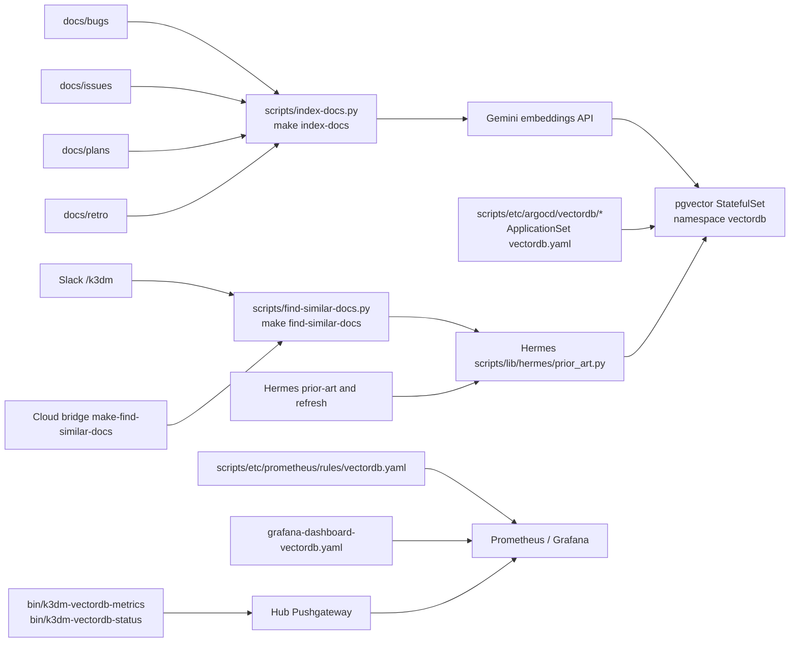
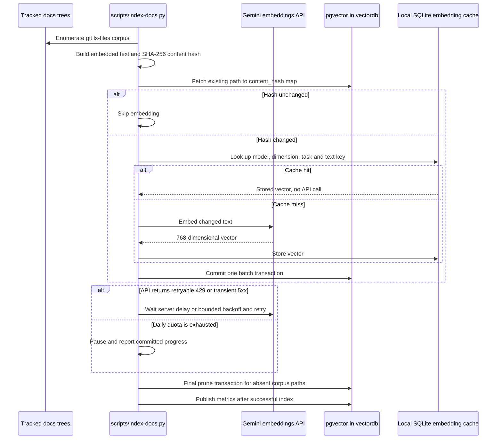
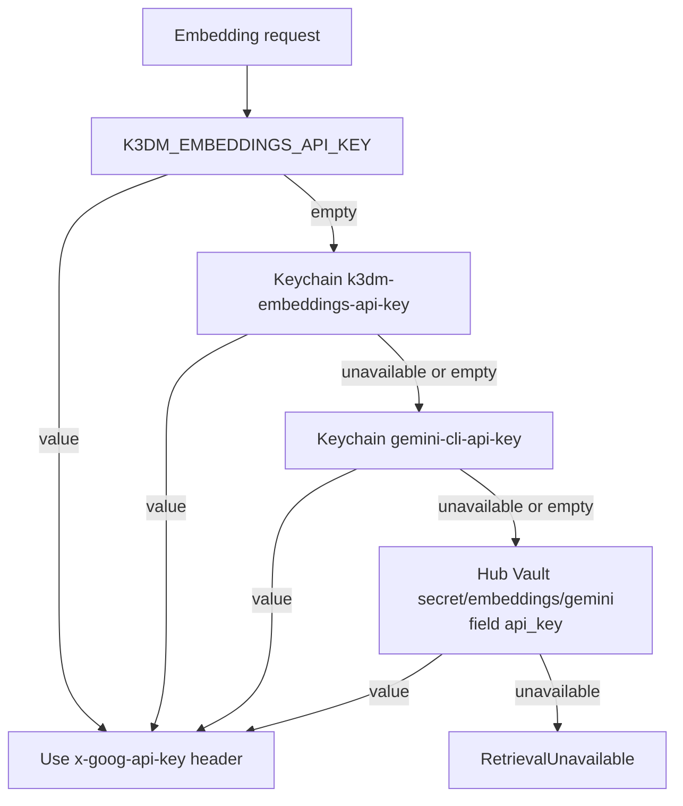

# Architecture: Documentation Vector Store

## Purpose

The vector store provides similarity search across `docs/bugs`, `docs/issues`, `docs/plans` and
`docs/retro` to find possible prior art before filing a duplicate. Retrieval is advisory in
every caller: a result is something to read, never a gate that suppresses a document or a
Hermes run. The pgvector database is a rebuildable cache derived from tracked Markdown, not a
system of record.

## Components

The ApplicationSet deploys one hub-only `pgvector/pgvector:pg17` StatefulSet, its ClusterIP
Service and 10Gi PVC in namespace `vectordb`; the manifests are under
`scripts/etc/argocd/vectordb/`, and the generator is
`scripts/etc/argocd/applicationsets/vectordb.yaml`. Slack `/k3dm` exposes the reader-tier query
target, and the cloud bridge exposes the corresponding `make-find-similar-docs` action. The
operator-only `make index-docs` target is separate from those query entry points.

Metrics are published by `bin/k3dm-vectordb-metrics` from the read-only facts emitted by
`bin/k3dm-vectordb-status`. Prometheus rules and the `scripts/etc/argocd/platform-ops/grafana-dashboard-vectordb.yaml` ConfigMap
show reachability, corpus drift, index age and ingestion state; Pushgateway retains the last
published values, so those panels are explicitly historical observations.

## Index run

Each batch is committed independently, so a later failure leaves completed batches available for
the next run. A quota pause does not mean the store or credential is broken; rerunning after the
daily reset resumes from the stored hashes. The final prune is separate, so a failed embedding
run does not delete rows.

Every vector is also kept in a local SQLite cache at `~/.cache/k3dm/embeddings.sqlite`, keyed by
model, dimension, task type and text. Rebuilding the store after a hub loss therefore reads vectors
from that cache and spends no embeddings quota for unchanged text. The cache lives on the operator's
Mac, not in the cluster, so it needs its own copy: `make embed-cache-backup DEST=...` and
`make embed-cache-restore SRC=...` copy it off and merge it back, `make embed-cache-seed` fills an empty cache from
the store, and `make embed-cache-stats` / `make embed-cache-prune` inspect and trim it. See
[`docs/howto/find-prior-art.md`](../howto/find-prior-art.md).

## Credential resolution

The order is implemented at call time in `scripts/lib/hermes/prior_art.py`: environment, the
two Keychain items in order, then hub Vault. The key is never a command-line flag. The Vault
fallback reads the root token from the `vault-root` Kubernetes Secret and sends it to `vault-0`
on stdin; it does not create a credential cycle through the Keychain.

## Failure modes

| Symptom | Meaning | Where documented |
|---|---|---|
| Retrieval reports no credential or names an unavailable source | Environment, Keychain, and then hub Vault were tried in order and none supplied a usable embeddings key | [`The embeddings credential`](../guides/vector-store.md#the-embeddings-credential) |
| Index says `paused` and reports a daily quota | The embeddings API's daily allowance is spent; already committed batches remain valid | [`Re-indexing, and what it costs`](../guides/vector-store.md#re-indexing-and-what-it-costs) |
| Index says `unavailable` after a store error | The pgvector pod or its `psql` path could not be reached; callers retain their advisory fallback | [`How the store is reached, and why there is no Postgres driver`](../guides/vector-store.md#how-the-store-is-reached-and-why-there-is-no-postgres-driver) |
| Rows, corpus docs or index age are missing from Grafana | The publisher could not determine a field, or its last publication is stale; missing metrics are not zero | [`The metrics publisher`](../guides/vector-store.md#the-metrics-publisher), [`Hub metrics and dashboard`](../guides/vector-store.md#hub-metrics-and-dashboard) |
| ExternalSecret is not ready or `vectordb-0` is not ready | The store's Vault-backed database credentials or pod readiness is unhealthy | [`Hub metrics and dashboard`](../guides/vector-store.md#hub-metrics-and-dashboard) |
| Similarity results are noisy or miss a duplicate | Retrieval is an advisory cache with measured false positives and misses; inspect the candidate and continue the normal dedup workflow | [`Measuring retrieval quality`](../guides/vector-store.md#measuring-retrieval-quality) |
