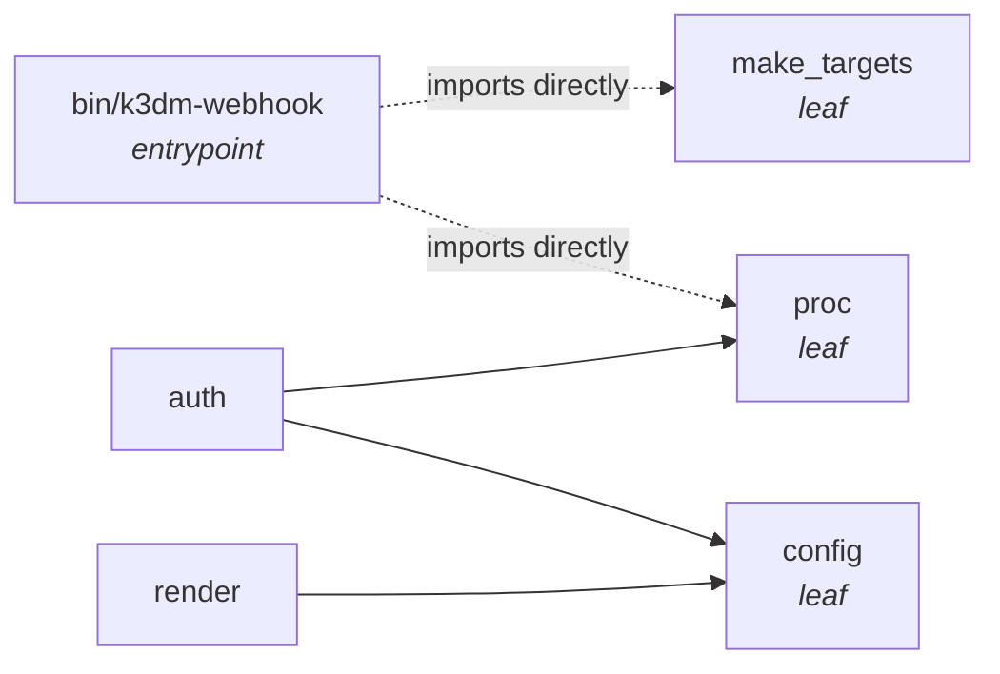
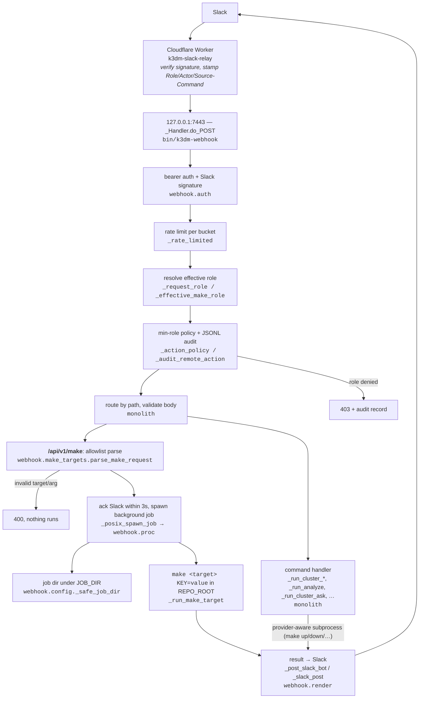

# Webhook Server Architecture

**Component:** `bin/k3dm-webhook` + `scripts/lib/webhook/`
**Status:** modularization Phase 1 landed (v1.13.0), extended by `make_targets` (v1.34.0); Phases 2–5 pending
**Related specs:** [`docs/plans/v1.13.0-webhook-modularization.md`](../plans/v1.13.0-webhook-modularization.md) (umbrella),
`v1.13.0-webhook-modularization-phase1.md` (config), `-render.md` (render), `-auth.md` (proc + auth),
[`docs/plans/v1.34.0-slack-k3dm-make-command.md`](../plans/v1.34.0-slack-k3dm-make-command.md) (`/k3dm` make allowlist)

This document describes the webhook server **as it currently exists** — what has been
extracted into the package, what still lives in the monolith, and the seams the remaining
phases will cut along. Line numbers and counts are measured against the tree, not the
original spec.

---

## What it is

`bin/k3dm-webhook` is a single-process Python HTTP server (stdlib
`http.server.ThreadingHTTPServer`, no framework) bound to `127.0.0.1:7443`. It runs under
launchd (`scripts/etc/launchd/com.k3d-manager.webhook.plist.tmpl`) and is fronted by the
Cloudflare `k3dm-slack-relay` Worker, which verifies Slack requests and proxies them here
(see [`docs/architecture/cloudflare-slack-relay.md`](cloudflare-slack-relay.md)).

It is the execution backend for Slack slash commands and thread commands — cluster
lifecycle (`cluster-up/down/refresh/resume/status`), diagnostics, failure analysis,
CVE remediation, the multi-agent `/ask` `/claude` `/gemini` `/codex` handlers, and — since
v1.34.0 — **`/k3dm`, which runs an allowlisted Makefile target**. The Makefile is now the
operator interface the webhook exposes, rather than each operation growing its own route.

> **Operational note:** launchd runs whatever `bin/k3dm-webhook` was on disk when it last
> started — it does **not** auto-reload after a `git pull`/merge. Run `make restart-webhook`
> after any change. See [`docs/howto/slack-slash-commands.md`](../howto/slack-slash-commands.md).

---

## Module layout after Phase 1

The refactor keeps `bin/k3dm-webhook` as the entrypoint and process host, and pulls
**pure, low-risk helpers** into an importable package at `scripts/lib/webhook/`. The
entrypoint wires the package onto `sys.path` before importing:

```python
# bin/k3dm-webhook:27
sys.path.insert(0, str(Path(__file__).resolve().parent.parent / "scripts" / "lib"))
from webhook.config       import (...)
from webhook.render       import (...)
from webhook.proc         import _spawn_capture_text
from webhook.auth         import (...)
from webhook.make_targets import (MAKE_JOB_TIMEOUT_DEFAULT, MAKE_TARGETS,
                                  make_target_help, parse_make_request)
```

| Module | Lines | Responsibility | Depends on |
|--------|-------|----------------|------------|
| `webhook/config.py`  | 51  | Constants, env-var parsing, filesystem paths (`REPO_ROOT`, `SHOPPING_CARTS_ROOT`, `JOB_DIR`, `RUN_DIR`, `AUDIT_DIR`, `SCREENSHOT_DIR`, `TOKEN_FILE`, ports, Slack/Pushgateway URLs), `_safe_job_dir()` job-id validation | — (leaf) |
| `webhook/render.py`  | 107 | Slack output: `_slack_post` (incoming webhook/response_url), `_post_slack_bot` (chat.postMessage), `_fetch_thread_context` | `config` |
| `webhook/proc.py`    | 78  | `_spawn_capture_text` — the fork-safe `os.posix_spawn` capture primitive (avoids macOS NEF atfork SIGSEGV) | — (leaf) |
| `webhook/auth.py`    | 103 | `_keychain_secret`, `_get_token` (bearer resolution), `_verify_slack_signature`, plus the Slack identity gate — `_slack_user_is_allowlisted`, `_slack_user_role` (reads `K3DM_SLACK_ROLE_MAP`); computes `SLACK_SIGNING_SECRET` at import | `config`, `proc` |
| `webhook/make_targets.py` | 73 | The `/k3dm` allowlist — `MAKE_TARGETS` (17 targets × min-role, required/optional args, per-target timeout, `confirm` flag), `_ARG_PATTERNS` regex whitelist, `parse_make_request()`, `make_target_help()` | — (leaf) |

`webhook/__init__.py` is empty — the package is a plain namespace.

### Dependency direction



`config`, `proc` and `make_targets` are leaves (no intra-package imports), which is what
makes them safe to import from BATS/pytest and from the smoke gate without booting the HTTP
server. `make_targets` is deliberately a pure data + validation leaf: the allowlist is
testable without a cluster, a Makefile, or a running server.

---

## What still lives in the monolith

`bin/k3dm-webhook` is **4,008 lines** — it grew, not shrank, since Phase 1: `/k3dm`,
`/api/v1/cve-remediate`, `/api/v1/hostinger-status`, `/api/v1/cleanup-stale-sandbox`,
`/api/v1/analyze`, the login smoke suite and the fix-mode thread handler all landed in the
monolith. Everything below is **not yet extracted** and maps to the phases still to come:

| Area (functions) | Lines (approx) | Future home (planned) |
|------------------|----------------|-----------------------|
| HTTP routing — `_Handler.do_POST` / `do_GET`, `__main__` server bootstrap | 3497–4008 | `server.py`, `routes.py` |
| Provider resolution — `_normalize_provider`, `_resolve_provider`, `_provider_context`, `_acg_stack_probe` | 70–232 | `dispatch.py` |
| RBAC / audit / rate limit — `_rate_limited`, `_ROLE_LEVELS`, `_ACTION_POLICY`, `_normalize_role`, `_request_role/actor`, `_effective_make_role`, `_thread_command_min_role`, `_role_allows`, `_action_policy`, `_audit_remote_action` | 233–400 | `commands.py` / `dispatch.py` |
| Request validation — `_validate_namespace/resource_name/diagnostics_request`, `_resolve_diagnostics_context` | 401–520 | `routes.py` |
| CVE cooldown + scan jobs — `_cve_cooldown_*`, `_active_cve_scan_job`, `_create_cve_scan_job` | 423–479 | `diagnostics.py` |
| Cluster / make ops — `_run_cleanup`, `_run_stale_sandbox_cleanup`, `_run_make_target`, `_run_upgrade`, `_run_cluster`, `_run_cluster_resume` | 552–886 | `dispatch.py` |
| Job runner — `_posix_spawn_job`, `_read_job_tail`, `_running_cluster_job`, `_find_job_by_thread_ts`, `_notify_job`, `_clear_stale_jobs` | 646–1696 | `jobs.py` |
| Secret redaction — `_redact_skip_reason`, `_register_secret`, `_redact_secrets` | 1231–1280 | `render.py` |
| Diagnostics / failure analysis — `_call_gemini`, `_analyze_stall`, `_collect_cluster_state`, `_analyze_failure`, `_smoke_*` login suite, `_smoke_test_services`, `_run_post_provision_check` | 1297–2520 | `diagnostics.py` |
| k8s / metrics — `_init_k8s_ctx`, `_push_metrics`, `_provider_supports_pushgateway` | 1566–1796 | `dispatch.py` / `diagnostics.py` |
| Command handlers — `_run_cluster_status/refresh/diagnostics`, `_run_hostinger_*`, `_run_analyze`, fix/filing-mode gates, `_run_cluster_ask`, `_handle_thread_command` | 949–1209, 2521–3496 | `commands.py` |

**Deliberately not extracted yet** (per the umbrella spec's "Why not `lib-foundation` yet"):
these paths are tightly bound to the repo's provider model, shopping-cart diagnostics,
Slack command semantics, and cluster lifecycle — the seams are not stable enough to lift.

---

## Request flow (current)



Auth, Slack I/O and the `/k3dm` allowlist sit at the package boundary; routing, job
lifecycle, and command execution are still monolith-internal.

---

## The Makefile as the operator interface (v1.34.0)

The shape of new operator capability changed. Before v1.34.0, every operation meant a new
route, a new handler, and a new Worker branch. Now a capability is added by **adding a
Makefile target and one row to `MAKE_TARGETS`** — the route, the Slack surface, the role
check and the help text all come for free.

`/api/v1/make` is the single door. `webhook/make_targets.py` is the whole contract:

```python
"e2e-remote": {"min_role": "operator", "required": ("RUNNER",), "optional": ("DIGEST",),
               "timeout": 3600, "summary": "Tier 1 e2e on a remote runner"},
"fix-delete-pod": {"min_role": "admin", "confirm": True, "required": ("APP", "NS"),
                   "optional": ("FIX_CONTEXT",), "summary": "delete pods with label app=APP"},
```

Four independent gates, all of which must pass before `make` is reached:

1. **Target allowlist** — anything not a `MAKE_TARGETS` key is a 400. There is no
   pass-through; an unlisted Makefile target is unreachable from Slack.
2. **Argument allowlist + regex** — only the target's own `required`/`optional` keys are
   accepted, and each value must `fullmatch` a pattern in `_ARG_PATTERNS` (`NS` is a DNS
   label, `DIGEST` is `sha256:` + 64 hex, `FIX_CONTEXT` is one of three literal contexts).
   A rejected value means nothing runs.
3. **Role floor, capped twice** — the Worker stamps `/k3dm` as `admin`, then
   `_effective_make_role` caps that at the *caller's* own `K3DM_SLACK_ROLE_MAP` role
   (unmapped → `reader`), and only then is the target's `min_role` applied. A reader cannot
   reach an operator target by way of the relay's stamp.
4. **`confirm` for destructive targets** — `fix-delete-pod`, `fix-force-sync` and
   `e2e-runner-unlock` require an explicit `confirm` token.

Execution detail worth knowing: arguments are passed as **positional `$@` parameters**, not
interpolated into a command string —

```python
cmd = ["/bin/bash", "-c", 'make --no-print-directory "$@"; echo "__K3DM_MAKE_RC=$?"',
       "k3dm-make", *argv_tail]
```

The trailing `__K3DM_MAKE_RC=` sentinel is how the real exit code survives being captured
alongside stdout — `_posix_spawn_capture` merges the streams, so the rc is read from the
last line rather than from the process status. A single `_MAKE_JOB_LOCK` allows one `/k3dm`
job at a time (409 otherwise), independent of the cluster-job guard.

The authoritative target list lives in
[`docs/howto/slack-slash-commands.md`](../howto/slack-slash-commands.md#k3dm-targets) —
`make_targets.py` is the source of truth, and `/k3dm help` renders it per role at runtime.

---

## Testing & operational surfaces

- **pytest:** `scripts/tests/bin/webhook_make_targets.py` — the `/k3dm` allowlist contract
  (unknown target, unaccepted arg, regex-rejected value, missing `confirm`, role-filtered
  help). Pure imports, no server, no cluster — this is what the `make_targets` leaf buys.
  Run via `make test-pytest`.
- **BATS:** `scripts/tests/lib/webhook.bats`, `scripts/tests/lib/webhook_hub_eso.bats` —
  end-to-end handler behavior. Must isolate
  `K3DM_JOB_DIR` / `K3DM_RUN_DIR` (and stub `make` / `K3DM_GEMINI_BIN`) so it never touches
  the live `:7443` job dirs — see the v1.13.0 bats-isolation bugfix specs in `docs/bugs/`.
- **Smoke gate:** `bin/smoke-test-webhook` boots an isolated instance and hits
  `/api/v1/health`; it **must** override `K3DM_JOB_DIR` / `K3DM_RUN_DIR` or it clobbers
  live jobs.
- **launchd:** `com.k3d-manager.webhook.plist.tmpl`; token auto-rotation via
  `com.k3d-manager.webhook-token-rotate.plist.tmpl` + `bin/rotate-webhook-token`.
- **Secrets:** bearer token and Slack signing secret resolve from the macOS Keychain
  (account `k3dm`: `k3dm-webhook-token`, `k3dm-slack-signing-secret`) via
  `webhook.auth._keychain_secret`, with env-var overrides.

---

## Roadmap (remaining phases)

Phase 1 (config/auth/render/proc) is done, and `make_targets` was added to the package in
v1.34.0 outside the original phase plan. The umbrella spec sequences the rest by risk:

- **Phase 2** — command registry + dispatch split (`commands.py`, `dispatch.py`). Note that
  `/k3dm` has already demonstrated the target shape: a declarative table plus a pure parser,
  with the handler reduced to lock → spawn → notify.
- **Phase 3** — jobs/state management split (`jobs.py`)
- **Phase 4** — diagnostics/failure analysis split (`diagnostics.py`)
- **Phase 5** — evaluate generic extraction candidates for `lib-foundation` (auth,
  job-state primitives, subprocess wrappers) — only if another repo demonstrably needs them

No change to the external Slack/Worker contract is planned across any phase.
