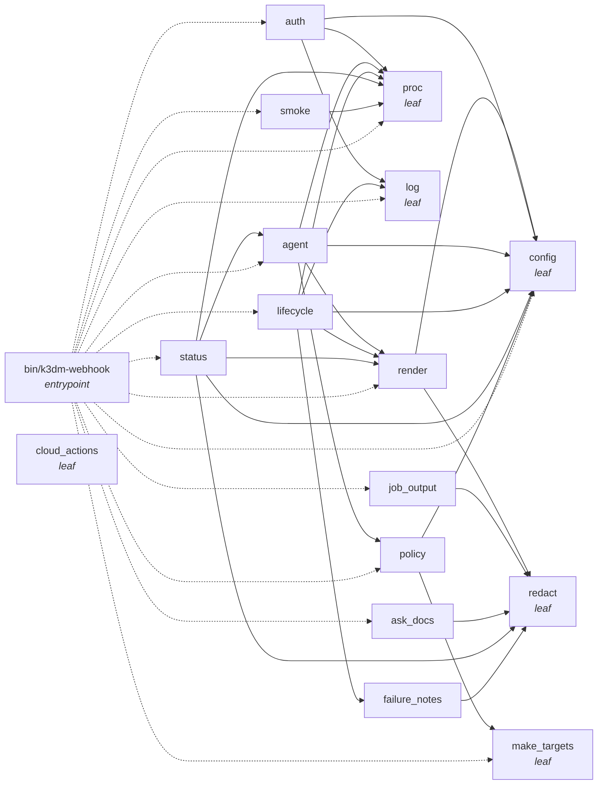
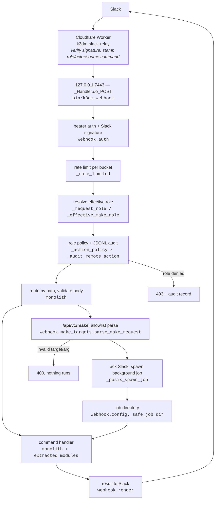

# Webhook Server Architecture

**Component:** `bin/k3dm-webhook` + `scripts/lib/webhook/`
**Status:** The entrypoint still owns provider resolution, request validation, job
coordination, Slack thread commands, diagnostics, failure analysis, metrics, HTTP routing,
and server bootstrap. Extracted modules now cover configuration, rendering, subprocesses,
logging, job output, authentication, policy, Make target validation, AI-agent support,
documentation Q&A, lifecycle orchestration, status collection, smoke checks, redaction,
failure notes, and cloud-session action definitions.
**Related specs:** [`docs/plans/v1.13.0-webhook-modularization.md`](../plans/v1.13.0-webhook-modularization.md),
[`docs/plans/v1.34.0-slack-k3dm-make-command.md`](../plans/v1.34.0-slack-k3dm-make-command.md)

This document describes the webhook server as it exists in the tree measured on 2026-10-09:
what has been extracted into the package, what still lives in the monolith, and the seams the
remaining phases may cut along. Function names are used for the monolith inventory so that
the inventory does not depend on source layout.

---

## What it is

`bin/k3dm-webhook` is a single-process Python HTTP server (stdlib
`http.server.ThreadingHTTPServer`, no framework) bound to `127.0.0.1:7443`. It runs under
launchd (`scripts/etc/launchd/com.k3d-manager.webhook.plist.tmpl`) and is fronted by the
Cloudflare `k3dm-slack-relay` Worker, which verifies Slack requests and proxies them here
(see [`docs/architecture/cloudflare-slack-relay.md`](cloudflare-slack-relay.md)).

It is the execution backend for Slack slash commands and thread commands: cluster lifecycle,
diagnostics, failure analysis, CVE remediation, the multi-agent `/ask` `/claude` `/gemini`
`/codex` handlers, and `/k3dm`, which runs an allowlisted Makefile target. The Makefile is
the operator interface exposed by the webhook rather than each operation growing its own
route.

> **Operational note:** launchd runs whatever `bin/k3dm-webhook` was on disk when it last
> started; it does not auto-reload after a `git pull`/merge. Run `make restart-webhook` after
> any change. See [`docs/howto/slack-slash-commands.md`](../howto/slack-slash-commands.md).

---

## Module layout after the current extraction

The entrypoint remains the process host and imports the package from `scripts/lib/`:

```python
# bin/k3dm-webhook:21
sys.path.insert(0, str(Path(__file__).resolve().parent.parent / "scripts" / "lib"))
from webhook.config import (...)
from webhook.render import (...)
from webhook.proc import _spawn_capture_text
from webhook.log import get_logger
from webhook.job_output import read_job_output
from webhook.agent import (...)
from webhook import ask_docs
from webhook.lifecycle import (...)
from webhook.status import (...)
import webhook.status as _status
from webhook.smoke import (...)
from webhook.auth import (...)
from webhook.make_targets import (...)
from webhook.policy import (...)
import webhook.policy as _policy
```

The following line counts are the `wc -l` measurements from 2026-10-09. Responsibilities
follow each module's docstring and its functions; dependencies list only intra-package
imports.

| Module | Lines | Responsibility | Intra-package imports |
|--------|------:|----------------|-----------------------|
| `webhook/agent.py` | 631 | AI-agent invocation, question policy, cluster-ask orchestration, mutation and prompt-injection gates | `config`, `policy`, `proc`, `render` |
| `webhook/ask_docs.py` | 226 | Bounded, redacted documentation Q&A and source-link replies | `redact` |
| `webhook/auth.py` | 137 | Keychain/bearer-token resolution, Slack signature verification, and Slack identity mapping | `config`, `log`, `proc` |
| `webhook/cloud_actions.py` | 51 | Shared cloud-session action definitions | — |
| `webhook/config.py` | 52 | Configuration constants and safe job-directory path handling | — |
| `webhook/failure_notes.py` | 33 | Small redacted prior-art notes for failed local jobs | `redact` |
| `webhook/job_output.py` | 56 | Bounded, redacted output reads from webhook job directories | `redact` |
| `webhook/lifecycle.py` | 522 | Long-running cleanup, Make, upgrade, cluster, resume, and provider-refresh orchestration | `config`, `failure_notes`, `log`, `proc`, `render` |
| `webhook/log.py` | 35 | Redaction-safe logging facade | — |
| `webhook/make_targets.py` | 119 | `/k3dm` Make target allowlist, argument validation, and role-filtered help | — |
| `webhook/policy.py` | 220 | Authorization, audit, request-rate policy, dynamic action policy, and thread-command roles | `config`, `make_targets` |
| `webhook/proc.py` | 84 | Fork-safe `posix_spawn` subprocess capture primitive | — |
| `webhook/redact.py` | 79 | Scrubbing credential-shaped values from untrusted output | — |
| `webhook/render.py` | 128 | Slack response, bot-thread, question-redaction, and thread-context helpers | `config`, `redact` |
| `webhook/smoke.py` | 731 | Browser-emulating SSO and service smoke client without HTTP-server ownership or import-time network side effects | `proc` |
| `webhook/status.py` | 505 | Read-only cluster/status/diagnostics collection and Slack formatting | `agent`, `config`, `proc`, `redact`, `render` |

`webhook/__init__.py` is empty and is not part of the module table. `config`, `log`,
`make_targets`, `proc`, `redact`, and `cloud_actions` have no intra-package imports.

### Dependency direction


```mermaid
flowchart LR
    ENTRY["bin/k3dm-webhook<br/><i>entrypoint</i>"]
    CONFIG["config<br/><i>leaf</i>"]
    RENDER["render"]
    PROC["proc<br/><i>leaf</i>"]
    LOG["log<br/><i>leaf</i>"]
    JOB["job_output"]
    AGENT["agent"]
    ASK["ask_docs"]
    LIFE["lifecycle"]
    STATUS["status"]
    SMOKE["smoke"]
    AUTH["auth"]
    MAKE["make_targets<br/><i>leaf</i>"]
    POLICY["policy"]
    REDACT["redact<br/><i>leaf</i>"]
    FAILURE["failure_notes"]
    CLOUD["cloud_actions<br/><i>leaf</i>"]

    RENDER --> CONFIG
    RENDER --> REDACT
    AUTH --> CONFIG
    AUTH --> LOG
    AUTH --> PROC
    JOB --> REDACT
    AGENT --> CONFIG
    AGENT --> POLICY
    AGENT --> PROC
    AGENT --> RENDER
    ASK --> REDACT
    LIFE --> CONFIG
    LIFE --> FAILURE
    LIFE --> LOG
    LIFE --> PROC
    LIFE --> RENDER
    STATUS --> AGENT
    STATUS --> CONFIG
    STATUS --> PROC
    STATUS --> REDACT
    STATUS --> RENDER
    SMOKE --> PROC
    POLICY --> CONFIG
    POLICY --> MAKE
    FAILURE --> REDACT

    ENTRY -.-> CONFIG
    ENTRY -.-> RENDER
    ENTRY -.-> PROC
    ENTRY -.-> LOG
    ENTRY -.-> JOB
    ENTRY -.-> AGENT
    ENTRY -.-> ASK
    ENTRY -.-> LIFE
    ENTRY -.-> STATUS
    ENTRY -.-> SMOKE
    ENTRY -.-> AUTH
    ENTRY -.-> MAKE
    ENTRY -.-> POLICY
```

The entrypoint injects runtime hooks into lifecycle, status, smoke, policy, and agent code;
those modules do not import the entrypoint. The package contains both pure leaves and
behavioral helpers, while HTTP routing and server bootstrap remain in the entrypoint.

### API route table

The dispatcher declares exactly these keys in `_POST_ROUTES` and `_GET_ROUTES` inside
`bin/k3dm-webhook`. Each entry carries a handler, a minimum role, and an action name.
`/api/v1/cluster` resolves its effective role by action; `/api/v1/make` resolves it from
the selected `MAKE_TARGETS` entry. The effective requirement is the strictest table floor
and dynamic policy. `/slack/events` has its own full-body signature-verification flow and is
outside these route tables.

| Method | Route key | Minimum role |
|--------|-----------|--------------|
| POST | `/api/v1/argocd-upgrade` | admin |
| POST | `/api/v1/cve-remediate` | operator |
| POST | `/api/v1/cluster` | reader baseline; `kill` operator; `up`/`down` admin |
| POST | `/api/v1/cluster-status` | reader |
| POST | `/api/v1/diagnostics` | reader |
| POST | `/api/v1/hostinger-status` | reader |
| POST | `/api/v1/cluster-refresh` | operator |
| POST | `/api/v1/cluster-resume` | admin |
| POST | `/api/v1/cleanup-stale-sandbox` | admin |
| POST | `/api/v1/make` | reader baseline; selected target dynamically |
| POST | `/api/v1/analyze` | operator |
| POST | `/api/v1/ask` | reader |
| POST | `/api/v1/ask-docs` | reader |
| GET | `/api/v1/health` | reader |
| GET | `/api/v1/status/` | reader; job-id suffix accepted |

---

## What still lives in the monolith

`bin/k3dm-webhook` is **2,576 lines** in the 2026-10-09 measurement. The extracted package
owns the concerns described above; the entrypoint still contains these definitions:

| Area | Functions/classes still defined in `bin/k3dm-webhook` |
|------|--------------------------------------------------------|
| Provider and access-layer resolution | `_normalize_provider`, `_context_reachable`, `_resolve_live_provider`, `_resolve_provider`, `_provider_context`, `_acg_stack_probe` |
| Request and diagnostics validation | `_request_source_command`, `_content_length`, `_resolve_diagnostics_context`, `_validate_namespace`, `_validate_resource_name`, `_cve_cooldown_key`, `_cve_cooldown_file`, `_cve_cooldown_active`, `_cve_touch_cooldown`, `_active_cve_scan_job`, `_create_cve_scan_job`, `_validate_diagnostics_request` |
| Provider metadata and stale cleanup | `_current_label`, `_cluster_name`, `_patch_label`, `_run_stale_sandbox_cleanup`, `_record_acg_state` |
| Jobs and thread coordination | `_posix_spawn_job`, `_read_job_tail`, `_running_cluster_job`, `_find_job_by_thread_ts`, `_thread_ts_for_job`, `_parse_thread_diagnose`, `_run_upgrade_thread_job`, `_handle_thread_command`, `_clear_stale_jobs` |
| Screenshot, redaction, and notification glue | `_archive_acg_screenshot`, `_redact_skip_reason`, `_register_secret`, `_redact_secrets`, `_notify_job` |
| Failure analysis and diagnostics | `_analyze_stall`, `_collect_cluster_state`, `_analyze_failure`, `_init_k8s_ctx`, `_run_post_provision_check` |
| Metrics | `_push_metrics`, `_publish_test_metrics` |
| Command handlers | `_run_analyze`, `_run_ask_docs` |
| HTTP server | `_Handler` |

The monolith also contains the `__main__` server bootstrap. The package modules own the
functions that moved there; they are not repeated in this inventory. There is no `server.py`
or `routes.py` in the current package, so the remaining HTTP and dispatch seams are still
entrypoint-internal.

---

## Request flow (current)


```mermaid
flowchart TD
    SLACK["Slack"]
    CF["Cloudflare Worker<br/>k3dm-slack-relay<br/><i>verify signature, stamp role/actor/source command</i>"]
    HANDLER["127.0.0.1:7443 — _Handler.do_POST<br/><code>bin/k3dm-webhook</code>"]
    AUTH["bearer auth + Slack signature<br/><code>webhook.auth</code>"]
    RATE["rate limit per bucket<br/><code>_rate_limited</code>"]
    ROLE["resolve effective role<br/><code>_request_role / _effective_make_role</code>"]
    POLICY["role policy + JSONL audit<br/><code>_action_policy / _audit_remote_action</code>"]
    ROUTE["route by path, validate body<br/><code>monolith</code>"]
    MAKEP["<b>/api/v1/make</b>: allowlist parse<br/><code>webhook.make_targets.parse_make_request</code>"]
    ACK["ack Slack, spawn background job<br/><code>_posix_spawn_job</code>"]
    JOBDIR["job directory<br/><code>webhook.config._safe_job_dir</code>"]
    CMD["command handler<br/><code>monolith + extracted modules</code>"]
    RESULT["result to Slack<br/><code>webhook.render</code>"]

    SLACK --> CF --> HANDLER --> AUTH --> RATE --> ROLE --> POLICY --> ROUTE
    POLICY -->|"role denied"| DENY["403 + audit record"]
    ROUTE --> MAKEP
    ROUTE --> CMD
    MAKEP -->|"invalid target/arg"| BAD["400, nothing runs"]
    MAKEP --> ACK
    ACK --> JOBDIR --> CMD
    CMD --> RESULT --> SLACK
```

Auth, Slack I/O, policy, and the `/k3dm` allowlist sit at the package boundary; routing,
job coordination, and some command handling remain monolith-internal.

---

## The Makefile as the operator interface

The capability contract lives in `scripts/lib/webhook/make_targets.py` and is exposed through
`/api/v1/make` and `/k3dm help`. A new allowlisted capability is a `MAKE_TARGETS` entry plus
the corresponding Makefile target; the route and target-role check are already shared.

The targets with `confirm: True` are:

| Target | Required confirmation |
|--------|-----------------------|
| `e2e-runner-unlock` | `confirm` |
| `fix-delete-pod` | `confirm` |
| `fix-force-sync` | `confirm` |

Every relayed slash command is capped at the Slack caller's mapped role. The relay's stamped
role cannot elevate the caller: `_effective_make_role` applies the caller mapping before the
selected target's role floor, and the corresponding thread-command and route policies remain
in force. The unranked `cloud-runner` role is capability-bound to `e2e-remote`, `e2e`, and
provider-bound cluster lifecycle actions; it is not a general lower tier.

Validated arguments reach Make as an argv list, not an interpolated shell command. The
authoritative target list is `MAKE_TARGETS`; `/k3dm help` renders the role-filtered list.

---

## Slack threading and cloud-runner

Top-level jobs, cleanup, status, diagnostics, and agent replies preserve the source Slack
thread and channel when one is supplied. The renderer records thread timestamps in the job
directory, fetches bounded thread context for agent questions, and falls back to the
response URL when a bot thread cannot be used. Relayed slash commands are still subject to
the mapped caller role, including commands stamped by the Worker.

The `cloud-runner` credential is a capability set for remote e2e and the AWS-bound cluster
lifecycle actions, rather than a ranked role. The surrounding request, credential, and
allowlist boundary is documented in [`docs/architecture/cloud-bridge.md`](cloud-bridge.md).

---

## Testing & operational surfaces

Focused webhook test files present in the requested inventory are:

- `scripts/tests/bin/makefile_webhook_slack.bats`
- `scripts/tests/bin/smoke_test_webhook.bats`
- `scripts/tests/bin/test_webhook_ai_fallback.py`
- `scripts/tests/bin/test_webhook_ask_claude_argv.py`
- `scripts/tests/bin/test_webhook_ask_delivery.py`
- `scripts/tests/bin/test_webhook_ask_docs_thread.py`
- `scripts/tests/bin/test_webhook_cluster_status_thread.py`
- `scripts/tests/bin/test_webhook_live_provider.py`
- `scripts/tests/bin/test_webhook_log.py`
- `scripts/tests/bin/test_webhook_pushgateway_provider.py`
- `scripts/tests/bin/test_webhook_stale_cleanup.py`
- `scripts/tests/bin/test_webhook_thread_dispatch.py`
- `scripts/tests/bin/webhook_agent.py`
- `scripts/tests/bin/webhook_lifecycle.py`
- `scripts/tests/bin/webhook_make_targets.py`
- `scripts/tests/bin/webhook_policy.py`
- `scripts/tests/bin/webhook_redaction.py`
- `scripts/tests/bin/webhook_request_hardening.py`
- `scripts/tests/bin/webhook_status.py`
- `scripts/tests/lib/webhook.bats`
- `scripts/tests/lib/webhook_hub_eso.bats`

The smoke gate is `bin/smoke-test-webhook`; it boots an isolated instance and checks
`/api/v1/health`. It must override `K3DM_JOB_DIR` and `K3DM_RUN_DIR` so it does not touch
live job directories. launchd uses `com.k3d-manager.webhook.plist.tmpl`; token rotation uses
`com.k3d-manager.webhook-token-rotate.plist.tmpl` and `bin/rotate-webhook-token`.

---

## Roadmap (remaining phases)

The phase table now reflects the files in the tree:

| Phase | Planned modules | Status | Evidence |
|-------|-----------------|--------|----------|
| **1** — thin entrypoint + config/auth/render split | `config.py`, `render.py`, `proc.py`, `auth.py` | **done** | all four are present |
| *(unplanned)* `/k3dm` allowlist | `make_targets.py` | **done** | present and used by `/api/v1/make` |
| **2** — command registry + dispatch split | `commands.py`, `dispatch.py` | **not started** | neither file exists |
| **3** — jobs/state management split | `jobs.py` | **not started** | file does not exist |
| **4** — diagnostics/failure analysis split | `diagnostics.py` | **not started** | file does not exist |
| **5** — evaluate `lib-foundation` extraction candidates | — | **not started** | gated on phases 2–4 |

There is no `server.py` or `routes.py`; the entrypoint remains both process host and router.
The current extraction has expanded beyond the original Phase 1 set, but the remaining
behavioral splits are still pending.

### The measurement that matters

Historical rows remain useful context; the current row is the measured 2026-10-09 value:

| Point | `bin/k3dm-webhook` |
|-------|--------------------:|
| before Phase 1 (`28f38058~1`) | 3,142 lines |
| after Phase 1 (`28f38058`, 2026-07-05) | 2,953 lines |
| today (2026-10-09) | **2,576 lines** |

The current entrypoint is smaller than the stale measurement because lifecycle, status,
agent, smoke, and supporting concerns have moved into package modules. Future progress should
be checked against both the entrypoint count and the module table above.

### What the pattern actually is now

The extractions include pure leaves such as `make_targets.py`, `proc.py`, `redact.py`, and
`config.py`, plus behavioral helpers for lifecycle, status, AI-agent, smoke, and policy work.
The package boundary is therefore real, but HTTP routing and server bootstrap remain in the
entrypoint. If phases 2–4 are picked up, the low-risk path is still to lift each area's
tables and validation before moving tightly coupled handlers.

No change to the external Slack/Worker contract is planned across any phase.
