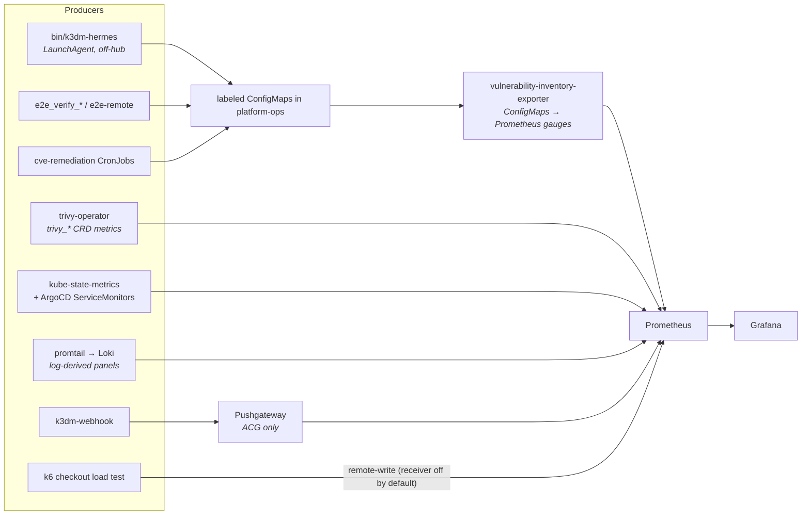

# Grafana Dashboards

A learning-oriented map of every dashboard this repo ships: what each panel means, **which
producer feeds it**, and why a panel is empty when it is. Grounded in
`scripts/etc/argocd/platform-ops/grafana-dashboard-*.yaml`,
`scripts/etc/grafana/dashboards/*.yaml`, and
`scripts/etc/argocd/platform-ops/vulnerability-inventory-exporter.yaml`.

> **The one thing to internalise.** Most `No data` in this system is **not** a Grafana or
> datasource fault — it is a **missing producer**. Every dashboard here is downstream of
> something that has to run first: an exporter, a CronJob, a port-forward, a promtail
> DaemonSet, a load test, an e2e run. Before touching a panel, ask *"has the thing that
> makes this series run since the last rebuild?"* The triage table at the bottom is a
> record of how often that turned out to be the answer.

---

## The seven dashboards

| Dashboard | uid | Source file | Deployed by | Cluster |
|---|---|---|---|---|
| ArgoCD Apps & Image Updater Hub | `argocd-image-updater` | `platform-ops/grafana-dashboard-argocd.yaml` | `make platform-ops` | hub |
| CVE Auto-Patch | `cve-autopatch` | `platform-ops/grafana-dashboard-cve-autopatch.yaml` | `make platform-ops` | hub |
| E2E Verification | `e2e-verification` | `platform-ops/grafana-dashboard-e2e.yaml` | `make platform-ops` | hub |
| Hermes Status | `hermes-status` | `platform-ops/grafana-dashboard-hermes.yaml` | `make platform-ops` | hub |
| k3dm Deployment Metrics | `k3dm-deployments` | `etc/grafana/dashboards/k3dm-deployments-configmap.yaml` | `make observability-acg` | **ACG** |
| Trivy Security | `trivy-security` | `etc/grafana/dashboards/trivy-security-configmap.yaml` | `make observability-acg` | **ACG** |
| Checkout Load Test | `checkout-loadtest` | `etc/grafana/dashboards/checkout-loadtest-configmap.yaml` | **nothing — see below** | — |

All seven are `ConfigMap`s in the `monitoring` namespace carrying
`labels: {grafana_dashboard: "1"}`, which the kube-prometheus-stack Grafana sidecar
discovers and imports. A dashboard that does not appear at all is usually a sidecar /
namespace / label problem; a dashboard that appears but is blank is a producer problem.

> **`checkout-loadtest-configmap.yaml` has no applier.** No plugin, Makefile target or
> ApplicationSet references it — only `docs/bugs/2026-08-29-loadtest-slice-f-generator.md`
> does. It reaches a cluster only if applied by hand. Treat "the load-test dashboard is
> missing" as expected, not as a regression.

### Which Grafana am I looking at?

There are two Grafana instances — hub and ACG app-cluster — and they hold **different**
dashboards. `grafana.3ai-talk.org` must route to the **hub** instance; when the public route
was pointed at the app-cluster instance the symptom was a healthy Grafana shell rendering
`Dashboard not found`, not a 502
(`docs/issues/2026-07-08-grafana-dashboard-not-found-public-route-hit-app-cluster-instance.md`).
The mirror-image failure also happened: the ArgoCD/Image-Updater dashboard was applied to
the app cluster, where `argocd_*` and `kube_deployment_*{namespace="cicd"}` do not exist, so
every panel read `No data` while the JSON itself loaded fine
(`docs/bugs/2026-06-29-image-updater-grafana-wrong-cluster.md`).

**Check the instance before debugging the query.**

---

## The producer chain

Only two of the seven dashboards read metrics that Prometheus scrapes natively. The rest
depend on a producer this repo owns.

**The exporter is the load-bearing piece.** `vulnerability-inventory-exporter` is a
stdlib-Python pod in `platform-ops` that lists labeled ConfigMaps and re-emits them as
bounded Prometheus gauges. Three independent refresh paths, three label selectors:

| Selector | Feeds | Metrics |
|---|---|---|
| `k3dm.k3d.io/cve-remediation-event=true` | CVE Auto-Patch | `cve_remediation_state`, `cve_remediation_event_info`, `cve_remediation_requested/applied_timestamp_seconds` |
| `k3dm.k3d.io/e2e-result=true` | E2E Verification | `e2e_last_run_pass`, `e2e_last_run_duration_seconds`, `e2e_last_success_timestamp_seconds`, `e2e_run_info`, `e2e_failure_info`, `e2e_failure_group_info` |
| `k3dm.k3.io/hermes-status=true` | Hermes Status | `hermes_sensor_status`, `hermes_incident_active`, `hermes_last_poll_timestamp_seconds`, `hermes_status_check_info` |

> **Do not "fix" the Hermes label.** The Hermes selector is `k3dm.k3.io`, **not**
> `k3dm.k3d.io` like the other two. The publisher in `bin/k3dm-hermes` writes the same odd
> domain (`labels = "k3dm.k3.io/hermes-status=true"`), so the two agree and the dashboard
> works. Normalising it in one place and not the other silently empties the Hermes
> dashboard — the selector matches nothing and the exporter reports no error. If it is ever
> normalised, **both** files must change in the same commit.

Also note: `trivy_vulnerability_inventory` comes from the *same pod* as the remediation
gauges but a different code path. Inventory panels having thousands of series while
remediation panels show `No data` is therefore a perfectly consistent state — it means the
remediation CronJobs have not produced an event ConfigMap, not that the exporter is down
(`docs/issues/2026-08-24-cve-remediation-panels-empty.md`).

---

## Dashboard reference

### ArgoCD Apps & Image Updater Hub (`argocd-image-updater`)

Hub-only. Mixes three producers: kube-state-metrics, the ArgoCD ServiceMonitors, and
**Loki log queries**.

| Panel | Query basis | Producer |
|---|---|---|
| Image Updater Ready / Desired Replicas | `kube_deployment_status_replicas_available{namespace="cicd"}` | kube-state-metrics |
| Watched App Sync Activity (5m increase) | `increase(argocd_app_sync_total{...})` | ArgoCD ServiceMonitor |
| Watched App Health / Sync | `argocd_app_info{...}` | ArgoCD ServiceMonitor |
| Possible Flapping (30m syncs) | same, 30m window | ArgoCD ServiceMonitor |
| Image Updater Apps Watched / Images Updated (30d) / Errors (30d) | LogQL over `argocd-image-updater` pod logs, `\|= "Processing results"` + regexp unwrap | **promtail → Loki** |
| App CVE Scan Successful / Failed Jobs | `increase(kube_job_status_*{job_name=~"app-cve-scan.*"}[30d])` | kube-state-metrics |
| App CVE Scan Decisions | LogQL `\|= "[app-cve-scan]"` | **promtail → Loki** |
| Trivy Operator Job Reconcile Errors | LogQL `\| json \| level="error"` | **promtail → Loki** |

Three traps, all previously hit:

- **`argocd_*` is absent entirely if the ServiceMonitors never installed.** After the
  2026-09-10 hub rebuild, ArgoCD's Helm release was created *before* the ServiceMonitor CRD
  existed, so the chart's `Capabilities` check silently skipped all four ServiceMonitors
  even though `values` had `enabled: true`. Every `argocd_*` panel was blank with the values
  file looking correct. Recovery is `helm upgrade` with the same values — nothing in the
  config needs changing. Documented in
  `docs/bugs/2026-09-13-hub-rebuild-skips-argocd-servicemonitors-and-promtail.md`.
- **The Loki panels go blank when promtail is absent**, which the same rebuild also caused.
  These panels look identical to a broken query.
- **`Images Updated (30d)` nonzero is the alarm; `applications=0` is intended.** Image
  Updater legitimately reports `applications=0`. Do not "fix" it — see
  `memory/reference_image_updater_zero_applications.md`.

Two historical render bugs worth knowing, because the fix shape recurs: a LogQL panel with
`| json` but **no line filter** renders as a wall of promtail `kubernetes_*` labels rather
than message content, and a `30d`-window `increase()` panel goes blank when the dashboard
time picker is narrower than the window
(`docs/bugs/2026-07-10-loki-logs-panels-render-empty-and-raw-json.md`,
`docs/issues/2026-07-07-grafana-app-cve-panels-go-blank-on-7d-dashboard-range.md`). The
replica stat showing several `1`s instead of one is kube-state-metrics pod-IP churn across
restarts — cosmetic, fixed by wrapping in `max()`.

### CVE Auto-Patch (`cve-autopatch`)

| Panel | Query | Notes |
|---|---|---|
| Critical CVE Alerts Firing | `count(ALERTS{alertname="TrivyCriticalVulnerabilityDetected",alertstate="firing"})` | `or vector(0)` so it reads 0 rather than `No data` |
| Namespaces With Critical CVEs | `count(count by (cluster,namespace) (trivy_vulnerability_inventory{severity="CRITICAL"}))` | exporter |
| Critical Vulnerabilities by Namespace | `sum by (cluster,namespace) (...)` | exporter |
| Verified Remediations by Service | `sum by (exported_service) (cve_remediation_state{state="applied",current="true"})` | exporter, remediation path |
| Remediation Failure Outcomes by Service | `state=~"failed\|superseded\|deployment_advanced"` | exporter, remediation path |
| Platform / Shopping-cart Unique CVEs | `topk(500, trivy_vulnerability_inventory{severity=~"CRITICAL\|HIGH"})`, second split by `image_repository=~"wilddog64/shopping-cart-.*"` | the split is deliberate |
| Current CVE Remediation Status / History (audit) | `cve_remediation_event_info{current="true"}` / unfiltered | first to go blank |

Traps:

- **The platform/shopping-cart split is by `image_repository`, and that label does not
  match between the two metric families.** Normalise with `label_replace` rather than
  assuming the values line up — `memory/reference_trivy_vs_remediation_image_repository_label_mismatch.md`.
- **Remediation panels blank while inventory panels are full is expected** when no
  remediation has run; the two come from different code paths in one pod.
- `cve-remediation-verify` failing with `secrets "cluster-ubuntu-hostinger" not found` stops
  new remediation events at the source — check the CronJob before the panel.
- Critical findings on *upstream* images are mostly noise; split `wilddog64/.*` from
  `tier: upstream` — `memory/reference_trivy_critical_upstream_image_noise.md`.

### E2E Verification (`e2e-verification`)

Templated on `$service` / `$tier` / `$runner`. Everything is exporter-fed from
`k3dm.k3d.io/e2e-result=true` ConfigMaps.

| Panel | Query |
|---|---|
| Status by runner/service/tier/project | `e2e_last_run_pass{...}` |
| Last success age | `time() - e2e_last_success_timestamp_seconds{...}` |
| Failing runs in window | `count(e2e_run_info{passed="false",...})` |
| Duration trend | `e2e_last_run_duration_seconds{...}` |
| Recent runs | `topk(100, e2e_run_info{...,failure_ratio=~".*%.*"})` |
| Failure groups / details | `topk(200, e2e_failure_group_info{...})`, `topk(100, e2e_failure_info{...})` |
| Failure trend / causes by service | `sum by (exported_service[, kind]) (e2e_failure_group_info{...})` |
| Top failing specs | `topk(10, sum by (exported_service,file) (e2e_failure_info{...}))` |

Traps:

- **Remote runs can finish, fail informatively, and still publish nothing.**
  `E2E_M2_PUBLISH_BACK_HOST` lives only in the repo `.envrc`, which **launchd never loads** —
  so Slack-triggered (`/k3dm e2e-remote`) and Hermes-triggered runs pass no publish-back
  host and the runner retains the result as `*.publication_pending.json`. The hub then has
  **zero** `k3dm.k3d.io/e2e-result` ConfigMaps and the dashboard is empty even though the
  run produced 45 real failures. OPEN:
  `docs/bugs/2026-09-15-e2e-remote-results-never-reach-grafana.md`.
- **Aggregate-only events make the *detail* panels empty while the summary panels work.**
  Older result ConfigMaps carried only `failed=/total=`; with no per-failure payload the
  exporter falls back to ConfigMap metadata and emits no `e2e_failure_group_info`
  (`docs/issues/2026-09-16-live-e2e-failure-groups-empty.md`).
- A table rendering raw label soup instead of columns is a transform problem, not a query
  problem — `docs/issues/2026-08-25-e2e-grafana-table-raw-labels.md`.

### Hermes Status (`hermes-status`)

Six panels, all from `hermes_*`:

| Panel | Query |
|---|---|
| Active incident | `sum(hermes_incident_active) or vector(0)` |
| Minutes since last poll | `max((time() - hermes_last_poll_timestamp_seconds) / 60)` |
| Degraded sensors | `count(hermes_sensor_status{status="degraded"}) or vector(0)` |
| Unknown sensors | `count(hermes_sensor_status{status="unknown"}) or vector(0)` |
| Current Hermes findings | `hermes_sensor_status` |
| Sensor status history | `hermes_sensor_status` over time |

Hermes runs **off-hub** as a macOS LaunchAgent (`com.k3d-manager.hermes`) and publishes a
redacted snapshot — no tokens, no raw log lines — as a `platform-ops` ConfigMap.
`K3DM_HERMES_PUBLISH_STATUS=0` disables publication, and the dashboard then ages out via
*Minutes since last poll* rather than going blank, which is the point of that panel.

Read *Minutes since last poll* **first**. A stale poll age invalidates every other panel on
the dashboard: sensor states are a snapshot, not a live read. Two sensors reading `unknown`
together (`eso` + `node_pressure`) is the webhook-down signature and pages by SMS,
bypassing the correlator — see `docs/guides/hermes.md`.

### k3dm Deployment Metrics (`k3dm-deployments`) — ACG only

| Panel | Query |
|---|---|
| Last acg-up / acg-down Duration | `k3dm_deployment_duration_seconds{action="up"\|"down"}` |
| Last Deployment Success | `k3dm_deployment_success` |
| Last Deployment Time | `k3dm_deployment_last_timestamp_seconds * 1000` |
| Deployment Duration Over Time | `k3dm_deployment_duration_seconds` |

> **The panel titles say `acg-up` / `acg-down`, which are the pre-v1.7.1 script names**
> (now `bin/cluster-up` / `bin/cluster-down`). The titles are literal strings in
> `k3dm-deployments-configmap.yaml`, so the table above quotes the dashboard as deployed.
> Renaming them means editing the ConfigMap and reapplying `make observability-acg`.

Fed by `k3dm-webhook`'s `_push_metrics()` → Pushgateway, and this is the **only** dashboard
whose producer is a push, not a scrape. The chain has three host-side links that each fail
independently: the webhook LaunchAgent, the Pushgateway port-forward LaunchAgent on
`localhost:9091` (installed by `bin/cluster-up` Step 14c), and the Pushgateway pod itself.

**The hub has no Pushgateway** — the webhook pushes only for the ACG provider. This
dashboard being empty on the hub is by design, not a regression. See
`docs/architecture/cloudflare-slack-relay.md` §3 for the full metrics path.

### Trivy Security (`trivy-security`) — ACG only

Native `trivy-operator` metrics, no exporter in the path.

| Panel | Query basis |
|---|---|
| Trivy Scan Job Failures (30m) | `increase(kube_job_status_failed{namespace="trivy-system",job_name=~"scan-.*"}[30m])` |
| Trivy Infra High/Critical Findings | `trivy_role_rbacassessments` + `trivy_clusterrole_clusterrbacassessments` |
| Trivy Cluster Compliance Failures | `sort_desc(sum by (title,description,status) (trivy_cluster_compliance{status="Fail"}) > 0)` |
| Trivy Infra Findings Drilldown | the same, `label_replace`d twice to synthesise `source` / `reason` columns |
| Trivy Drilldown Banner | text panel |

Traps: `trivy-operator` **skips private images** unless
`operator.privateRegistryScanSecretsNames` is set, so a clean report can mean "not scanned"
(`memory/reference_trivy_operator_node_cred_private_image_skip.md`). The index-digest
verifier false-negative on multi-arch images is usually just aliasing
(`memory/reference_containerd_index_digest_aliasing_verifier.md`). And a reconcile panel
matching zero log lines is a query-drift bug that has happened before
(`docs/bugs/2026-07-24-trivy-reconcile-panel-query-matches-zero-lines.md`).

### Checkout Load Test (`checkout-loadtest`)

Seven panels over `k6_checkout_load_*` and `k6_vus`, templated on `$run_id`.

This is a **planned view with no producer wired up**: there is no applier for the ConfigMap,
no k6 run in the normal flow, and Prometheus's remote-write receiver is off by default.
Verified live: `count(k6_checkout_load_requests_total_total) = 0`. `No data` here is the
correct steady state (`docs/issues/2026-09-17-checkout-loadtest-dashboard-no-data.md`).

The one panel that *does* populate is **shopping-cart-apps CPU saturation**, because it uses
`container_cpu_usage_seconds_total` / `kube_pod_container_resource_limits` — ordinary
Kubernetes metrics, independent of the load test. A dashboard where exactly one panel has
data is the signature of "the native metrics work, the custom producer never ran."

---

## Triage: `No data` by cause

Work down this table before editing a query. Every row is a real past incident.

| Symptom | Likely cause | Check |
|---|---|---|
| Dashboard missing entirely | sidecar didn't import it; wrong namespace or missing `grafana_dashboard: "1"` | `kubectl -n monitoring get cm -l grafana_dashboard=1` |
| `Dashboard not found` in a healthy Grafana | public route points at the **app-cluster** instance | confirm which Grafana the hostname resolves to |
| *All* panels blank, JSON loads fine | dashboard applied to the wrong cluster | does the cluster even have `argocd_*` / `trivy_*`? |
| All `argocd_*` panels blank after a rebuild | Helm release predates the ServiceMonitor CRD; chart skipped them | `kubectl -n cicd get servicemonitor`; fix = `helm upgrade`, same values |
| Loki / LogQL panels blank after a rebuild | promtail DaemonSet absent | `kubectl get ds -A \| grep promtail` |
| LogQL panel shows a wall of `kubernetes_*` labels | `\| json` with no line filter | add the `\|= "…"` filter before `\| json` |
| `30d` / `30m` `increase()` panel blank | dashboard time range narrower than the window | widen the time picker first |
| Exporter-backed panels blank, inventory full | the ConfigMap producer never ran — different code path, same pod | `kubectl -n platform-ops get cm -l <selector>` |
| Hermes panels blank | selector/publisher label drift (`k3dm.k3.io` vs `k3dm.k3d.io`), or publication disabled | compare `bin/k3dm-hermes` to the exporter; check *Minutes since last poll* |
| E2E detail panels blank, summary panels fine | result event carries aggregates only | inspect the newest `e2e-result` ConfigMap payload |
| E2E entirely blank after a real remote run | `E2E_M2_PUBLISH_BACK_HOST` unset under launchd; result stuck `publication_pending` | count `k3dm.k3d.io/e2e-result` ConfigMaps on the hub |
| k3dm Deployment panels blank | no Pushgateway (hub has none by design), or the `:9091` port-forward is down | `curl localhost:9091/metrics` |
| Checkout Load Test blank except CPU | no producer — expected | nothing to fix |
| Replica stat shows several `1`s | kube-state-metrics pod-IP churn | cosmetic; wrap in `max()` |

---

## Adding or changing a dashboard

1. Edit the ConfigMap YAML under `scripts/etc/argocd/platform-ops/` (hub, via
   `make platform-ops`) or `scripts/etc/grafana/dashboards/` (ACG, via
   `make observability-acg`). Keep `grafana_dashboard: "1"` and `namespace: monitoring`.
2. If the panel needs a series nothing produces yet, **add the producer first** — a panel
   without a producer becomes a permanent `No data` that the next person has to re-diagnose.
   The Checkout Load Test dashboard is what that looks like.
3. Prefer `or vector(0)` on counting panels so an honest zero reads as `0`, not `No data` —
   the existing dashboards do this deliberately and it removes a whole class of false alarm.
4. Re-apply, then confirm the series exists rather than trusting the render:
   `kubectl -n monitoring exec … -- promtool query instant` or the Grafana Explore tab.
5. **Reapply the ApplicationSets after a release.** Dashboards templated through
   ApplicationSets freeze their `$values` ref to whatever branch was checked out when the
   set was last applied — config on a newer branch is inert until reapplied. Then confirm
   with `argocd_check_values_branch`. See `CLAUDE.md`.

---

## Where to look next

- `docs/guides/hermes.md` — the Hermes agent, its five sensors, and the correlator.
- `docs/architecture/cloudflare-slack-relay.md` §3 — the Pushgateway metrics path.
- `docs/guides/vcluster-e2e-harness.md` — what produces the e2e result events.
- `scripts/etc/argocd/platform-ops/vulnerability-inventory-exporter.yaml` — the exporter.
- `scripts/plugins/observability.sh` — `deploy_observability`, `_deploy_pushgateway_acg`,
  `_observability_apply_trivy_dashboard`, `observability_status`.
