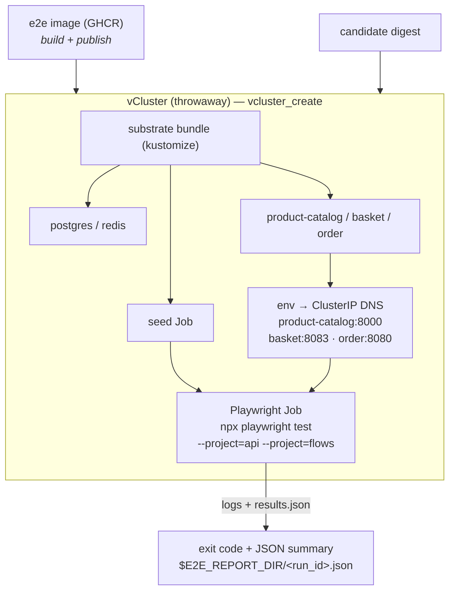

# vCluster E2E Harness

A learning-oriented guide to the **end-to-end verification harness** — both tiers of the
two-tier model in `docs/plans/v1.25.0-e2e-verification-harness.md`. Grounded in
`scripts/plugins/e2e.sh` and `scripts/etc/e2e/`.

| Tier | Function | Substrate | Cadence |
|---|---|---|---|
| [**Tier 1**](#tier-1-per-candidate-vcluster-gate) | `e2e_verify_vcluster` | throwaway vCluster, `OAUTH2_ENABLED=false`, no ESO/Vault/ArgoCD | **blocking, per-candidate** |
| [**Tier 2**](#tier-2-acg-sandbox-stripe-verification) | `e2e_verify_sandbox` | ACG full-stack sandbox, real OIDC, live Stripe path | opt-in, periodic, never blocking |

Most of this guide is Tier 1, because that is the gate a candidate image must pass. Tier 2
has its own section near the end.

---

## What a vCluster is (and why we use one)

A **vCluster** is a fully functional Kubernetes control plane (its own API server,
scheduler view, and syncer) running *inside a namespace* of a host cluster. To a
client it behaves like a real cluster — you get your own `kubeconfig`, your own
namespaces, your own RBAC — but it is created and destroyed in seconds and shares
the host's nodes. That makes it the ideal substrate for a **per-candidate** e2e run:

- **Isolation** — the run cannot touch the live app cluster or Hostinger prod.
- **Speed / cost** — no cloud provisioning; create → test → destroy in one command.
- **Disposability** — every run gets a *uniquely named* vCluster and is torn down
  on success **and** on failure (via an `EXIT` trap), so nothing leaks.

The harness builds on the existing `vcluster.sh` plugin
(`vcluster_create` / `vcluster_destroy` / `_vcluster_kubeconfig_path`), which requires
a host cluster context (`VCLUSTER_HOST_CONTEXT` or the current kube-context).

**Prerequisite:** run `make e2e`; the foundation contract resolves the pinned vCluster
CLI under `${XDG_DATA_HOME:-$HOME/.local/share}/lib-foundation/vcluster/<version>/`.
No manual vCluster CLI installation is supported.

---

## Tier 1: per-candidate vCluster gate

### The self-contained substrate bundle (`scripts/etc/e2e/`)

The existing `shopping_cart_reconcile_*` functions are hardcoded to the **live** app
cluster — they assume ArgoCD, ESO, Vault, and a running Postgres. They are *not*
reusable to stand up three bare services in a scratch vCluster. So Tier 1 ships its
own **self-contained kustomize overlay** that is essentially the e2e
`docker-compose.yml` translated to Kubernetes manifests, with **zero** dependency on
Vault / ESO / ArgoCD:

| Manifest | Brings up | Notes |
|---|---|---|
| `postgres.yaml` | `postgres:5432` + initdb | one Postgres, an initdb ConfigMap creates **both** `products` and `orders` DBs |
| `redis.yaml` | `redis:6379` | `--requirepass testredis123` |
| `product-catalog.yaml` | `product-catalog` service | `DATABASE_URL=…/products`, `OAUTH2_ENABLED=false` |
| `basket.yaml` | `basket` service | `REDIS_HOST=redis`, `OAUTH2_ENABLED=false` |
| `order.yaml` | `order` service | `SPRING_DATASOURCE_URL=…/orders`, `OAUTH2_ENABLED=false` |
| `seed-configmap.yaml` + `seed-job.yaml` | product seed | seeds 1,000 products once the catalog is up |
| `kustomization.yaml` | ties it together | namespace `shopping-cart-apps`, pinned images, `k3dm.k3d.io/e2e-substrate` label |

**Contract, not convenience** — every value is derived from the authoritative
`shopping-cart-e2e-tests/docker-compose.yml` and each service's `k8s/base`.

#### The port-decoupling detail worth knowing

The e2e tests and the compose contract address product-catalog on **:8000**, but the
published container image actually listens on **:8080** (`uvicorn --port 8080`). The
bundle resolves this cleanly in the **Service**, not the Deployment:

```
Service product-catalog  port 8000  ->  targetPort http (8080)   # container's real port
Service basket           port 8083  ->  targetPort http (8083)
Service order            port 8080  ->  targetPort http (8080)
```

So the test-facing DNS name/port (`product-catalog…svc:8000`) is stable regardless of
the container's internal port.

#### Image pinning (A08)

All images are pinned — no `:latest`. The three service images default to their
last-known-good immutable `sha-<gitsha>` tags (mirrored from each service's own
`k8s/base/kustomization.yaml`); datastores pin `postgres:16.4-alpine`,
`redis:7.4-alpine`. When a candidate is under test, the harness **overrides the
service-under-test image** with the candidate digest at deploy time.

---

### The in-cluster Playwright Job model

Rather than port-forwarding services to the host and running Playwright locally, the
harness ships the tests **as a container image** and runs them **inside** the
vCluster as a `Job`:



The Job talks to the services over **ClusterIP DNS** — no host port-forward. It uses
`restartPolicy: Never`, `backoffLimit: 0` (one shot, honest exit code), and pulls
from GHCR with the `ghcr-pull-secret` the harness provisions in the vCluster.

---

### The gate-consumable contract

Two outputs matter, and both are **exit-code-faithful**:

1. **Exit code** — `e2e_verify_vcluster` returns non-zero on *any* failure
   (substrate didn't come up, seed failed, or a test failed). Zero means the api +
   flows projects passed.
2. **JSON summary** — written to `$E2E_REPORT_DIR/<run_id>.json`:

```json
{
  "run_id": "…", "tier": "vcluster", "service": "product-catalog",
  "candidate_digest": null, "project": "api+flows",
  "passed": 42, "total": 42, "failed": 0,
  "duration_seconds": 31.2, "timestamp": "…", "commit": "…",
  "exit_code": 0, "result": "pass"
}
```

This is the contract the **v1.26.0 promotion gate** consumes: a candidate image is
only promoted when its Tier 1 run reports `result: pass`. (The event-ConfigMap
exporter and Grafana dashboard that turn these summaries into observability are plan
#2, not Tier 1 — but the JSON is emitted in the same shape so they drop in.)

---

### Running it

```bash
# Requires a host cluster context (VCLUSTER_HOST_CONTEXT or current kube-context).
./scripts/k3d-manager e2e_verify_vcluster

# Test a specific candidate image (overrides the service-under-test):
E2E_SERVICE_UNDER_TEST=product-catalog \
  ./scripts/k3d-manager e2e_verify_vcluster \
  ghcr.io/wilddog64/shopping-cart-product-catalog@sha256:<digest>
```

Useful knobs (all env-overridable): `E2E_IMAGE` / `E2E_IMAGE_TAG` (the test-runner
image), `E2E_NAMESPACE`, `E2E_JOB_TIMEOUT`, `E2E_ROLLOUT_TIMEOUT`, `E2E_REPORT_DIR`,
`E2E_SERVICE_UNDER_TEST`.

> **The test-runner image** (`ghcr.io/wilddog64/shopping-cart-e2e-tests`) is built and
> published from the `shopping-cart-e2e-tests` repo (Part 1 of the Tier 1 spec:
> `Dockerfile` + `publish-image.yml` + a `workflow_call` surface on `e2e-tests.yml`).
> Pin `E2E_IMAGE_TAG` to a `sha-<gitsha>` tag for reproducible runs.

## Tier 2: ACG sandbox Stripe verification

`e2e_verify_sandbox` is the opt-in, periodic Tier 2 path for the Stripe checkout
flow. It extends the ACG sandbox TTL, installs disposable ArgoCD inside the
`ubuntu-k3s` sandbox, applies the four ApplicationSets plus the sandbox-only
order/payment overrides, and runs the `flows` Playwright project with
`OAUTH2_ENABLED=true` and `STRIPE_E2E=true`.

```bash
./scripts/k3d-manager e2e_verify_sandbox
```

The sandbox is never registered with hub ArgoCD and is not torn down by the
harness; ACG TTL expiry provides cleanup. Tier 2 is best-effort and periodic,
never a blocking per-candidate gate. Its summaries use `tier: sandbox` and
`project: stripe` in the shared report directory.

### Tier 2 ACG auto-login enablement

The ACG session gate is already wired into the browser path. Tier 2 extends the
sandbox through `acg_extend_playwright`, which launches or reuses the CDP browser,
then `_cdp_ensure_acg_session` checks the Pluralsight session. When needed, that
gate reads the `username` and `password` keys from the macOS Keychain service
`k3dm-acg-pluralsight` and signs in before Playwright runs.

Path A is the supported unattended setup: the item must contain the operator's
personal ACG account, which must have no MFA. Never store the company/MFA account
there; the login deliberately refuses MFA challenges and does not attempt to work
around that control. Credentials must be supplied to the one-time Keychain setup
through stdin or environment variables, never as command-line arguments. Do not
print credential values.

The two values live under **one service with two accounts**, where the account name
is the field name:

| Service | Account (`-a`) | Value |
|---|---|---|
| `k3dm-acg-pluralsight` | `username` | the personal ACG account's email |
| `k3dm-acg-pluralsight` | `password` | that account's password |

This differs from every other Keychain item in the repo, which stores a single
value under the account `k3dm` (`k3dm-webhook-token`, `k3dm-hermes-audit-token`,
and the rest). Applying that house convention here produces an item that **nothing
ever reads**: `_secret_load_data` (`scripts/lib/foundation/scripts/lib/system.sh:579`)
resolves to `security find-generic-password -s <service> -a <key> -w`, so the
account name is load-bearing. An entry under `-a k3dm` leaves auto-login reporting
`ACG_SESSION_EXPIRED` with no indication that the credential is in the wrong place.

Start diagnostics with an existence-only check, per account:

```bash
security find-generic-password -s k3dm-acg-pluralsight -a username
security find-generic-password -s k3dm-acg-pluralsight -a password
```

Do not add `-w` by hand: it reads the secret value, while this diagnostic only needs to
know whether each account exists. Do not check the service alone — a match on
`-s` with no `-a` is satisfied by an entry under any account name, including one
the loader never reads, so it cannot tell you whether auto-login will work.
An absent account is an error for Path A. Path B is
the manual-session mode: a live `pw-profile` session may exist without the item,
but it must be refreshed by a human when it expires.

**Existence is weaker than readability, and the preflight tests the stronger claim.**
`_e2e_sandbox_preflight_auth` calls `_secret_load_data` — the same loader
`_cdp_ensure_acg_session` uses — and discards the value to `/dev/null`, so a value the
preflight cannot read is a value unattended login will never see. This catches two
states an existence-only check reports as healthy:

| State | `find-generic-password` (no `-w`) | `_secret_load_data` |
|---|---|---|
| entry absent | fails | fails |
| **login keychain locked** | **succeeds** | fails (`User interaction is not allowed`) |
| **value stored empty** | **succeeds** | fails (empty is rc 1) |
| value readable | succeeds | succeeds |

The empty-value row is not hypothetical: `security -w` with no TTY stores an empty
value at rc 0, so a population attempt from a non-GUI session produces an item that
exists, reads back as nothing, and passes an existence check.

On success the preflight exports `K3DM_ACG_REQUIRE_CREDENTIALS=1`, which makes the
downstream session check fail closed: `acg_session_check.js` refuses to fall back to a
pre-existing browser session when the credential store is unusable, rather than
silently passing on a human's leftover login. The preflight arms this only after the
`_ACG_SANDBOX_URL` and `K3DM_ACG_SKIP_SESSION_CHECK` guards pass, and it reads no
credential at all when it refuses on those.

The session gate reports these states:

| Marker | Meaning |
|---|---|
| `ACG_SESSION_OK path=existing-session` | already authenticated; no login attempted |
| `ACG_SESSION_OK path=auto-login` | signed in unattended during this run |
| `ACG_SESSION_OK path=manual-login` | a human signed in interactively during this run; only reachable when `K3DM_NONINTERACTIVE` is unset **and** stdout is a TTY, so it cannot occur in CI or an unattended Tier 2 run |
| `ACG_CREDENTIALS: username=… password=…` | credential-store health (`present`/`empty`/`absent`), never the values |
| `ACG_CREDENTIALS_REQUIRED` | store unusable while `K3DM_ACG_REQUIRE_CREDENTIALS=1` — the fail-closed gate |
| `ACG_LOGIN_FIELDS_MISSING` | the sign-in form did not yield both fields |
| `ACG_LOGIN_MFA_REQUIRED` | MFA challenge detected and deliberately refused |
| `ACG_SESSION_EXPIRED` | unauthenticated and unattended login unavailable |

The `path=` suffix on `ACG_SESSION_OK` is what distinguishes "auto-login works" from
"a human happened to be signed in already" — before it existed, both printed the same
marker, and headless auto-login was broken for months without the gate noticing. Those three
are the complete set of `path=` values; a Tier 2 gate that must prove *unattended* login should
accept `auto-login` alone and treat an unrecognized value as a failure.
`K3DM_ACG_SKIP_SESSION_CHECK=1` is a local debugging aid only and is never valid for a
Tier 2 acceptance run; the Tier 2 preflight refuses to run with it set.

#### One-time population must happen in a GUI-session terminal

Write the two accounts from **Terminal.app on the Mac itself**, one command each,
with no value after `-w` so the tool prompts and the credential never enters argv
or shell history. `-U` updates in place, which makes the same command the rotation
procedure.

Two environment traps make this fail in ways that do not look like failure:

- **`User interaction is not allowed`** — the writing process is not attached to
  the Mac's login session, so it cannot reach the security agent to authorize the
  write, even when the keychain is unlocked. An SSH session and a non-TTY shell
  (`!` in Claude Code, `codex exec`, a launchd job) all hit this. Run
  `security unlock-keychain` interactively in that session first, or do the write
  at the machine. Recorded previously for `k3dm-webhook-token` in
  `docs/issues/2026-09-16-status-webhook-health-timeout.md`. Do not work around it
  with a plaintext token file.
- **A bare `-w` in a non-TTY shell silently stores an empty value and exits 0.**
  It reads EOF instead of a prompt, so the item exists, the existence checks above
  pass, and `_cdp_ensure_acg_session` loads an empty string. The session check then
  takes its no-credentials branch (`acg_session_check.js:19,62,66` test for
  truthiness) and reports `ACG_SESSION_EXPIRED`, which is indistinguishable from an
  absent item. If auto-login fails while both accounts exist, re-enter both values
  from a real terminal before investigating anything else.

## Failure classification

A failed run is not just a red light: each failing test is classified into a **kind** (what went
wrong) and routed to a **service** (who owns it). Both live in one place —
`scripts/lib/hermes/e2e_triage.py` — and are used by both the Bash summary writer
(`_e2e_write_summary`) and Hermes' bug filer (`scripts/lib/hermes/e2e_bugs.py`). There was
briefly a second, divergent copy inlined in `scripts/plugins/e2e.sh`; it is gone, and adding
another is the thing to avoid.

### Kinds

`classify()` returns the first match in a deliberate order, and that order is the policy:

| Order | Kind | Matches on |
|---|---|---|
| 1 | `service-unreachable` | `ECONNREFUSED`, `ENOTFOUND`, `EAI_AGAIN`, `connect ETIMEDOUT` |
| 2 | `timeout` | Playwright `status == "timedOut"`, or `Timeout <n>ms exceeded` |
| 3 | `auth` | `401`/`403`, `Unauthorized`, `Forbidden`, `invalid_grant`, `invalid_token`, expiry |
| 4 | `contract-drift` | `Received: undefined`, `toHaveProperty`, type-shape mismatches |
| 5 | `assertion` | anything else — the default |

`harness` is a sixth kind, produced only when a run fails with **no** test-level failures at all
(it died before or around Playwright); its target is the failing phase.

Two narrowings are deliberate and are pinned by tests, so don't "simplify" them:

- `auth` is checked **before** `contract-drift`, because a 401 body is often empty and would
  otherwise read as a shape mismatch.
- `auth` matches `\b(401|403)\b` only. A test asserting `toBe(404)` or a `500` is an
  **assertion** failure, not an auth failure.

### Routing, and the tier port split

`service_for()` attributes a failure to one owning service; `repo_for()` maps that to the repo
that must carry the fix, returning `None` when there is no single owner so the caller has to
decide rather than defaulting silently.

For a connection failure the port *is* the attribution — and the two tiers deliberately use
**different ports for the same two services**:

| Service | Tier 1 (vcluster) | Tier 2 (sandbox) | Repo |
|---|---|---|---|
| product-catalog | `8000` | `8082` | `shopping-cart-product-catalog` |
| order | `8080` | `8081` | `shopping-cart-order` |
| basket | `8083` | `8083` | `shopping-cart-basket` |
| payment | `8084` | `8084` | `shopping-cart-payment` |
| cross-service | — | — | `shopping-cart-e2e-tests` |

The union has no collisions, so one map serves both tiers. This is worth knowing because a map
covering only Tier 1 silently degrades Tier 2 attribution to `host-8081` / `host-8082` — a
failure with no owning service and therefore no routable repo. An unrecognised port keeps its
number as `host-<port>` rather than collapsing to `unknown`, so the value stays diagnosable.

For everything else the target is the spec slug (`api/cart.spec.ts` → `api-cart`) and routing is
by substring, with `cross-service` as the fallback when no single service owns the spec.

### Redaction

Failure text is **redacted before it is truncated**, not after — a token cut in half by a length
cap would escape the pattern and survive. This matters because `failure_details` does not stay
local: it is published to a hub `platform-ops` ConfigMap and surfaced in Grafana, and Playwright
assertion output for an auth test routinely embeds the header that failed.

Redacted: the JSON summary (`<run_id>.json`), the failures sidecar (`<run_id>.failures.json`),
and the published event. **Not** redacted: the raw `<run_id>.log`, deliberately — it never
leaves the machine and is what you actually debug from. The remote publisher
(`scripts/plugins/e2e_remote.sh`) re-redacts on receipt rather than trusting the runner, since a
runner may be on older code.

### The corpus

`scripts/tests/fixtures/e2e-corpus/corpus.jsonl` holds labelled failures that pin the classifier
against regression — real samples back-labelled from machine-filed bug docs, plus synthetic
entries for the cases real data does not yet cover. When you triage a new failure shape, add an
entry. Read that directory's `README.md` before citing the corpus for anything else: it is a
regression set, and it is far too small to validate a probabilistic or confidence-scored method.

---

## Safety rules baked in

- **Never** points at live Hostinger prod — ephemeral vCluster only.
- **Always** tears down via an `EXIT` trap — success or failure — with a unique name
  per run. (The trap references the run name through a global so it stays valid under
  `set -u` even after the function's locals go out of scope.)
- **Secrets** — the GHCR PAT is resolved via `shopping_cart_resolve_ghcr_pat`
  (env → Vault → gh) and confined to a function-local; never in argv or logs.
  Postgres/Redis creds are dev-only, e2e-substrate only.
- **Pin everything** — Playwright base image to the locked version, datastore tags,
  service images by immutable tag/digest.

---

## Where to look next

- `scripts/plugins/e2e.sh` — the harness (`e2e_verify_vcluster` + `_e2e_*`).
- `scripts/etc/e2e/` — the substrate bundle.
- `scripts/tests/plugins/e2e.bats` — structural + exit-code-contract tests.
- `docs/howto/vcluster.md` — vCluster lifecycle basics.
- `docs/plans/v1.25.0-e2e-verification-harness.md` — the two-tier design.
