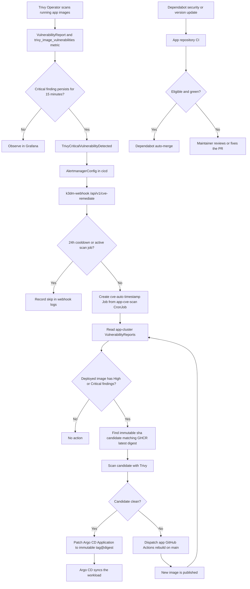

# How-To: CVE Detection and Remediation Pipeline

This guide describes the security loop for the shopping-cart workloads. It has two
remediation paths:

- **Image remediation:** promote a clean immutable image, or trigger a rebuild
  when no clean candidate exists.
- **Dependency remediation:** Dependabot opens an update PR for CVEs that require
  a source dependency change; eligible green PRs auto-merge under each app repo's
  policy.

The image path is an automated attempt, not a guarantee that every CVE can be
patched without a source change.

## Flow



## Components

| Component | Responsibility |
|---|---|
| Trivy Operator | Scans running Kubernetes workloads and writes `VulnerabilityReport` CRs. |
| PrometheusRule | Fires `TrivyCriticalVulnerabilityDetected` when `trivy_image_vulnerabilities{severity="Critical"}` remains positive for 15 minutes. |
| AlertmanagerConfig | Routes the alert to both remediation and analysis receivers. |
| `bin/k3dm-webhook` | Authenticates Alertmanager, enforces idempotency, and creates an event-driven scan Job. |
| `app-cve-scan` | Evaluates reports, scans candidate images, promotes clean candidates, or dispatches a rebuild. |
| Argo CD | Applies the immutable image override and reconciles the workload. |
| Dependabot | Covers dependency updates that an image rebuild cannot repair by itself. |

## Safeguards

- The alert must remain active for **15 minutes** before remediation is requested.
- The webhook uses a **24-hour cooldown** keyed by `namespace` and
  `image_repository`.
- Only one active `app-cve-scan` or `cve-auto-*` Job is allowed at a time.
- Promotion requires an immutable `sha-*` tag that resolves to the registry's
  current `latest` digest and passes a new High/Critical Trivy scan.
- The promoted image is pinned as `<repository>:<sha-tag>@<digest>`.
- If no clean candidate exists, the scan dispatches the service's GitHub Actions
  workflow on `main`; promotion waits for the next clean candidate.
- Missing reports cause a non-zero scan result rather than a false-green run.

## Prerequisites

- `platform-ops` is deployed on the hub through Argo CD bootstrap.
- The hub Prometheus/Alertmanager stack has `alertmanagerConfigMatcherStrategy:
  {type: None}` so the cluster-wide alert is not restricted to the `cicd`
  namespace.
- `cicd/k3dm-webhook-token` exists and matches the webhook bearer token.
- `platform-ops` has a `GH_TOKEN` with package-read access for GHCR and workflow
  dispatch access for the shopping-cart repositories.
- The app-cluster registration secret is present in `cicd` so `app-cve-scan` can
  read the app cluster's `VulnerabilityReport` objects.

## Observe and Validate

Use the Hub Grafana dashboards to view critical findings, remediation-job outcomes,
and webhook activity. The existing [Trivy Operator observability guide](trivy-operator-observability.md)
covers scan metrics and operator failures.

Useful live checks:

```bash
# Current critical findings by app namespace and repository.
kubectl --context ubuntu-hostinger get vulnerabilityreports -A

# Event-driven and scheduled scan Jobs.
kubectl --context k3d-k3d-cluster -n platform-ops get jobs

# Decision and promotion logs.
kubectl --context k3d-k3d-cluster -n platform-ops logs job/<cve-auto-job>

# Webhook cooldown and dispatch decisions.
tail -f ~/.k3dm/logs/k3dm-webhook.log
```

The source configuration is:

- `scripts/etc/argocd/platform-ops/prometheusrule.yaml`
- `scripts/etc/argocd/platform-ops/alertmanager-config.yaml`
- `scripts/etc/argocd/platform-ops/app-cve-scan.sh`
- `bin/k3dm-webhook`

## Verified remediation history

Every promotion request is retained as a labeled ConfigMap event in the Hub
`platform-ops` namespace. The exporter exposes the event lifecycle separately
from active Trivy findings:

```promql
cve_remediation_state
cve_remediation_requested_timestamp_seconds
cve_remediation_applied_timestamp_seconds
cve_remediation_event_info
```

The `Recent CVE Remediations` table in the Hub CVE Auto-Patch dashboard shows
the retained CVE IDs, replacement image, request and apply times, state, and
reason. `applied` means ArgoCD was Synced/Healthy, all replicas were ready for
the configured `minReadySeconds`, and every ready pod reported the exact target
image digest. A `manual_review` or `failed` event is never treated as applied.

## Dry-run, approval, and verification

Use a one-off scan Job with `DRY_RUN=true` to assess candidates without writing
an event or changing an Application. Create a copy of the CronJob template,
add the environment variable before starting the Pod, and review its logs:

```bash
kubectl --context k3d-k3d-cluster -n platform-ops create job \
  --from=cronjob/app-cve-scan cve-scan-dry-run-$(date +%s)
# Set DRY_RUN=true on the copied Job's container env before its Pod starts.
kubectl --context k3d-k3d-cluster -n platform-ops logs job/<dry-run-job>
```

For a safe stateless rollout, confirm the target Deployment has
`cve-remediation.k3dm.io/rollout-class=stateless-safe`, a readiness probe,
`minReadySeconds > 0`, `maxUnavailable=0`, and `maxSurge >= 1`. Then let ArgoCD
reconcile the immutable `<sha-tag>@<digest>` image. The five-minute verifier
records `applied_at` only after the ArgoCD, replica, readiness, capacity, and
pod-digest checks pass:

```bash
kubectl --context k3d-k3d-cluster -n platform-ops create job \
  --from=cronjob/cve-remediation-verify cve-verify-now-$(date +%s)
kubectl --context k3d-k3d-cluster -n platform-ops get configmaps \
  -l k3dm.k3d.io/cve-remediation-event=true \
  -o jsonpath='{range .items[*]}{.metadata.name}{"\t"}{.data.state}{"\t"}{.data.reason}{"\t"}{.data.applied_at}{"\n"}{end}'
```

Stateful workloads, schema changes, incompatible major upgrades, missing
readiness probes, or insufficient surge capacity must remain `manual_review` and
be handled in a maintenance window.

## Rollback

An immutable promotion is reversible before `applied_at` is recorded. Restore
the prior ArgoCD image override (the event's `from_image`/`from_digest`) and
allow ArgoCD to sync. Confirm the old digest is ready, then inspect the event as
`failed` or `manual_review`; never add `applied_at` to a failed rollback. Re-run
the Trivy report and verify that the replacement image, rollout state, and
active findings agree before closing the incident.

## Failure Handling

| Symptom | Likely cause | First action |
|---|---|---|
| Alert fires but no Job appears | webhook token, Alertmanager route, cooldown, or an active scan Job | Check Alertmanager delivery and webhook logs. |
| Job exits with `ZERO VulnerabilityReports matched` | app report repository does not match the configured GHCR path | Compare `.report.artifact.repository` with `APP_IMAGE_PREFIX`. |
| Candidate missing | no immutable `sha-*` tag matches `latest` | Check the app publish workflow and GHCR tags. |
| Candidate remains vulnerable | the fix needs a source/dependency update | Inspect the dispatched build and Dependabot PRs. |
| Dependabot PR stays open | CI, review policy, or an incompatible major update | Fix CI or review the dependency change; majors are intentionally not auto-merged. |

## Maintenance

Run the focused regression tests when changing the webhook or scan behavior:

```bash
bats scripts/tests/lib/webhook.bats
bats scripts/tests/plugins/app_cve_scan.bats
bats scripts/tests/plugins/trivy_operator_observability.bats
```
