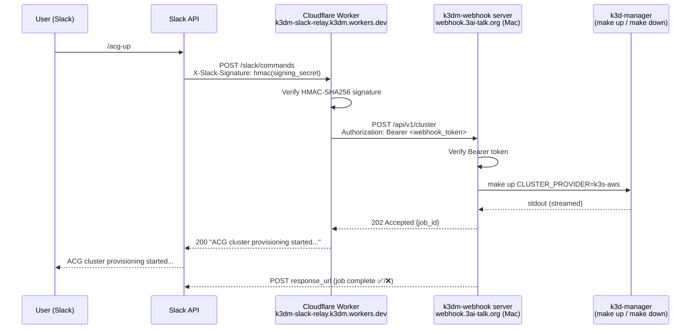

# Slack Slash Commands Setup

Slack slash commands (`/acg-up`, `/acg-down`, `/acg-status`, `/argocd-upgrade`) that
control the k3d-manager cluster from any Slack channel.

---

## Architecture



### Components

| Component | Where it runs | Purpose |
|-----------|--------------|---------|
| Slack App (`k3dm`) | Slack (cloud) | Receives slash commands, enforces workspace auth |
| Cloudflare Worker (`k3dm-slack-relay`) | Cloudflare edge | Verifies Slack signature, forwards to webhook |
| `bin/k3dm-webhook` | Mac (launchd daemon) | Executes cluster commands, posts results back to Slack |
| Cloudflare Tunnel | Mac → `webhook.3ai-talk.org` | Exposes local webhook server publicly over HTTPS |

### Secrets flow

| Secret | Stored in | Used by |
|--------|-----------|---------|
| `SLACK_SIGNING_SECRET` | Cloudflare Worker secret store + macOS Keychain | Worker: verify Slack request authenticity |
| `K3DM_WEBHOOK_TOKEN` | Cloudflare Worker secret store + macOS Keychain | Worker→webhook auth (Bearer token) |
| `CLOUDFLARE_API_TOKEN` | macOS Keychain only | `bin/k3dm-worker-setup`: deploy Worker |

---

## One-time Bootstrap

Run once per machine. Safe to re-run.

### Prerequisites

- `gh` authenticated (`gh auth login`)
- `node` / `npx` available (`brew install node`)
- Cloudflare account at dash.cloudflare.com
- Slack app created at api.slack.com/apps (see [Create Slack App](#create-slack-app))

### 1. Create Slack App

1. Go to [api.slack.com/apps](https://api.slack.com/apps) → **Create New App** → **From a manifest**
2. Select your workspace, paste this JSON manifest:

```json
{
  "display_information": {
    "name": "k3dm",
    "description": "k3d-manager cluster control",
    "background_color": "#2c2d30"
  },
  "features": {
    "bot_user": {
      "display_name": "k3dm",
      "always_online": false
    },
    "slash_commands": [
      {
        "command": "/acg-up",
        "url": "https://k3dm-slack-relay.k3dm.workers.dev/slack/commands",
        "description": "Start ACG sandbox cluster",
        "should_escape": false
      },
      {
        "command": "/acg-down",
        "url": "https://k3dm-slack-relay.k3dm.workers.dev/slack/commands",
        "description": "Stop ACG sandbox cluster",
        "should_escape": false
      },
      {
        "command": "/acg-status",
        "url": "https://k3dm-slack-relay.k3dm.workers.dev/slack/commands",
        "description": "Check ACG cluster status",
        "should_escape": false
      },
      {
        "command": "/argocd-upgrade",
        "url": "https://k3dm-slack-relay.k3dm.workers.dev/slack/commands",
        "description": "Upgrade ArgoCD platform-ops",
        "should_escape": false
      }
    ]
  },
  "oauth_config": {
    "scopes": {
      "bot": [
        "commands",
        "chat:write"
      ]
    }
  },
  "settings": {
    "org_deploy_enabled": false,
    "socket_mode_enabled": false,
    "token_rotation_enabled": false
  }
}
```

3. After creating: **Install App** → **Install to Workspace**
4. Note the **Signing Secret**: Basic Information → App Credentials → Signing Secret

### 2. Create Cloudflare API Token

1. dash.cloudflare.com → My Profile → **API Tokens** → **Create Token**
2. Use **"Edit Cloudflare Workers"** template
3. Account Resources: your account; Zone Resources: All zones; IP filtering: none; TTL: none
4. Create and copy the token value

### 3. Run setup

```bash
make setup-worker
```

This will:
- Generate `K3DM_WEBHOOK_TOKEN` and store it in macOS Keychain
- Start `bin/k3dm-webhook` as a launchd daemon (auto-starts on login)
- Prompt for `CLOUDFLARE_API_TOKEN` and `SLACK_SIGNING_SECRET` → store in Keychain
- Set all three as GitHub Actions secrets
- Deploy the Cloudflare Worker to `https://k3dm-slack-relay.k3dm.workers.dev`

### 4. Verify tunnel config

Confirm `scripts/etc/cloudflared/config.yml` contains:

```yaml
- hostname: webhook.3ai-talk.org
  service: http://127.0.0.1:7443
```

Then restart the tunnel:

```bash
brew services restart cloudflared
```

---

## Ongoing Operations

### Rotate tokens

```bash
./bin/k3dm-webhook-setup --rotate   # rotates K3DM_WEBHOOK_TOKEN
./bin/k3dm-worker-setup --rotate    # rotates CLOUDFLARE_API_TOKEN + SLACK_SIGNING_SECRET
```

After rotating `K3DM_WEBHOOK_TOKEN`, redeploy the Worker to pick up the new value:

```bash
gh workflow run deploy-worker.yml
```

No daemon restart needed — `bin/k3dm-webhook` reads from Keychain on every request.

### Worker redeploy

Triggered automatically on push to `main` when `workers/slack-relay/**` changes.
For manual redeploy (e.g. after token rotation):

```bash
gh workflow run deploy-worker.yml
```

### View webhook logs

```bash
tail -f ~/Library/Logs/k3dm-webhook.log
```

### Restart webhook daemon

```bash
launchctl kickstart -k gui/$(id -u)/com.k3d-manager.webhook
```

### Uninstall

```bash
bin/k3dm-webhook-setup --uninstall
```

---

## Slash Commands Reference

| Command | Action | Notes |
|---------|--------|-------|
| `/acg-up` | Provision ACG k3s cluster | Runs `make up CLUSTER_PROVIDER=k3s-aws` |
| `/acg-down` | Tear down ACG cluster | Runs `make down KEEP_LOCAL=1` |
| `/acg-status` | Check cluster health | kubectl nodes + ArgoCD app status |
| `/argocd-upgrade` | Upgrade ArgoCD platform-ops | Requires `chart_version` and `stage` params |

All commands respond immediately with an acknowledgement, then post results back to the
channel via `response_url` when the job completes.
