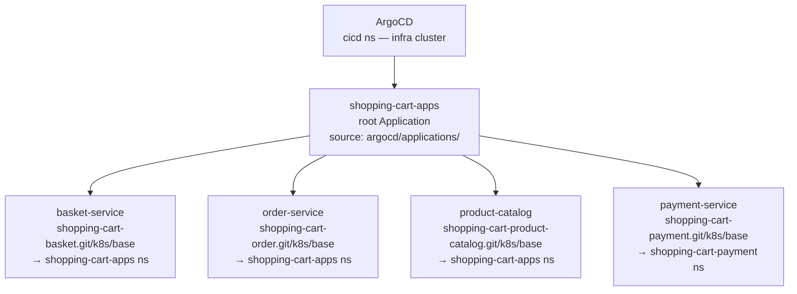
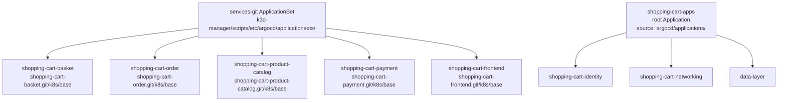

# Bugfix: v1.4.12 — shopping-cart-infra Makefile and architecture doc stale ArgoCD references

**Branch (spec repo):** `k3d-manager-v1.4.12`
**Work repo:** `shopping-cart-infra`
**Work branch:** `fix/remove-legacy-argocd-apps`

---

## Problem

PR #76 (fix/remove-legacy-argocd-apps) deletes 5 legacy Application YAML files but leaves two
stale artifacts that reference the deleted files and old app names:

1. **`Makefile` lines 227-236** — `argocd-sync` syncs `order-service` and `product-catalog` (old
   legacy app names); `argocd-delete` deletes `argocd/applications/order-service.yaml` and
   `product-catalog.yaml` which no longer exist on disk after this PR — both targets will break.

2. **`docs/architecture.md`** — directory structure diagram still lists the 5 deleted child
   Application files; "App-of-Apps vs ApplicationSet" section explicitly states we use app-of-apps
   *rather than* ApplicationSet — now incorrect since the `services-git` ApplicationSet (in
   k3d-manager) is the active model.

**Root cause:** The spec for fix/remove-legacy-argocd-apps only scoped the application deletions,
not the ancillary docs and Makefile that referenced them.

---

## Fix

### Change 1 — `Makefile`: update `argocd-sync` and `argocd-delete` targets

**Exact old block (lines 227-237):**

```makefile
argocd-sync: ## Sync all shopping-cart applications
	@echo "${BLUE}Syncing shopping-cart applications...${RESET}"
	@argocd app sync order-service 2>/dev/null || kubectl patch application order-service -n argocd --type merge -p '{"operation":{"initiatedBy":{"username":"admin"},"sync":{"syncStrategy":{"apply":{"force":true}}}}}' 2>/dev/null || echo "order-service not found"
	@argocd app sync product-catalog 2>/dev/null || kubectl patch application product-catalog -n argocd --type merge -p '{"operation":{"initiatedBy":{"username":"admin"},"sync":{"syncStrategy":{"apply":{"force":true}}}}}' 2>/dev/null || echo "product-catalog not found"
	@echo "${GREEN}✓ Sync triggered${RESET}"

argocd-delete: ## Delete ArgoCD applications (keeps project)
	@echo "${YELLOW}Deleting ArgoCD applications...${RESET}"
	kubectl delete -f argocd/applications/order-service.yaml --ignore-not-found
	kubectl delete -f argocd/applications/product-catalog.yaml --ignore-not-found
	@echo "${GREEN}✓ ArgoCD applications deleted${RESET}"
```

**Exact new block:**

```makefile
argocd-sync: ## Sync all shopping-cart applications (ApplicationSet-managed)
	@echo "${BLUE}Syncing shopping-cart applications...${RESET}"
	@argocd app sync shopping-cart-order 2>/dev/null || echo "shopping-cart-order not found"
	@argocd app sync shopping-cart-product-catalog 2>/dev/null || echo "shopping-cart-product-catalog not found"
	@argocd app sync shopping-cart-basket 2>/dev/null || echo "shopping-cart-basket not found"
	@argocd app sync shopping-cart-frontend 2>/dev/null || echo "shopping-cart-frontend not found"
	@argocd app sync shopping-cart-payment 2>/dev/null || echo "shopping-cart-payment not found"
	@echo "${GREEN}✓ Sync triggered${RESET}"

argocd-delete: ## Delete ArgoCD applications managed by services-git ApplicationSet
	@echo "${YELLOW}Deleting ArgoCD applications...${RESET}"
	@argocd app delete shopping-cart-order shopping-cart-basket shopping-cart-frontend shopping-cart-payment shopping-cart-product-catalog --yes 2>/dev/null || true
	@echo "${GREEN}✓ ArgoCD applications deleted${RESET}"
```

---

### Change 2 — `docs/architecture.md`: update ArgoCD directory structure and model description

**Exact old block — directory structure (replace the argocd/ tree inside the code fence):**

```
argocd/
├── applications/
│   ├── shopping-cart-apps.yaml   # root Application (app-of-apps)
│   ├── basket-service.yaml       # child Application
│   ├── order-service.yaml        # child Application
│   ├── payment-service.yaml      # child Application
│   └── product-catalog.yaml      # child Application
├── config/
│   ├── argocd-cm.yaml            # OIDC / Keycloak SSO config
│   ├── argocd-rbac-cm.yaml       # RBAC role bindings
│   ├── argocd-secret.yaml        # server secret (admin password hash)
│   └── shopping-cart.yaml        # cluster registration secret
└── projects/
    └── shopping-cart.yaml        # AppProject — source/destination permissions
```

**Exact new block:**

```
argocd/
├── applications/
│   └── shopping-cart-apps.yaml   # root Application — watches argocd/applications/
├── config/
│   ├── argocd-cm.yaml            # OIDC / Keycloak SSO config
│   ├── argocd-rbac-cm.yaml       # RBAC role bindings
│   ├── argocd-secret.yaml        # server secret (admin password hash)
│   └── shopping-cart.yaml        # cluster registration secret
└── projects/
    └── shopping-cart.yaml        # AppProject — source/destination permissions
```

---

**Exact old block — App-of-Apps vs ApplicationSet section (replace entire section):**

```markdown
### App-of-Apps vs ApplicationSet

We use **app-of-apps** (a root `Application` that watches `argocd/applications/`) rather than `ApplicationSet` for the following reasons:

| Concern | App-of-Apps | ApplicationSet |
|---|---|---|
| Per-service namespace | Each child sets its own `destination.namespace` | Requires generator templating |
| Per-service Kustomize patches | Defined inline per child manifest | Complex with matrix generators |
| Adding a new service | Drop a new YAML in `argocd/applications/` | Same, but template logic is shared |
| Complexity for 4–6 services | Low | Higher (generator config, template variables) |

ApplicationSet is the right choice when you have many services with identical structure (10+) or need cluster-level fan-out. For this platform ApplicationSet would add overhead without benefit.

### App-of-Apps pattern

All shopping cart deployments are managed through a two-level ArgoCD hierarchy:



The root Application (`shopping-cart-apps`) watches the `argocd/applications/` directory in this repo and creates or deletes child Applications automatically when manifests are added or removed.
```

**Exact new block:**

```markdown
### Deployment model — ApplicationSet

Service applications (`shopping-cart-basket`, `shopping-cart-order`, `shopping-cart-payment`,
`shopping-cart-product-catalog`, `shopping-cart-frontend`) are generated by the `services-git`
ApplicationSet deployed via k3d-manager. Each service repo's `k8s/base/` directory is the source.

The `shopping-cart-apps` root Application watches `argocd/applications/` in this repo and manages
platform-level apps (identity, networking, data-layer, namespace). It is **not** the parent of
the service applications — the ApplicationSet is.

### Deployment hierarchy



The ApplicationSet uses a git generator polling each service repo at `HEAD`. Changes to `k8s/base/`
in any service repo are auto-synced to the cluster within ~3 minutes.
```

---

## Files Changed

| File | Change |
|------|--------|
| `Makefile` | Update `argocd-sync` (new app names) and `argocd-delete` (remove deleted file refs) |
| `docs/architecture.md` | Update directory tree + replace App-of-Apps section with ApplicationSet model |

---

## Rules

- No other files modified
- `bash -n Makefile` not applicable (Make syntax); visually verify indentation uses tabs not spaces
- Makefile recipe lines must use tab indentation — never spaces

---

## Definition of Done

- [ ] `Makefile` `argocd-sync` and `argocd-delete` targets updated
- [ ] `docs/architecture.md` directory tree and model section updated
- [ ] No other files touched
- [ ] Committed and pushed to `fix/remove-legacy-argocd-apps` in `shopping-cart-infra`
- [ ] memory-bank updated with commit SHA and task status

**Commit message (exact):**
```
fix(docs): update Makefile argocd targets and architecture.md for ApplicationSet model
```

---

## What NOT to Do

- Do NOT create a PR (PR #76 already exists — this commit adds to it)
- Do NOT skip pre-commit hooks (`--no-verify`)
- Do NOT modify any file other than `Makefile` and `docs/architecture.md`
- Do NOT commit to `main` — work on `fix/remove-legacy-argocd-apps`
- Do NOT rebase or force-push — just add a new commit on top of `c852bca`
