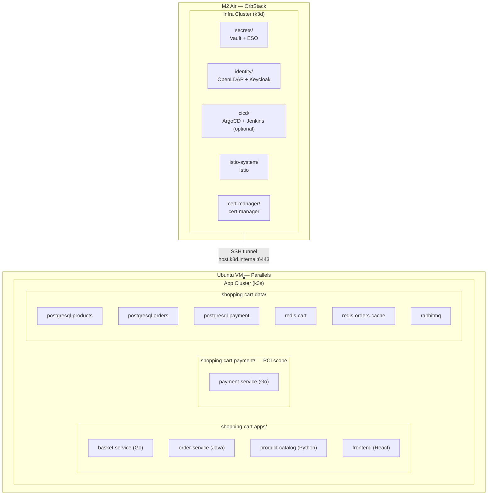
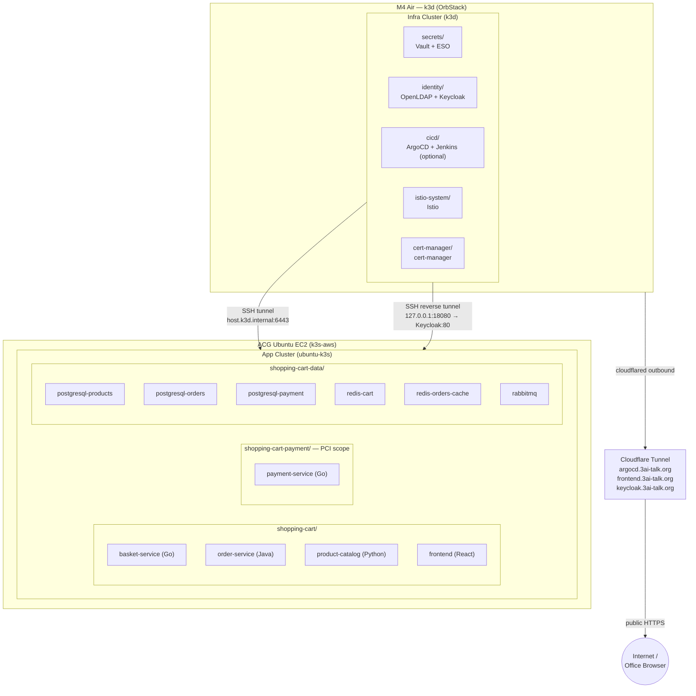
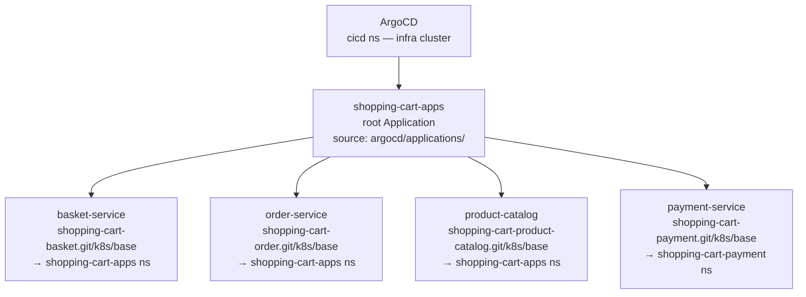
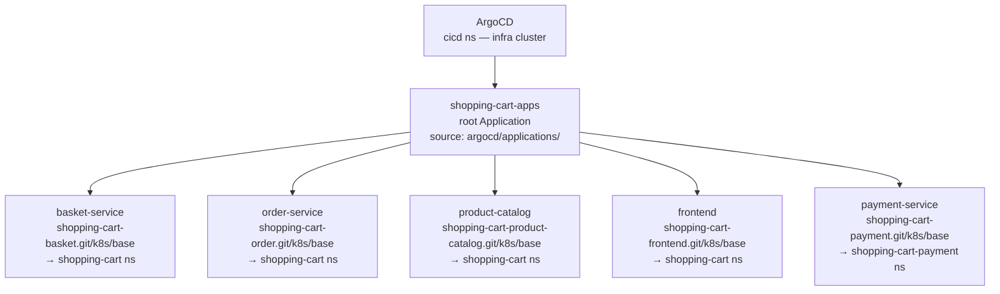
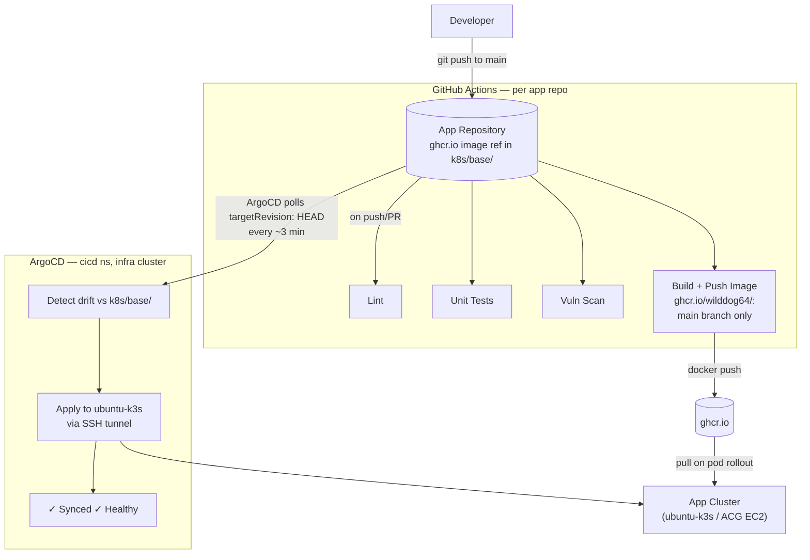

# Spec: v1.4.9 — Update shopping-cart-infra architecture docs

**Branch (work repo):** `docs/next-improvements` on `shopping-cart-infra`
**Files:**
- `docs/architecture.md`
- `docs/cicd-architecture.md`

---

## Before You Start

- Read this spec in full before touching anything
- Branch (all work): `docs/next-improvements` in `shopping-cart-infra` repo
  (path: `~/src/gitrepo/personal/shopping-carts/shopping-cart-infra`)
- `git pull origin docs/next-improvements` before making any changes

---

## Problem

Both architecture documents are outdated against the actual deployed infrastructure:

1. `docs/architecture.md` (last updated 2026-03-17):
   - Still shows M2 Air / Ubuntu Parallels VM — now M4 Air / ACG Ubuntu EC2
   - Keycloak OIDC issuer is wrong local URL — now `https://keycloak.3ai-talk.org`
   - ArgoCD app-of-apps diagram is missing the `frontend` Application
   - No Cloudflare tunnel section (argocd/frontend/keycloak public access)
   - No Keycloak cross-cluster tunnel section

2. `docs/cicd-architecture.md` (last updated 2026-03-25):
   - Describes Jenkins building images and committing Helm chart tag updates — entirely wrong
   - Jenkins is optional, does not participate in CI/CD
   - ArgoCD tracks HEAD on each app repo directly; there is no Helm values file or yq step
   - Document duplicates and contradicts architecture.md section 4

---

## Fix

### Change 1 — `docs/architecture.md`: update Last Updated date

**Exact old:**
```
**Last Updated:** 2026-03-17
```

**Exact new:**
```
**Last Updated:** 2026-05-19
```

---

### Change 2 — `docs/architecture.md`: fix Section 1 System Overview mermaid

**Exact old block:**
```

```

**Exact new block:**
```

```

---

### Change 3 — `docs/architecture.md`: update Section 2 cluster names

**Exact old:**
```
### Infra cluster — k3d on OrbStack
```

**Exact new:**
```
### Infra cluster — k3d on OrbStack (M4 Air)
```

**Exact old:**
```
### App cluster — k3s on Ubuntu (Parallels VM)
```

**Exact new:**
```
### App cluster — k3s on ACG Ubuntu EC2 (k3s-aws)
```

**Exact old:**
```
### Cluster connectivity — SSH tunnel

ArgoCD pods inside the infra k3d network cannot reach the Ubuntu VM API server directly. The M2 Air host forwards the k3s API port:

```bash
ssh -fNL 0.0.0.0:6443:localhost:6443 ubuntu
```

This makes `https://host.k3d.internal:6443` reachable from inside k3d. ArgoCD uses this as the cluster endpoint. `insecureSkipVerify: true` is set in the cluster secret because k3s TLS certificates are issued for `127.0.0.1`, not the hostname.

The cluster secret is registered via `scripts/register-ubuntu-k3s.sh` — credentials are never committed to git.
```

**Exact new:**
```
### Cluster connectivity

**ArgoCD → app cluster (API server):**

The M4 Air host forwards the ubuntu-k3s API port so ArgoCD inside k3d can reach it:

```bash
ssh -fNL 0.0.0.0:6443:localhost:6443 ubuntu
```

This makes `https://host.k3d.internal:6443` reachable from inside k3d. ArgoCD uses this as the cluster endpoint. `insecureSkipVerify: true` is set in the cluster secret because k3s TLS certificates are issued for `127.0.0.1`, not the hostname.

The cluster secret is registered via `scripts/register-ubuntu-k3s.sh` — credentials are never committed to git.

**Keycloak reverse tunnel (infra cluster → app cluster):**

App services on ubuntu-k3s need to reach Keycloak for JWT validation. Since Keycloak runs on the infra k3d cluster, `bin/acg-up` establishes a reverse SSH tunnel:

```bash
ssh -R 127.0.0.1:18080:127.0.0.1:80 ubuntu
```

This exposes Keycloak on the EC2 instance at `127.0.0.1:18080`. An iptables DNAT rule redirects `<node-ip>:80` → `127.0.0.1:18080`, and a CoreDNS `NodeHosts` entry resolves `keycloak.shopping-cart.local` to the node IP. App services reach Keycloak at `http://keycloak.shopping-cart.local`.
```

---

### Change 4 — `docs/architecture.md`: add frontend to ArgoCD app-of-apps diagram

**Exact old block (ArgoCD app-of-apps mermaid):**
```

```

**Exact new block:**
```

```

---

### Change 5 — `docs/architecture.md`: fix Keycloak OIDC issuer in Section 6

**Exact old:**
```
- OIDC issuer: `http://keycloak.identity.svc.cluster.local/realms/shopping-cart`
```

**Exact new:**
```
- OIDC issuer: `https://keycloak.3ai-talk.org/realms/shopping-cart` (Cloudflare public URL — required so JWT tokens issued to the browser have an issuer that external clients can validate)
```

---

### Change 6 — `docs/architecture.md`: add Cloudflare Tunnel section after Section 8

Insert a new section 8.5 (or append before section 9) titled `## Public Access — Cloudflare Tunnel`:

**Insert after the "## 8. Data Layer" section and before "## 9. Observability":**

```markdown
---

## 8.5. Public Access — Cloudflare Tunnel

`bin/acg-up` installs a named Cloudflare tunnel (`cloudflared`) as a macOS launchd daemon. The tunnel connects outbound from the M4 Air to Cloudflare's network — no inbound firewall rules or port-forwarding are required.

### Public hostnames (3ai-talk.org)

| Hostname | Backend (local) | Notes |
|---|---|---|
| `argocd.3ai-talk.org` | `http://localhost:8080` | ArgoCD port-forward via launchd |
| `frontend.3ai-talk.org` | `http://127.0.0.2:80` | Frontend kubectl port-forward on loopback alias |
| `keycloak.3ai-talk.org` | `http://localhost:80` | Istio IngressGateway port-forward |

### Config template

`scripts/etc/cloudflared-config.yml.tmpl` in `k3d-manager` is rendered by `bin/acg-up`
at provision time using the tunnel UUID from `~/.cloudflared/*.json`. Never commit
`~/.cloudflared/config.yml` or `~/.cloudflared/*.json` — the JSON contains credentials.

### DNS records (one-time Cloudflare setup)

```bash
cloudflared tunnel route dns k3d-manager argocd.3ai-talk.org
cloudflared tunnel route dns k3d-manager frontend.3ai-talk.org
cloudflared tunnel route dns k3d-manager keycloak.3ai-talk.org
```

These CNAME records are permanent — they survive sandbox resets and Mac reboots.
```

---

### Change 7 — `docs/cicd-architecture.md`: replace with accurate architecture

Replace the **entire content** of `docs/cicd-architecture.md` with:

```markdown
# CI/CD Architecture — GitHub Actions + ArgoCD

**Last Updated:** 2026-05-19
**Architecture:** GitOps — GitHub Actions for CI, ArgoCD for CD

---

## Overview

CI (build, test, image push) runs in GitHub Actions on each app repository.
CD (deploy to cluster) is handled exclusively by ArgoCD via GitOps poll — there is no
Jenkins step, no image tag commit, and no Helm chart.

**Jenkins** is an optional platform service (`ENABLE_JENKINS=1`) used for pipeline
experiments — it plays no role in the standard CI/CD flow.

---

## Architecture Diagram



---

## Repository Layout

| Repo | Purpose | CI trigger |
|---|---|---|
| `shopping-cart-basket` | basket-service (Go) | push to main / PR |
| `shopping-cart-order` | order-service (Java) | push to main / PR |
| `shopping-cart-product-catalog` | product-catalog (Python) | push to main / PR |
| `shopping-cart-frontend` | frontend (React/Nginx) | push to main / PR |
| `shopping-cart-payment` | payment-service (Go) | push to main / PR |
| `shopping-cart-infra` | K8s manifests, ArgoCD apps, data layer | ArgoCD only |

---

## CI Pipeline (GitHub Actions — per app repo)

Each app repo runs four parallel jobs on every push to `main` and every PR:

| Job | What it does |
|---|---|
| `lint` | Language-specific linter (golangci-lint / Checkstyle / flake8 / eslint) |
| `test` | Unit tests |
| `vuln` | Vulnerability scan (govulncheck / OWASP DepCheck / pip-audit / npm audit) |
| `build` | `docker build` + `docker push ghcr.io/wilddog64/<service>:<sha>` — main branch only |

The image tag is the git commit SHA. No version bump, no Helm values file update.

---

## CD Pipeline (ArgoCD)

ArgoCD polls each app repo's `k8s/base/` directory at `targetRevision: HEAD` every
~3 minutes. When it detects a drift (new Deployment spec or image digest change after a
push), it applies the manifests to the `ubuntu-k3s` cluster via the SSH API tunnel.

### What ArgoCD does NOT do

- Does not trigger on webhook (poll only — webhooks would require public ArgoCD inbound)
- Does not update image tags in any repo (no yq commit, no Helm values)
- Does not manage the data layer (PostgreSQL, Redis, RabbitMQ) — those manifests are in
  `shopping-cart-infra` and managed by a separate ArgoCD root Application

### App-of-apps hierarchy

```
shopping-cart-apps (root Application — watches argocd/applications/)
├── basket-service          → shopping-cart-basket.git/k8s/base  → shopping-cart ns
├── order-service           → shopping-cart-order.git/k8s/base   → shopping-cart ns
├── product-catalog         → shopping-cart-product-catalog.git/k8s/base → shopping-cart ns
├── frontend                → shopping-cart-frontend.git/k8s/base → shopping-cart ns
└── payment-service         → shopping-cart-payment.git/k8s/base → shopping-cart-payment ns

shopping-cart-infra (root Application — watches argocd/applications/infra/)
├── shopping-cart-data      → data-layer/                        → shopping-cart-data ns
└── shopping-cart-identity  → identity/                          → identity ns (ubuntu-k3s)
```

### Kustomize patches (applied by each child Application)

- **Replica cap** — `replicas: 1` (ubuntu-k3s is a single ACG EC2 sandbox)
- **Image pull secret** — injects `ghcr-pull-secret` for private ghcr.io images

---

## Image Registry

All images: `ghcr.io/wilddog64/<service>:<sha>`

The GHCR PAT is stored in Vault at `secret/data/ghcr/pat` and synced to the
`ghcr-pull-secret` Kubernetes secret on both clusters via ESO.

---

## Sync Policy

All child Applications:

```yaml
syncPolicy:
  automated:
    prune: true
    selfHeal: true
    allowEmpty: false
  retry:
    limit: 5
    backoff: 5s → 3m
```

---

## What Jenkins Does (optional)

Jenkins (`ENABLE_JENKINS=1`) is an optional platform service in the `cicd` namespace on
the infra k3d cluster. It is used for pipeline experiments and Jenkins-specific
integration tests. It plays **no role** in the standard GitHub Actions → ArgoCD CI/CD
flow and is not required for `make up`.
```

---

## Files Changed

| File | Change |
|------|--------|
| `docs/architecture.md` | Update date, cluster names, Keycloak OIDC URL, ArgoCD diagram, Cloudflare section, cross-cluster tunnel section |
| `docs/cicd-architecture.md` | Full rewrite — replace Jenkins/Helm flow with correct GitHub Actions + ArgoCD flow |

---

## Rules

- No other files touched
- CHANGELOG and memory-bank updates are required documentation

---

## Definition of Done

- [ ] `docs/architecture.md` "Last Updated" is 2026-05-19
- [ ] Section 1 mermaid shows M4 Air + ACG Ubuntu EC2 + Cloudflare tunnel
- [ ] Section 2 cluster names updated; Keycloak reverse tunnel documented
- [ ] Section 3 ArgoCD diagram includes `frontend` Application
- [ ] Section 6 Keycloak OIDC issuer is `https://keycloak.3ai-talk.org/realms/shopping-cart`
- [ ] Section 8.5 Cloudflare Tunnel section added
- [ ] `docs/cicd-architecture.md` describes GitHub Actions + ArgoCD (no Jenkins CI, no Helm yq)
- [ ] Committed and pushed to `docs/next-improvements` on `shopping-cart-infra`
- [ ] memory-bank in k3d-manager updated with commit SHA

**Commit message (exact):**
```
docs(architecture): update cluster topology, Keycloak OIDC URL, Cloudflare tunnel, CI/CD flow
```

---

## What NOT to Do

- Do NOT create a PR
- Do NOT skip pre-commit hooks (`--no-verify`)
- Do NOT modify any file other than the listed targets
- Do NOT commit to `main` — work on `docs/next-improvements` in shopping-cart-infra
- Do NOT modify k3d-manager files
