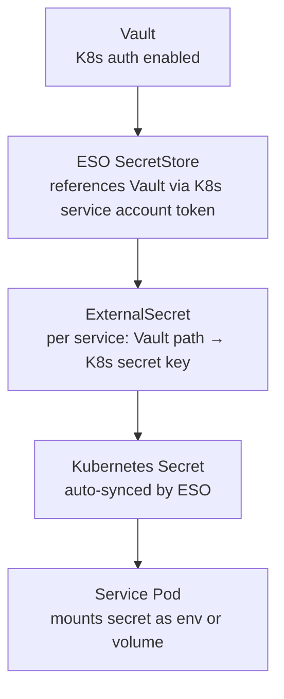
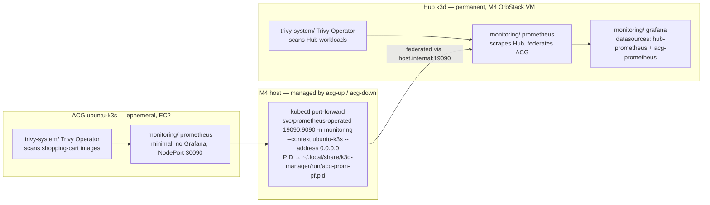

# System Patterns – k3d-manager

_Last verified against the tree on 2026-09-21 (branch `k3d-manager-v1.36.0`). The previous revision
dated from v1.24.0 (2026-08-11). It had duplicate section numbers (two §12, §17 before §16) and two
sections that stated the opposite of current practice — agent role boundaries and the agent commit
protocol. Both are corrected below._

## 1) Dispatcher + Lazy Plugin Loading

- `scripts/k3d-manager` is the sole entry point. It sources core libraries unconditionally and loads
  a plugin **only when a function from that plugin is first invoked**.
- Benefit: fast startup; unused plugins never load.
- Convention: plugin files must not execute anything at source time (no side effects).
- **Consequence that bites:** a cross-plugin call silently no-ops if the other plugin was never
  sourced. A `declare -f` guard around a call is the smell that this is happening — fix the sourcing,
  don't paper over it with the guard.

## 2) Configuration-Driven Strategy Pattern

Three environment variables select the active implementation at runtime:

| Variable | Selects | Default |
|---|---|---|
| `CLUSTER_PROVIDER` | Cluster backend | Auto-detects OrbStack on macOS when running, otherwise `k3d` |
| `DIRECTORY_SERVICE_PROVIDER` | Auth backend | `openldap` |
| `SECRET_BACKEND` | Secret backend | `vault` |

Consumer code calls a generic interface function; the abstraction layer dispatches to the
provider-specific implementation. Adding a provider means one new file and no consumer changes.

## 3) Provider Interface Contracts

### Cluster Provider (`CLUSTER_PROVIDER`)
`scripts/lib/providers/<provider>.sh` — **nine** implementations:

| Provider | Role |
|---|---|
| `orbstack` | macOS, auto-detected when `orb` is running |
| `k3d` | Docker runtime; the hub cluster |
| `k3s` | Linux / systemd |
| `k3s-hostinger` | The live long-running remote cluster |
| `k3s-aws`, `k3s-az`, `k3s-gcp` | Cloud sandboxes |
| `k3s-oci`, `k3s-oci-storage` | **De-scoped** — no Always-Free; retained, not used |

### Directory Service (`DIRECTORY_SERVICE_PROVIDER`)
`scripts/lib/dirservices/<provider>.sh` must implement:

| Function | Purpose |
|---|---|
| `_dirservice_<p>_init` | Deploy (OpenLDAP) or validate connectivity (AD) |
| `_dirservice_<p>_validate_config` | Check reachability / credentials |
| `_dirservice_<p>_create_credentials` | Store service-account creds in Vault |
| `_dirservice_<p>_get_groups` | Query group membership for a user |
| `dirservice_smoke_test_login` | Validate end-user login works |
| `_dirservice_<p>_generate_jcasc` | Emit Jenkins JCasC `securityRealm` YAML _(deprecated path)_ |

### Secret Backend (`SECRET_BACKEND`)
`scripts/lib/secret_backends/<backend>.sh` must implement:

| Function | Purpose |
|---|---|
| `<backend>_init` | Initialize / authenticate backend |
| `<backend>_create_secret` | Write a secret |
| `<backend>_create_secret_store` | Create ESO SecretStore resource |
| `<backend>_create_external_secret` | Create ESO ExternalSecret resource |
| `<backend>_wait_for_secret` | Block until the K8s Secret is synced |

Only **`vault`** implements this contract. `plugins/azure.sh`, `aws.sh` and `gcp.sh` are cloud/ESO
provider plugins — they are *not* secret backends, despite the earlier "planned" note.

## 4) ESO Secret Flow



Each service plugin creates its own ExternalSecret resources. Vault policies must grant each
service account **only** its own secrets path — `read` unless `write` is genuinely needed.

**Operational note:** where a Secret is ESO-managed, do not overwrite it directly. Annotate the
ExternalSecret with `force-sync=<timestamp>` and let ESO reconcile, or the next sync reverts you.

## 5) `_run_command` Privilege Escalation Pattern

Never call `sudo` directly, and never `command sudo`. Always route through `_run_command`:

```bash
_run_command --prefer-sudo -- apt-get install -y jq   # sudo if available
_run_command --require-sudo -- mkdir /etc/myapp        # fail if no sudo
_run_command --probe 'config current-context' -- kubectl get nodes
_run_command --quiet -- might-fail                     # suppress stderr
```

`_args_have_sensitive_flag` detects `--password`, `--token`, `--username` and automatically disables
`ENABLE_TRACE` for that command. **Register every new sensitive flag there.**

## 6) Idempotency Mandate

Every public function must be safe to run more than once:
- "resource already exists" → skip, not error.
- "helm release already deployed" → upgrade, not re-install.
- "Vault already initialized" → skip init, read existing unseal keys.

## 7) Error Convention

`_err` **exits 1** (`scripts/lib/system.sh`). `_warn` prints and returns. Choosing the wrong one
turns a recoverable branch into a hard stop, or hides a fatal condition — check which you mean.

## 8) GitOps: the ApplicationSet values-branch trap

ApplicationSets template their `$values` source at `${K3D_MANAGER_BRANCH}`, which **freezes to
whichever branch was checked out when the set was last applied**. Config committed to a newer branch
is *inert* until the sets are reapplied: it is in git, CI is green, and no cluster reads it.

This silently persisted for two releases. Decision 2026-07-24: the values ref keeps tracking the
**release branch**, not `main` — which makes reapplying a **required release step**, for *both* hub
and ACG variants, confirmed afterwards with `argocd_check_values_branch`.

Related: ArgoCD `selfHeal` reverts an out-of-band `kubectl patch` — it exits 0, then vanishes. You
need `ignoreDifferences` **and** `RespectIgnoreDifferences=true`. Always read the value back.

## 9) Image Build, Sign and Promote Pattern

The shopping-cart repos call a reusable workflow,
`shopping-cart-infra/.github/workflows/build-push-deploy.yml`, pinned **by commit SHA**:

```
build → trivy scan → push to ghcr.io → cosign sign + attest (vuln, SBOM) → promote tag
```

Two things about this pipeline are counter-intuitive and have each cost a debugging session:

- **The registry login uses `secrets.GITHUB_TOKEN`** — the ephemeral per-run Actions token with
  automatic `packages: write`. A green push therefore says nothing about any long-lived credential.
- **Promotion pushes to the *calling* repo**, not to infra (`git@github.com:${{ github.repository }}`).
  So every calling repo needs its **own** write `sc-image-promoter` deploy key, its own
  `PROMOTER_SSH_KEY` secret, and a ruleset with a `DeployKey` bypass. The keys are not
  interchangeable between repos. On personal repos neither `github-actions[bot]` nor a user-owned
  GitHub App can be a bypass actor (HTTP 422, org-only) — only a deploy key.

**A pinned reusable workflow does not pick up new commits.** A fix in infra is inert in a consumer
until that consumer's pin moves. Dependabot tracks the pins — which also means Dependabot can carry a
*breaking* change across a required-secret boundary, auto-merged and green, because the `publish` job
is gated on a `main` push and is skipped on the PR itself.

## 10) Read the Job List, Not the Run Conclusion

`conclusion: success` on a workflow run does not mean the release path works. A **skipped** job does
not fail a run, and publish/promote jobs gated on
`github.ref == 'refs/heads/main' && github.event_name == 'push'` are skipped on every PR and
Dependabot run. Filter with `--event push --branch main` and read the **job list**.

Also: `*.yml` globs miss `*.yaml`. Enumerate all workflow files and select by **content**, never by
filename guess, and never take the first match per repo.

## 11) Subtree Discipline — upstream-first

`scripts/lib/foundation/` is the **lib-foundation subtree**. Never edit it in k3d-manager; fix
upstream in lib-foundation and pull the subtree. The same rule governed `scripts/lib/acg/` before its
absorption into lib-foundation (archived 2026-09-12).

Likewise the **shopping-cart repos are never edited directly** — write a spec, dispatch to Codex,
work on a feature branch, never push to `main`.

## 12) Cross-Agent Documentation Pattern

`memory-bank/` is the collaboration substrate across agent sessions.

| File | Role |
|---|---|
| `projectbrief.md` | Project scope and goals — stable |
| `techContext.md` | Technologies, layout, key files |
| `systemPatterns.md` | Architecture and design decisions (this file) |
| `activeContext.md` | Current branch, open items, decisions in flight |
| `progress.md` | Done / pending tracker |

`activeContext.md` must capture **what changed AND why**. Updating both files is **mandatory and
immediate** after every completed action — not deferred to session end, not waiting to be asked.

**Retractions stay visible.** When a recorded claim turns out to be wrong, strike it through and mark
it `**RETRACTED, was wrong**` with the correction beside it. A silently edited history teaches the
next session nothing.

## 13) Agent Role Boundaries

_Corrected 2026-09-21 — the previous table described a division of labour that has not held for
months. Gemini no longer authors the test suite, and Codex routinely writes BATS alongside its code._

| Agent | Owns | Never does |
|---|---|---|
| **Codex** | Production code and its BATS coverage, security fixes, multi-repo spec execution | PRs, merges, `main` commits, force-push, `--no-verify` |
| **Gemini** | Bounded verification and red-team passes | Production code; live-cluster verification (Claude runs kubectl) |
| **Claude** | Specs, memory-bank, PR management, verification of every agent report, live cluster ops | Acts on outward-facing changes without the owner's go |

**Red-team scope (Gemini):** `_copilot_prompt_guard`, `_safe_path`, stdin injection, trace
isolation; attempt credential leakage via `/proc/*/cmdline`, PATH poisoning, prompt bypass. Report
findings to memory-bank; never modify production code. Claude routes fixes to Codex.

## 14) Agent Commit Protocol

_Corrected 2026-09-21 — the previous text said agents self-commit and "Claude does not re-commit on
their behalf." That is no longer true and following it strands work._

**`codex exec` frequently cannot write `.git`** — `fatal: Unable to create '.git/index.lock':
Operation not permitted`. This is recurring, not an anomaly. When it happens, Claude verifies the
working tree independently and **commits on Codex's behalf**.

Its sandbox is `workspace-write [workdir, /tmp, $TMPDIR]`, so a multi-repo task needs the **parent
directory** as workdir, plus `--skip-git-repo-check` when that parent is not itself a git repo.

**Verify before trust — always:**
- The SHA exists *on `origin/<branch>`*, not just locally. Codex commits and forgets to push.
- The diff touches only spec-listed files.
- Tests actually ran and the gates are non-vacuous.
- Reported counts are re-measured, not believed. A fabricated gate count has been caught.

## 15) Agent Boundary Security

Every handoff (Claude → Codex, Claude → Gemini, memory-bank reads) is a perimeter crossing:

- **No credentials in specs, reports or memory-bank.** Reference env var names only (`$VAULT_ADDR`,
  `$KUBECONFIG`). Live values stay on the owner's machine.
- **`memory-bank/` and `docs/plans/` are Instruction Code** — a prompt-injection surface. Claude
  reviews agent writes before the next agent reads them.
- **Minimize context to sub-agents.** Specs carry what the task needs — not full history, not cluster
  state, not credentials.
- **Validate output before acting.** Claude reviews every diff before commit.
- **Serialize live access.** One agent per ACG sandbox or live runner; give Codex stubbed BATS.

## 16) Red-Team Defensive Patterns

- **PATH sanitization** — `_safe_path` validates `PATH` before any agent invocation. Rejects
  world-writable dirs (sticky bit is **not** an exemption) and relative/empty entries. Glob-safe
  `IFS=':' read -r -a` split.
- **Secret injection via stdin** — token + payload piped into the pod's bash; extracted with
  `while IFS="=" read -r key value`. The token never appears in `kubectl exec` args or
  `/proc/*/cmdline`.
- **Prompt guard** — `_copilot_prompt_guard` checks 8 forbidden shell fragments.
- **Trace isolation** — see §5.
- **AI gate** — `K3DM_ENABLE_AI=1` must be set explicitly; copilot calls route through
  `_k3d_manager_copilot`.

## 17) Test Strategy

- BATS for pure logic only — deterministic, offline, no cluster, no mock-heavy orchestration suites
  asserting internal call sequences (they drifted and were removed).
- Integration confidence comes from live smoke tests and the two-tier e2e harness
  (Tier 1 vCluster per-PR, Tier 2 ACG).
- **A new test passing does not mean it can fail.** Check the pattern against the pre-fix source and
  confirm the count moves; mutation-test the guard.
- Prefer disappearance gates (`old → 0`). Never `grep -F` a whole source line — assertions rot.

```bash
./scripts/k3d-manager test smoke
```

## 18) Observability Architecture — Hub + ACG Dual-Cluster



**Why:** the stack lives inside OrbStack's VM (zero extra macOS RSS); ACG Prometheus runs on EC2 with
only a light port-forward on the host; when ACG tears down, last-scraped metrics persist in the hub.
`host.internal` is OrbStack's hostname for the M4 host, reachable from inside k3d pods. Loki and
Tempo deferred.

**Key files:** ApplicationSets `scripts/etc/argocd/applicationsets/observability.yaml` (hub) and
`observability-acg.yaml`; Helm values `scripts/etc/helm/observability/`; plugin
`scripts/plugins/observability.sh`; Makefile targets `observability`, `observability-acg`,
`observability-status`, `vuln-scan`.

**Alerting gotchas:** Alertmanager inline templates have **no sprig** (no `default`), and `amtool`
skips inline templates — render with a Go harness. `notifications_total` counts *attempts*; confirm
delivery in the notify.go logs. "Disappeared from target discovery" is **KubeAPIDown**, not
TargetDown.

## 19) Browser Automation Pattern (ACG sandbox lifecycle)

- The automation carries the legacy "Antigravity" name but is **standalone** — it needs only Node.js,
  Playwright and Chrome (CDP port 9222). The Antigravity IDE is **not** required.
- **CDP session reuse:** attach to the user's running Chrome to reuse authentication and interact
  with already-open modals. A consequence is that ACG login reuses that session and a one-time
  *manual* login needs a real TTY.
- **TTL awareness:** parse the sandbox "Auto Shutdown" time from the DOM and skip extension when
  >65 minutes remain, preventing false failures.
- Playwright clicks need `scrollIntoView` + a dispatched `MouseEvent`; `force: true` fails.

## 20) Deprecated — Jenkins

Jenkins is a **deprecated demonstration feature**: disabled by default (`ENABLE_JENKINS=0`) and
**not deployed**. Real CI is GitHub Actions; app delivery is ArgoCD GitOps. Removal was cancelled —
the code stays, marked deprecated and unsupported.

Retained for reference: Vault PKI issues a leaf cert stored as a K8s Secret in `istio-system`, and a
`jenkins-cert-rotator` CronJob renews it against `JENKINS_CERT_ROTATOR_RENEW_BEFORE`. JCasC
authorization must use the **flat `permissions:` list**, never the nested `entries:` form, which
fails parsing silently.

## 21) Active Directory Integration

- AD is always **external** — never deployed in-cluster.
- `_dirservice_activedirectory_init` validates connectivity (DNS + LDAP port probe).
- **Local testing:** `deploy_ad` — OpenLDAP with `bootstrap-ad-schema.ldif`. Test users `alice`
  (admin), `bob` (developer), `charlie` (read-only); all password `password`. **Dev-only — never
  reference these in production config paths.**
- **Production:** set `AD_DOMAIN`, use `--enable-ad-prod`. `TOKENGROUPS` is faster for nested groups.
- `AD_TEST_MODE=1` bypasses connectivity checks for unit testing.
